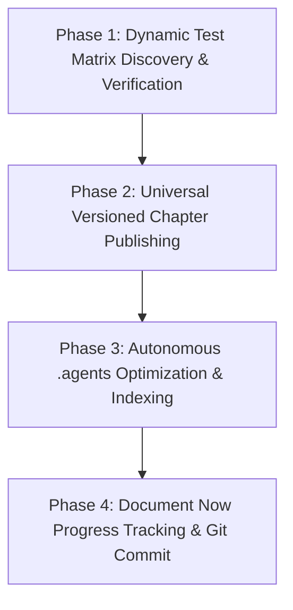

# Universal Milestone Release & Thesis Chapter Synchronization Skill

This skill provides a **universal, future-proof, multi-subsystem release pipeline** for the **Modular Adaptive Data Node (MADN)** project. It dynamically adapts to **any** newly added features, architectural changes, hardware components, or algorithm improvements across the entire project lifecycle.

---

## 1. Universal Trigger Conditions

Execute this workflow whenever the developer specifies:
- `"execute release"` or `"milestone release"`
- `"sync chapters and document"`
- `"publish milestone"`
- `"update chapters and document now"`
- Requests:
  1. Generating an updated version of chapter documentation reflecting any new features.
  2. Optimizing the `.agents` directory for modular adaptive data node systems.
  3. Creating a new versioned folder containing updated thesis chapters that reflect all newly implemented features.
  4. Triggering the `document-now` agentic progress tracking workflow.

---

## 2. Universal 4-Phase Architecture



---

### Phase 1: Dynamic Test Matrix Discovery & Verification

1. The test runner automatically discovers all active test suites in `Applications/Web App/backend` (e.g. `test_*.py`):
   ```bash
   python -m pytest -v
   ```
2. Dynamic assertion: All discovered test cases must pass with **100% success rate**. If regressions occur, resolve them prior to release.

---

### Phase 2: Universal Versioned Chapter Publishing

1. **Authoritative Local Machine Timestamp**:
   - Acquired dynamically at runtime (`YYYY-MM-DD Day HHMM` / `YYYY-MM-DD HHMM`).
   - Example folder: `01_Documentation_and_Thesis/Chapters/YYYY-MM-DD Day HHMM Version YYYY-MM-DD Day HHMM/`.
2. **Edition Changelog Mandate (`EDITION_CHANGELOG.md`)**:
   - Every new edition folder MUST include `EDITION_CHANGELOG.md` detailing all architectural advancements, design language modernizations (Sovereign Obsidian Glassmorphic Matrix), and performance benchmark gains.
3. **Dynamic Change Propagation (`build_versioned_chapters.py`)**:
   - Discovers the latest previous versioned chapter folder automatically.
   - Extracts recent git commits, newly introduced endpoints, data models, and UI views.
   - Updates date strings, version numbers, and Ndebele codenames dynamically.
   - Dynamically updates empirical test counts and benchmark results in **Chapter 5 (Results, Testing & Analysis)**.
   - Propagates feature implementations, component integrations, challenges, and solutions into **Chapter 3 (Methodology)**, **Chapter 4 (Design & Prototype)**, and **Chapters 1-2**.
   - Compiles unified chapter markdown documents and synchronizes top-level chapter files.

---

### Phase 3: Autonomous `.agents` Directory Optimization

1. **Dynamic Skill Discovery (`optimize_agents.py`)**:
   - Scans `../` for all active skill manifests.
   - Automatically maintains `[.agents/AGENTS.md](../../AGENTS.md)` with updated rule references and cross-links.
2. Ensures all subsystem standards (Tri-Node architecture, dynamic multi-ledger, offline mesh, zero-seed balances, security locks) remain synchronized.

---

### Phase 4: Document Now Progress Tracking & Git Commit

Execute the standard `document-now` workflow ([SKILL.md](../document-now/SKILL.md)):
1. **Synchronize System Documents**:
   - `Applications/Web App/SYSTEM_INTERNALS.md`
   - `Applications/Web App/USER_MANUAL.md`
   - `Applications/Web App/PROJECT_CHECKLIST.md`
2. **Version Registration**:
   - Register version number and unique Ndebele codename in `progress tracking/version_registry.json` and `progress tracking/Version_Registry.md`.
3. **Progress Document Creation**:
   - Generate `progress tracking/YYYY-MM-DD_HHMM_Description.md`.
4. **Git Stage & Commit**:
   - Stage all changes (`git add .`) and commit with:
     `YYYY-MM-DD Day HHMM: [Title] ([Codename] [Version])`

---

## 3. Automation Scripts Reference

| Script | Purpose |
| :--- | :--- |
| `scripts/run_milestone_release.py` | Master orchestrator coordinating all 4 phases end-to-end |
| `scripts/build_versioned_chapters.py` | Universal chapter publisher discovering changes and updating all 43+ files |
| `scripts/optimize_agents.py` | Scans `.agents/skills/` and synchronizes `AGENTS.md` |
