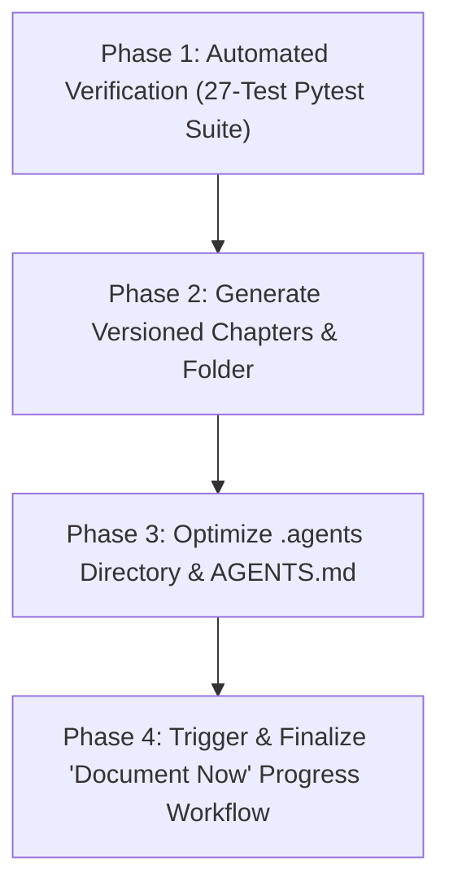

# Dynamic Value Milestone & Chapter Release Workflow Skill

This skill provides a standardized, automated end-to-end milestone release pipeline for the **Modular Adaptive Data Node (MADN) for Dynamic Value Systems**. It unifies codebase verification, academic chapter publication, `.agents` developer optimization, and progress tracking into an integrated workflow.

---

## 1. Trigger Conditions

Execute this workflow whenever the developer specifies:
- `"execute release"` or `"milestone release"`
- `"sync chapters and document"`
- `"publish milestone"`
- `"update chapters and document now"`
- Requests:
  1. Generating an updated version of chapter documentation.
  2. Optimizing the `.agents` directory for the modular adaptive data node in dynamic value systems.
  3. Creating a new versioned folder containing updated chapters that reflect newly implemented features.
  4. Triggering the `document-now` agentic skill.

---

## 2. Standard 4-Phase Execution Pipeline



---

### Phase 1: Automated Test Suite & Codebase Audit

1. Execute the full 27-test automated verification matrix from `Applications/Web App/backend`:
   ```bash
   python -m pytest test_portable_node_generation.py test_customer_banking.py test_business_operators.py test_multibiz_and_vouchers.py test_stage1_core.py -v
   ```
2. Confirm **100% pass rate (27/27 tests passed)** before proceeding. If any test fails, resolve regressions before proceeding.

---

### Phase 2: Create Versioned Folder & Publish Updated Chapters

1. Acquire the authoritative runtime system timestamp:
   - Format for folder name: `YYYY-MM-DD Day HHMM Version YYYY-MM-DD Day HHMM` (e.g. `2026-08-25 Tue 1301 Version 2026-08-25 Tue 1301`).
   - Format for file prefix: `YYYY-MM-DD HHMM` (e.g. `2026-08-25 1301`).
2. Run the chapter publisher script:
   ```bash
   python .agents/skills/dynamic-value-milestone/scripts/build_versioned_chapters.py <version> <codename>
   ```
3. Verify that the new folder is created under `01_Documentation_and_Thesis/Chapters/` containing all 43+ sub-section files and unified chapter files (Chapters 1 through 5+) reflecting:
   - Dynamic Extensible Multi-Currency Engine & Custom Virtual Tokens.
   - Zimbabwe Gold (`ZiG` / `ZWG`) gold-backed currency standard alignment.
   - Global World Currency (ISO 4217) and Cryptocurrency Continuous Ingestion Catalog & Collision Prevention.
   - Tri-Node distributed mesh topology (Operator Node, Data Node, Vault Node).
   - Clean `0.00` balance account initialization.
   - Full 27-test empirical benchmark matrix with 100% verification rate.

---

### Phase 3: Optimize the `.agents` Directory

1. Run the `.agents` optimization utility:
   ```bash
   python .agents/skills/dynamic-value-milestone/scripts/optimize_agents.py
   ```
2. Verify that [.agents/AGENTS.md](file:///c:/Users/ignaz/OneDrive/Documents/Projects/2026-02-15%20Sun%202055%20Modular%20Adaptive%20Data%20Node%20%28MAD%20-%20Node%29%20for%20Dynamic%20Value%20Systems/.agents/AGENTS.md) contains:
   - **Progress Tracking Rule (`document-now`)**
   - **System Internals Documentation Rule (`system-internals-doc`)**
   - **Chapter Development Rule (`chapter-development`)**
   - **Dynamic Value Milestone Release Rule (`dynamic-value-milestone`)**
   - **Tri-Node Architecture & Composable Dynamic Value Systems Standard** (including ISO 4217, ZiG standard, 27-test verification matrix).

---

### Phase 4: Trigger the `document-now` Skill

Execute the standard `document-now` workflow ([SKILL.md](file:///c:/Users/ignaz/OneDrive/Documents/Projects/2026-02-15%20Sun%202055%20Modular%20Adaptive%20Data%20Node%20%28MAD%20-%20Node%29%20for%20Dynamic%20Value%20Systems/.agents/skills/document-now/SKILL.md)):
1. **Synchronize Operational Manuals**:
   - `Applications/Web App/SYSTEM_INTERNALS.md`
   - `Applications/Web App/USER_MANUAL.md`
   - `Applications/Web App/PROJECT_CHECKLIST.md`
2. **Version Registration**:
   - Validate Ndebele version codename uniqueness using `.agents/skills/document-now/scripts/version_registry.py`.
   - Update `progress tracking/version_registry.json` and `progress tracking/Version_Registry.md`.
3. **Generate Progress Document**:
   - Create `progress tracking/YYYY-MM-DD_HHMM_Description.md` following the required schema (including Ndebele version codename, 10-year-old child target explanations and next steps, and developer attributions).
4. **Git Stage & Commit**:
   - Stage all changes (`git add .`) and commit with the standardized message:
     `YYYY-MM-DD Day HHMM: [Title] ([Codename] [Version])`
