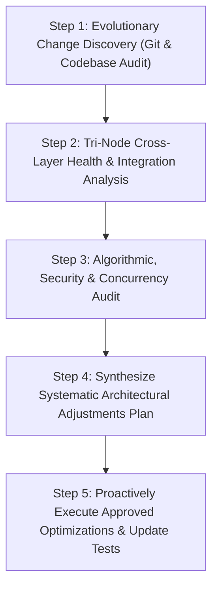

# MADN Evolution Tracker & Adaptive System Advisor

This skill enables Antigravity to act as an **autonomous architectural co-pilot** for the Modular Adaptive Data Node (MADN) ecosystem. It continuously monitors and analyzes the evolutionary trajectory of the project across time, evaluating code patterns, cross-node integration, performance bottlenecks, and system ergonomics to systematically propose and execute high-value improvements.

---

## 1. Trigger Conditions

Activate this skill whenever the developer specifies:
- `"track evolution"` or `"analyze evolution"`
- `"suggest adjustments"` or `"propose improvements"`
- `"analyze architecture"` or `"system audit"`
- `"optimize madn"` or `"adaptive check"`
- When planning the next architectural milestone or major refactor.

---

## 2. Core Execution Workflow



---

### Step 1: Evolutionary Change Discovery

1. Inspect the recent git commit trajectory and modified files over time:
   ```bash
   git log -n 15 --stat --oneline
   ```
2. Analyze what subsystems have recently evolved (e.g., Multi-Currency Ledger, POS Terminal, Agriculture, Security Gates, Node Replication, Offline Mesh).
3. Identify developmental patterns, repeated changes, or areas where technical debt might accumulate.

---

### Step 2: Tri-Node Cross-Layer Health Analysis

Inspect the Tri-Node heterogeneous stack for cross-layer synchronization and architectural completeness:
1. **Operator Node (Frontend - `:8000`)**:
   - Verify UI layout ergonomics (glassmorphic cards, clear typography, intuitive action buttons, responsive sub-tabs, `.panel-fullscreen` expand/restore controls).
   - Ensure user-facing copy is welcoming, clear, and relatable rather than overly nerdy or intimidating.
2. **Data Node (Collector & Discovery - `:8002`)**:
   - Check UDP multicast heartbeat parameters (224.0.0.251:8001).
   - Ensure external data collectors (e.g. World Currencies, Cryptos, Weather, Crop markets) run cleanly without blocking.
   - Verify that data stored in Data Node replicates cleanly to Vault Node via `/api/cluster/sync-data-nodes`.
3. **Vault Node (Ledger & Security Core - `:8000`)**:
   - Verify that database operations enforce SQLite WAL mode and `BEGIN IMMEDIATE` locks.
   - Check HMAC-SHA256 signature verification and scrypt/TOTP credentials.
   - Ensure zero-seed balances rule: All accounts initialize strictly with `0.00` balances.

---

### Step 3: Algorithmic, Security & Concurrency Audit

1. **Continuous Exponential Pricing Math**: Verify dynamic decay formulas:
   \[
   P(t) = \max\left(P_{\text{floor}}, P_{\text{initial}} \cdot e^{-\lambda t}\right)
   \]
2. **Namespace Collision Defense**: Verify multi-tier currency collision checks (`OFFICIAL_ISO_FIAT`, `MAJOR_CRYPTO`, `EXISTING_ACTIVE_CURRENCY`).
3. **Self-Replicating Node Generation**: Verify `node_generator.py` produces independent, zero-config portable node packages.

---

### Step 4: Synthesize Systematic Architectural Adjustments

Generate an **Intelligent Evolution & Adjustment Report** containing:
1. **Architectural Health Score**: Quantitative rating of the codebase health (1-100).
2. **Evolutionary Trajectory Summary**: What has been built, how subsystems connect, and what patterns emerge.
3. **Identified Optimization Opportunities**:
   - Latency reductions and caching.
   - UI/UX polish and responsiveness.
   - Cross-node wiring improvements.
   - Test coverage gaps.
4. **Actionable Adjustment Plan**: Clear, step-by-step proposals with concrete code changes.

---

### Step 5: Proactive Execution & Test Verification

1. Implement approved adjustments cleanly across frontend, backend, and documentation.
2. Run the automated pytest verification suite to guarantee **100% test pass rate**.
3. Synchronize documentation and progress tracking.
