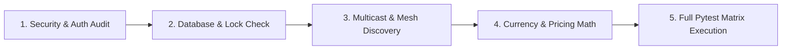

# MADN System Verifier & Security Auditor

This skill provides an automated, rigorous diagnostic and verification engine for the **Modular Adaptive Data Node (MADN)** project. It audits cryptographic credentials, database lock safety, WAL concurrency, bearer signature validity, zero-seed balances, and executes the full automated test suite to ensure flawless reliability.

---

## 1. Trigger Conditions

Activate this skill whenever the developer specifies:
- `"verify system"` or `"system health check"`
- `"audit security"` or `"audit database"`
- `"run verification"` or `"check concurrency"`
- Before publishing a release or after substantial refactoring.

---

## 2. Comprehensive Verification Checklist



---

### Tier 1: Security & Cryptographic Integrity
- **Scrypt Password Hashing**: Verify `scrypt` parameters ($N=16384, r=8, p=1, \text{salt}=16\text{ bytes}$) with constant-time comparison.
- **HMAC-SHA256 Signatures**: Verify bearer tokens and inter-node API authentication.
- **CSRF Token Validation**: Ensure mutation endpoints (`POST`, `PUT`, `DELETE`) require valid `X-CSRF-Token` headers.
- **TOTP Step-Up MFA**: Verify RFC 6238 TOTP validation with sliding window $\pm 1$ step.

### Tier 2: Database Concurrency & Lock Safety
- **SQLite WAL Mode**: Verify `PRAGMA journal_mode=WAL` and `PRAGMA busy_timeout=5000`.
- **Immediate Write Transactions**: Ensure multi-statement write transactions use `BEGIN IMMEDIATE` to prevent `SQLITE_BUSY` deadlock exceptions.
- **Zero-Seed Balances**: Confirm all new user wallets and business accounts initialize with `0.00` balances.

### Tier 3: Distributed Discovery & Mesh Routing
- **UDP Multicast Heartbeats**: Test multicast broadcast on `224.0.0.251:8001` with node metadata payload.
- **Node Sync API**: Verify `/api/cluster/sync-data-nodes` and `/api/node/activate`/`deactivate`.

### Tier 4: Dynamic Value Pricing & Currency Namespaces
- **Continuous Exponential Decay**: Verify price decay formula and floor protection.
- **Multi-Tier Collision Check**: Verify `validate_currency_code_collision()` correctly identifies official fiats, major cryptos, and active vault currencies.

### Tier 5: Automated Pytest Suite Execution
- Execute all core test suites:
  ```bash
  python -m pytest test_portable_node_generation.py test_customer_banking.py test_business_operators.py test_multibiz_and_vouchers.py test_stage1_core.py -v
  ```
- Assert **100% pass rate**.
