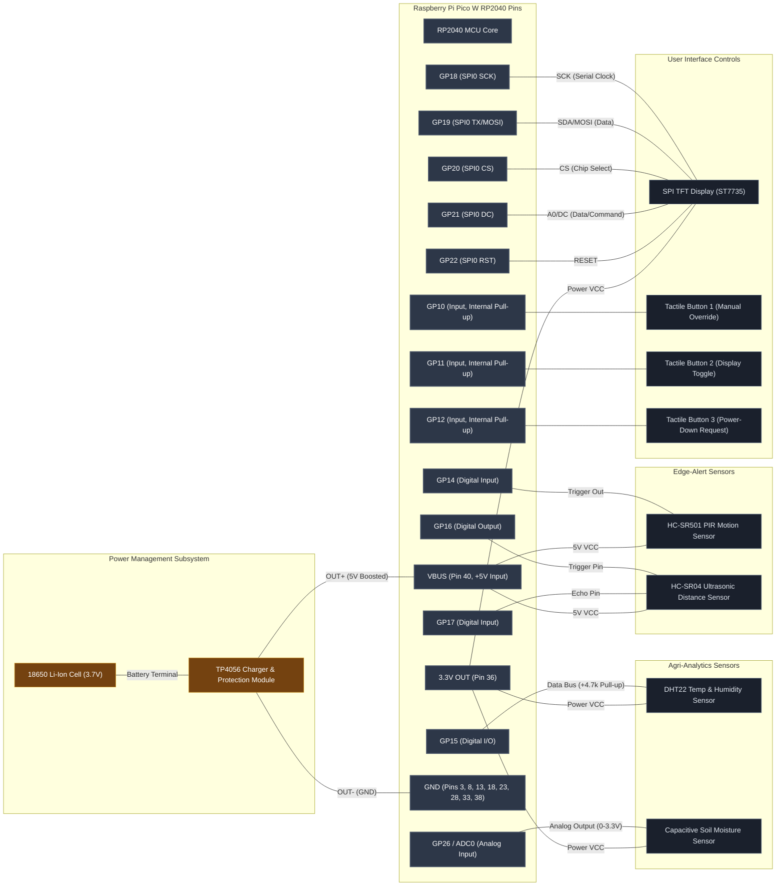
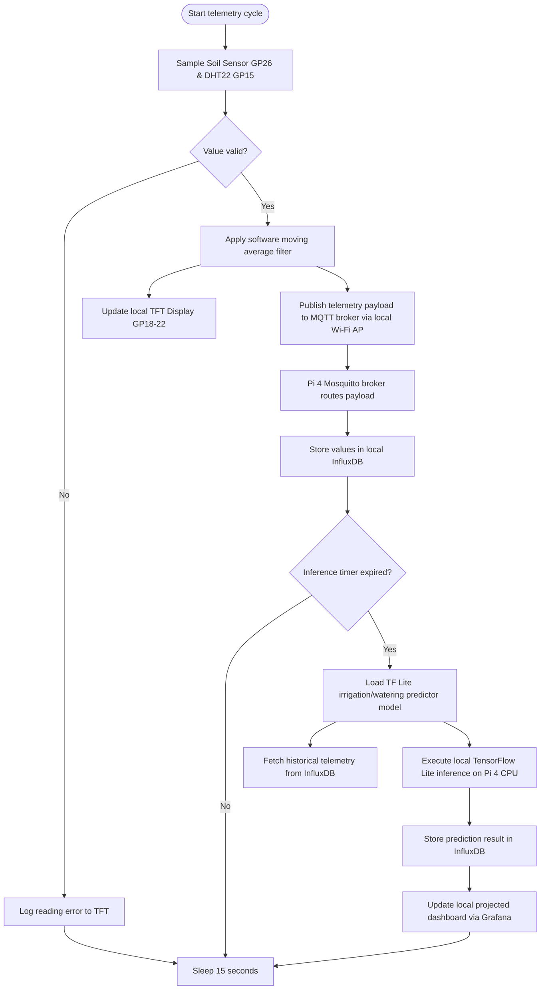
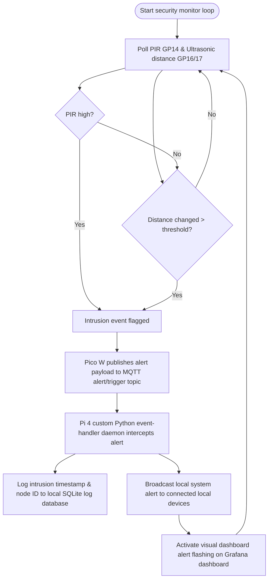
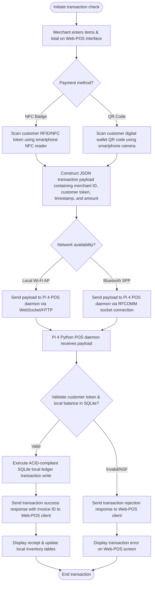

## 3.4 System Design

To map the physical components, electrical interfaces, and logic pathways of the Modular Adaptive Data Node (MADN), this section presents the detailed system design of the prototype. The architecture is structured to support local-first data processing, offline network resiliency, and cost-efficient hardware scaling. The system design is divided into three parts: the structural block diagram, the embedded hardware pin schematic, and the operational logic flowcharts governing telemetry, security, and transaction processing.

---

### 3.4.1 Architectural Block Diagram

The architectural block diagram delineates the system boundaries, runtime environments, and communication interfaces between the three primary tiers: the Central Orchestration Tier (The Vault), the Edge Sensing and Processing Tier (Intelligent Core), and the Mobile Point-of-Sale (POS) Client Tier. 

The central orchestrator runs Kali Linux (ARM64 headless) on a Raspberry Pi 4, hosting a Mosquitto MQTT broker, InfluxDB for time-series telemetry storage, and an SQLite database for transaction ledgers. Guest mobile devices connect to this hub through a localized Wi-Fi Access Point (via hostapd/dnsmasq) or a Bluetooth RFCOMM socket daemon, bypassing the need for cloud-based routing.

```mermaid
flowchart TB
    %% Styling Classes
    classDef hubStyle fill:#1a365d,stroke:#3182ce,stroke-width:2px,color:#fff;
    classDef edgeStyle fill:#2d3748,stroke:#718096,stroke-width:2px,color:#fff;
    classDef clientStyle fill:#2c5282,stroke:#4299e1,stroke-width:2px,color:#fff;
    classDef protocolStyle fill:#234e52,stroke:#319795,stroke-width:1px,color:#fff;

    subgraph Hub ["Central Vault Orchestration Node (Pi 4 - Kali Linux)"]
        OS["Kali Linux (ARM64 Headless)"]:::hubStyle
        AP["Hostapd Wi-Fi Access Point"]:::protocolStyle
        BT["Bluetooth RFCOMM Daemon"]:::protocolStyle
        MQTT["Mosquitto MQTT Broker"]:::protocolStyle
        DB_Telemetry[("InfluxDB Time-Series")]:::hubStyle
        DB_Ledger[("SQLite Transactions")]:::hubStyle
        Logic_Scheduler["Dynamic Resource Scheduler"]:::hubStyle
        Logic_POS["Python POS Daemon"]:::hubStyle
        Logic_Security["Security Alert Daemon"]:::hubStyle
        ML_Model["TensorFlow Lite Inference"]:::hubStyle

        OS --- AP
        OS --- BT
        OS --- MQTT
        MQTT --- DB_Telemetry
        Logic_Scheduler --- DB_Telemetry
        Logic_POS --- DB_Ledger
        Logic_Security --- DB_Ledger
        ML_Model --- DB_Telemetry
    end

    subgraph EdgeNode ["Edge Sensing Core (Pi Pico W)"]
        Firmware["MicroPython Runtime"]:::edgeStyle
        MQTT_Client["umqtt.simple Client"]:::protocolStyle
        Pin_Interface["GPIO / ADC / SPI Physical Bus"]:::edgeStyle
        
        Firmware --- MQTT_Client
        Firmware --- Pin_Interface
    end

    subgraph MobilePOS ["Mobile POS Client Terminal"]
        Browser["Merchant Browser (HTML5 / Vanilla JS)"]:::clientStyle
        NFC["Built-in NFC Chip (Card/Token Scan)"]:::clientStyle
        Camera["Built-in Camera (QR/Barcode Scan)"]:::clientStyle
        
        Browser --- NFC
        Browser --- Camera
    end

    %% Protocols and connections
    MQTT_Client == "Local Wi-Fi / MQTT (offline)" ==> AP
    Browser == "WebSocket / HTTP" ==> AP
    Browser == "Bluetooth RFCOMM" ==> BT
```

---

### 3.4.2 Embedded Hardware Circuit Design

To satisfy the strict cost-reduction parameters of the initial deployment stage, the design routes all edge telemetry sensors, local user interface displays, and physical inputs directly to the native GPIO pins of the Raspberry Pi Pico W. This direct-mapping strategy eliminates the requirement for I2C port expanders (such as the MCP23017), reducing component count and structural complexity.

The electrical schematic layout details the physical pin configurations:
1.  **Agri-Analytics Sensors**: The capacitive soil moisture sensor interfaces via the GP26/ADC0 pin to capture analog voltage readouts. The DHT22 digital temperature and humidity sensor utilizes a single-bus digital line connected to GP15 with an external 4.7kΩ pull-up resistor.
2.  **Edge-Alert Security Sensors**: The HC-SR501 PIR motion sensor outputs a digital signal to GP14, while the HC-SR04 ultrasonic sensor utilizes GP16 for trigger input and GP17 for echo output.
3.  **User Interface & Controls**: The SPI TFT display (ST7735 controller) maps to the hardware SPI0 bus on GP18 (SCK) and GP19 (MOSI/TX), with CS on GP20, DC on GP21, and Reset on GP22. Physical inputs are handled via three tactile push-buttons connected to GP10, GP11, and GP12, configured with internal pull-up resistors.
4.  **Power Distribution**: A TP4056 charging and step-up protection module accepts a 3.7V Lithium-Ion cell and outputs a boosted 5V rail connected to VBUS (Pin 40), powering the 5V PIR and ultrasonic sensors. The Pico W provides a regulated 3.3V output (Pin 36) to power the low-voltage soil sensor, DHT22, and SPI TFT display.

---

### 3.4.3 Operational Flowcharts & Logic Loops

#### 1. Telemetry Accumulation & Inference Loop
The Agri-Analytics Engine relies on an event-triggered feedback and processing loop. The Pico W samples moisture and microclimate variables, applies local filters, displays the results, and publishes raw variables to the orchestrator. The central orchestrator caches the records and executes a TensorFlow Lite watering requirements predictor model at scheduled intervals.

#### 2. Edge-Alert Perimeter Gateway Trigger Loop
The security gateway operates on a continuous low-latency polling loop. Sensors connected to the edge Pico W monitor physical parameters. Once a threshold violation is met, the node bypasses local storage and immediately transmits an MQTT trigger message to the central Vault running Kali Linux. The event handler logs the timestamp and alerts connected devices.

#### 3. Resilient Commerce Checkout Loop
The transaction loop manages merchant checkout execution without cloud verification. Merchants utilize the Web-POS client on their smartphones to scan customer tokens (NFC badge) or wallets (QR codes), transmitting the payload to the local Vault. The Pi 4 validates transaction variables locally and writes them to the SQLite ledger using ACID-compliant transactions.

