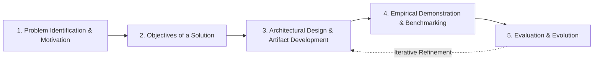

## 3.2 Research Design

The study follows the **Design Science Research Methodology (DSRM)** (Peffers et al., 2007), an established framework for creating and evaluating novel IT artifacts intended to solve identified organizational and infrastructural problems. DSRM is particularly suited for the MAD-Node as it emphasizes iterative prototyping, rigorous empirical evaluation, and pragmatic utility in resource-constrained environments.

The research execution proceeds through five iterative DSRM phases:

1. **Problem Identification & Motivation**: Contextualizing infrastructure vulnerabilities, expensive telecom tariffs, and lack of localized digital value systems in Bulawayo and Tsholotsho (Chapter 1 & 2).
2. **Objectives of a Solution**: Defining engineering criteria for zero-internet autonomy, 4-node taxonomy decoupling, cross-machine zero-configuration discovery, multi-currency accounting, and phased self-funding (*Ukunciphisa*).
3. **Architectural Design & Artifact Development**: Engineering the VisionPro Glassmorphic Web App (Stage 1), FastAPI Vault Gateway, decoupled SQLite WAL Data Node, and Stage 2 Cyber-Physical hardware blueprints.
4. **Empirical Demonstration & Benchmarking**: Deploying artifacts in controlled bench simulations to evaluate discovery latency, write lock throughput, memory footprint, thermal stability, and power draw.
5. **Evaluation & Evolution**: Quantifying system performance against research questions and iterating codebase optimizations.
