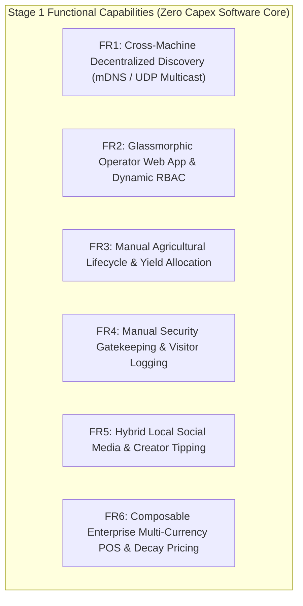

## 3.3 System Requirements

The system requirements are organized systematically across functional tiers (Stage 1 Foundation vs. Stage 2 Scale-Up) and non-functional engineering standards.

### 3.3.1 Stage 1 Functional Requirements (Immediate Software Foundation)

* **FR1: Decentralized Node Discovery**:
  - The system must permit Data Nodes, Vault Nodes, and Operator Nodes to execute across separate directories, physical machines, VMs, or containers on a local subnet.
  - Data Nodes must broadcast a UDP multicast heartbeat (`224.0.0.251:8001`) declaring their IP, port, storage engine, and available capacity.
  - Vault Nodes must dynamically discover active Data Nodes, establish health-checked connections, and route ACID transactions without hardcoded IP configurations.
* **FR2: Operator Web App & Dynamic RBAC**:
  - Provide a responsive VisionPro glassmorphic Single Page Application (SPA) compatible with any modern mobile or desktop browser.
  - Dynamically render views and navigation pills based on active user roles: `admin`, `agronomist`, `guard`, `merchant`, `customer`, and `guest`.
  - Secure authentication via `scrypt` password hashing, RFC 6238 TOTP two-factor authentication, CSRF double-submit cookies, and 15-minute step-up privileged elevation.
* **FR3: Manual Agricultural Lifecycle Tracking**:
  - **Planting Log**: Capture Crop Name/Variety, Plot/Bed Identifier, Planting Timestamp, Seeding Density ($\text{seeds}/\text{m}^2$), Target Maturity Date, and Initial Soil Hydration.
  - **Harvest Log**: Capture Crop ID, Harvest Timestamp, Total Harvested Mass ($\text{kg}$ or $\text{tons}$), Harvest Quality Grade (Grade A/B/C), and Storage Facility.
  - **Yield Disposition Allocation**: Interactive allocation splitting harvest mass between **Self-Consumption** (subsistence/community reserve) and **Composable Enterprise POS Sales**.
* **FR4: Manual Security Gatekeeping & Visitor Management**:
  - **Visitor Access Form**: Record National ID/Passport Number, Full Name, Time In (`time_in`), Time Out (`time_out`), Destination Environment (Main Office, Crop Silos, Farm Quadrant B, Machine Shed), Purpose of Visit, Escort/Host Officer Name, and Status (`Active`, `Checked-Out`, `Overstay Flagged`).
  - Searchable real-time visitor registry accessible offline during power blackouts.
* **FR5: Hybrid Local Social Media & Creator Tipping**:
  - **X Paradigm**: Text micro-posts, threaded comments, and community broadcasts.
  - **Instagram Paradigm**: Multi-photo carousels and produce showcase cards.
  - **Snapchat Paradigm**: 24-hour ephemeral status bubbles for daily stories.
  - **TikTok Paradigm**: Full-screen vertical swipe video reel stream for farming tutorials.
  - **Customer Tipping**: Wallet-to-wallet micro-tipping supporting USD, ZAR, and ZWG.
  - **Captive Network Access**: Bandwidth access tokens generated as QR codes on POS checkout receipts.
* **FR6: Composable Enterprise Multi-Currency Tri-Ledger**:
  - Unified catalog supporting USD base pricing with dynamic exchange conversion to ZAR and ZWG.
  - Continuous exponential price decay engine calculating perishable goods pricing:
    $$P(t) = P_{cost} + (P_{base} - P_{cost}) \cdot e^{-\lambda t}, \quad \lambda = \frac{\ln(2)}{T_{half\_life}}$$
  - Mixed-tender split payment change calculation:
    $$V_{paid} = T_{USD} + \frac{T_{ZAR}}{\text{rate}_{ZAR}} + \frac{T_{ZWG}}{\text{rate}_{ZWG}}$$
  - Strict `BEGIN IMMEDIATE` write locks on SQLite WAL and idempotent request deduplication via `X-Client-Request-Id` headers.

---

### 3.3.2 Stage 2 Functional Requirements (Revenue-Funded Scale-Up Tier)

* **FR7: Cyber-Physical Agricultural Telemetry & Actuation**:
  - Hardware integration with Raspberry Pi Pico W microcontrollers reading capacitive soil moisture (GP26/ADC0) and DHT22 temperature/humidity (GP15).
  - MicroPython non-blocking polling loops transmitting telemetry via MQTT (`port 1883`).
  - GP27 relay shield triggering physical 5V solenoid irrigation valves based on localized quantized TensorFlow Lite model predictions (<15KB FlatBuffer).
* **FR8: Cyber-Physical Perimeter Defense & Spatial Math**:
  - HC-SR501 PIR motion sensor on GP14 (MicroPython hardware interrupt ISR) and HC-SR04 ultrasonic distance sensor on GP16 (Trigger) / GP17 (Echo).
  - GP28 relay actuating high-decibel piezo siren and visual LED strobe upon confirmed perimeter intrusion.
  - Liang-Barsky 2D line-clipping ray-tracing against rectangular map obstacles stored in SQLite `map_obstacles_rtree`.
  - 3-Point RSSI intrusion trilateration calculating physical intruder coordinates $(x_i, y_i)$ on SVG zone maps.
  - Append-only tamper-evident HMAC-SHA256 audit log generation (`security_audit.log`).
* **FR9: Social Media Public Square Beacons**:
  - BLE and localized Wi-Fi beacons broadcasting local feed availability at village markets.
  - Ambient multi-color status LEDs reflecting live local mesh traffic.
* **FR10: Enterprise Hardware Peripherals**:
  - USB/UART thermal receipt printer output and physical cash drawer pulse relays.
  - Contactless NFC/RFID badge readers for rapid operator login.

---

### 3.3.3 Non-Functional Requirements

| Metric Category | Requirement Specification |
| :--- | :--- |
| **NFR1: Offline Latency** | Web App API responses $\le 50\text{ms}$ over local Wi-Fi; edge sensor alert dispatch to Vault $\le 100\text{ms}$. |
| **NFR2: Concurrency & Lock Handling** | Support $\ge 50$ concurrent read requests without lock timeouts (`busy_timeout=5000ms`, WAL mode). |
| **NFR3: Discovery Time** | Cross-machine Data Node to Vault Node mDNS/UDP discovery time $\le 3.0\text{ seconds}$. |
| **NFR4: Power Efficiency** | Total Stage 1 + Stage 2 active system power draw $\le 5.1\text{W}$ at peak inference/write load. |
| **NFR5: Thermal Limits** | Central orchestrator CPU temperature $\le 60^\circ\text{C}$ under continuous load at $38^\circ\text{C}$ ambient. |
| **NFR6: Cryptographic Rigor** | Constant-time token comparisons (`hmac.compare_digest`), scrypt password derivation ($N=16384$). |
| **NFR7: Cost Optimization** | Total prototype hardware expenditure $\le \$120\text{ USD}$ ($>93\%$ capital reduction vs proprietary IoT). |
