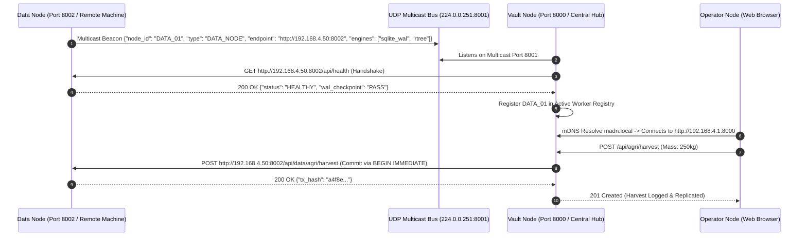
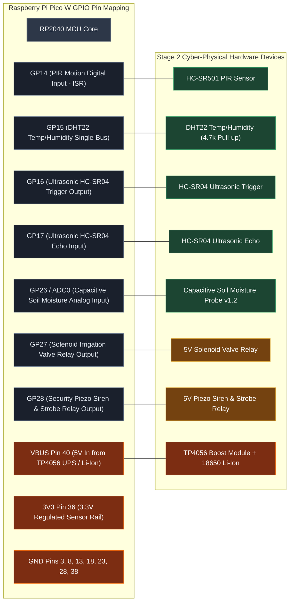
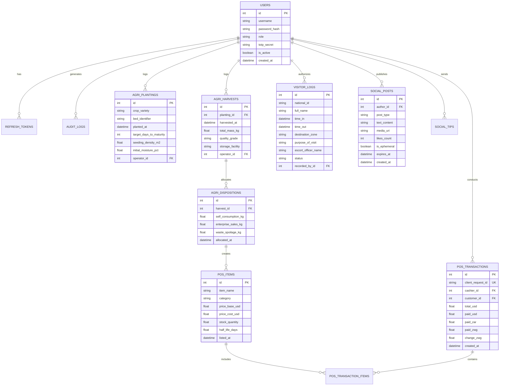

## 3.4 System Design

The system design translates the functional requirements into concrete structural components, network interaction protocols, electrical schematics, database schemas, and permission models.

### 3.4.1 Architectural Block Diagram

```mermaid
# 1. Write the JSON config without UTF-8 BOM
$configContent = @'
{
   "executablePath": "C:\\Users\\ignaz\\chrome-headless-shell\\win64-154.0.8016.0\\chrome-headless-shell-win64\\chrome-headless-shell.exe",
   "args": ["--no-sandbox"]
}
'@
[System.IO.File]::WriteAllText("$PWD\puppeteer-config.json", $configContent, [System.Text.UTF8Encoding]::new($false))

# 2. Mermaid diagram code (fixed dotted arrows and label escaping)
$mermaidCode = @'
flowchart TB
    %% Styling Classes
    classDef opStyle fill:#1a365d,stroke:#3182ce,stroke-width:2px,color:#fff;
    classDef vaultStyle fill:#1c4532,stroke:#38a169,stroke-width:2px,color:#fff;
    classDef dataStyle fill:#44337a,stroke:#805ad5,stroke-width:2px,color:#fff;
    classDef cpStyle fill:#744210,stroke:#d69e2e,stroke-width:2px,color:#fff;
    classDef busStyle fill:#2d3748,stroke:#718096,stroke-width:1px,stroke-dasharray: 4 4,color:#fff;

    subgraph DiscoveryBus ["ZeroConf / mDNS / UDP Multicast Bus (224.0.0.251:8001 / madn.local)"]
        BeaconEngine["Dynamic Peer Registry & Heartbeat Monitor"]:::busStyle
    end

    subgraph OperatorTier ["1. Operator Tier (Multi-Role Client Ecosystem)"]
        WebSPA["VisionPro Glassmorphic Web App (Vanilla JS / HTML5 / CSS3)"]:::opStyle
        RoleViews["Contextual Views (Admin / Agronomist / Guard / Merchant / Customer / Guest)"]:::opStyle
        ClientCache["Service Worker & LocalStorage Nonce Buffer"]:::opStyle
        WebSPA --- RoleViews
        WebSPA --- ClientCache
    end

    subgraph VaultTier ["2. Vault Gateway Tier (Central Hub - Raspberry Pi 4 / Kali Linux)"]
        FastAPIGateway["FastAPI Subsystem Gateway Layer"]:::vaultStyle
        AuthKernel["Security Kernel (scrypt / RFC 6238 TOTP / Step-Up / CSRF)"]:::vaultStyle
        RBACEngine["Fine-Grained RBAC Permission Evaluator"]:::vaultStyle
        DomainRouters["Domain Engines (Agri / Visitor Security / Social / POS Multi-Currency)"]:::vaultStyle
        TFLiteRuntime["Quantized TensorFlow Lite Inference Engine"]:::vaultStyle
        MQTTBroker["Mosquitto MQTT Broker (port 1883)"]:::vaultStyle

        FastAPIGateway --- AuthKernel
        FastAPIGateway --- RBACEngine
        FastAPIGateway --- DomainRouters
        DomainRouters --- TFLiteRuntime
        DomainRouters --- MQTTBroker
    end

    subgraph DataTier ["3. Decoupled Data Tier (Decentralized Workers - Any Folder / Machine)"]
        SQLiteEngine[("SQLite 3 (PRAGMA journal_mode=WAL;)")]:::dataStyle
        SpatialIndex[("SQLite R*Tree Virtual Spatial Index")]:::dataStyle
        InfluxEngine[("InfluxDB v2 Time-Series Engine")]:::dataStyle
        MediaStore["Decentralized Media Asset File System"]:::dataStyle
        AlgoRoutines["Algorithmic Execution (Liang-Barsky / Exponential Decay / Nonce Cache)"]:::dataStyle

        SQLiteEngine --- SpatialIndex
        SQLiteEngine --- AlgoRoutines
    end

    subgraph CPTier ["4. Cyber-Physical Tier (Field Nodes - RP2040 Pico W / MicroPython — STAGE 2)"]
        PicoCore["RP2040 MCU Core (MicroPython Runtime)"]:::cpStyle
        AgriSensors["Capacitive Soil Moisture (ADC0) & DHT22 (GP15)"]:::cpStyle
        AgriActuator["Solenoid Irrigation Valve Relay (GP27)"]:::cpStyle
        SecSensors["HC-SR501 PIR (GP14) & HC-SR04 Ultrasonic (GP16/17)"]:::cpStyle
        SecActuator["Piezo Siren & Strobe Relay (GP28)"]:::cpStyle
        POSHardware["Thermal Receipt Printer & Cash Drawer Relay"]:::cpStyle

        PicoCore --- AgriSensors
        PicoCore --- AgriActuator
        PicoCore --- SecSensors
        PicoCore --- SecActuator
        PicoCore --- POSHardware
    end

    OperatorTier <==>|"mDNS Resolution & HTTP/REST / WebSockets"| VaultTier
    VaultTier <==>|"ACID RPC / Mesh Bus"| DataTier
    VaultTier <-->|"MQTT JSON Streams (Stage 2)"| CPTier

    OperatorTier -.-> DiscoveryBus
    VaultTier -.-> DiscoveryBus
    DataTier -.-> DiscoveryBus
    CPTier -.-> DiscoveryBus
```

---

### 3.4.2 Cross-Machine Decentralized Discovery Protocol



---

### 3.4.3 Role-Based Access Control (RBAC) Matrix

| Module / Operation | Admin | Agronomist | Guard | Merchant | Customer | Guest |
| :--- | :---: | :---: | :---: | :---: | :---: | :---: |
| **System Settings & Federation** | **CRUD** | None | None | None | None | None |
| **Security Audit Logs (Step-Up)** | **CRUD** | None | Read | None | None | None |
| **Visitor Check-In / Check-Out** | **CRUD** | Read | **CRUD** | None | None | None |
| **Perimeter Tripwires & Map** | **CRUD** | Read | **CRUD** | None | None | None |
| **Planting & Harvest Logging** | **CRUD** | **CRUD** | None | Read | None | None |
| **Yield Split (Self vs Sales)** | **CRUD** | **CRUD** | None | Read | None | None |
| **POS Catalog & Price Decay** | **CRUD** | Read | None | **CRUD** | Read | Read |
| **Checkout & Mixed Tender** | **CRUD** | None | None | **CRUD** | **Create** | None |
| **Social Feeds & Posting** | **CRUD** | **CRUD** | **CRUD** | **CRUD** | **CRUD** | Read |
| **Creator Micro-Tipping** | **CRUD** | **CRUD** | **CRUD** | **CRUD** | **CRUD** | None |
| **Bandwidth Voucher Vending** | **CRUD** | None | None | **CRUD** | Redeem | None |

---

### 3.4.4 Embedded Hardware Pin Schematic (Stage 2 Cyber-Physical Nodes)



---

### 3.4.5 Database Schema & Entity Relationships


