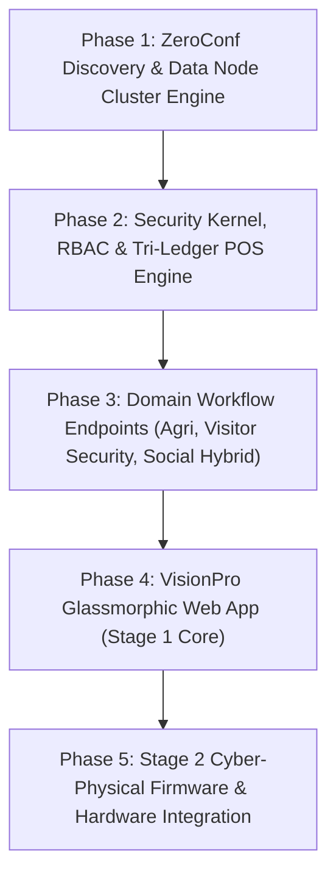

## 3.6 Development Procedure

The technical implementation was executed through a five-stage engineering procedure:

1. **Phase 1: ZeroConf Discovery & Data Node Decoupling**:
   - Engineered the UDP multicast beacon listener and mDNS responder scripts.
   - Initialized the decoupled SQLite schema with WAL configuration (`PRAGMA journal_mode=WAL;`, `PRAGMA busy_timeout=5000;`) and R\*Tree virtual bounding tables.
2. **Phase 2: Security Kernel, RBAC & Tri-Ledger Engine**:
   - Implemented `scrypt` password hashing, TOTP two-factor token evaluation, and double-submit CSRF cookies.
   - Built the multi-currency ledger with mixed-tender conversion algorithms and continuous exponential price decay functions.
3. **Phase 3: Domain Workflow Endpoints**:
   - Implemented REST and WebSocket endpoints for agricultural planting/harvest logs and disposition splits.
   - Built the visitor access check-in/check-out router and audit log append functions.
   - Developed social media post ingestion, image carousels, and creator micro-tipping endpoints.
4. **Phase 4: VisionPro Glassmorphic Web Application**:
   - Developed the 3-panel fluid glassmorphic layout in pure HTML5, vanilla JavaScript, and modern CSS3 (`backdrop-filter: blur(28px)`).
   - Wired dynamic RBAC view switching and sub-navigation pill updates.
5. **Phase 5: Stage 2 Cyber-Physical Firmware & Hardware Prototyping**:
   - Programmed MicroPython sensor polling scripts, interrupt service routines (ISRs), and MQTT publish loops on the Raspberry Pi Pico W.
   - Fabricated PETG 3D-printed enclosures and soldered Adafruit Terminal PiCowbell stacks.
