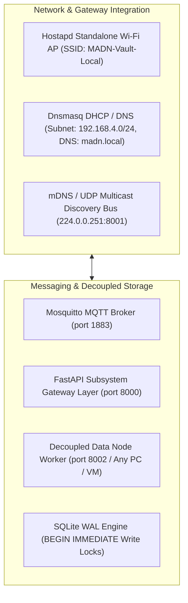

## 4.4 Integration of Components

The integration of software daemons, network routing layers, decoupled storage nodes, and edge microcontrollers established an autonomous local micro-cloud operating entirely independent of the public internet.

### 4.4.1 Network & Zero-Configuration Discovery Integration
* **Standalone Wi-Fi Subnet**: The Raspberry Pi 4 executes `hostapd` and `dnsmasq` to broadcast the localized `MADN-Vault-Local` Wi-Fi SSID, assigning IP leases across `192.168.4.0/24` and resolving `madn.local` to `192.168.4.1`.
* **Cross-Machine UDP Multicast Protocol**: Data Nodes running in separate directories, physical workstations, or VMs broadcast JSON beacons over `224.0.0.251:8001`. The Vault Gateway receives beacons, verifies health via an HTTP handshake, and dynamically binds storage routes without manual configuration.

### 4.4.2 Message Broker & Real-Time WebSocket Integration
* **Mosquitto MQTT Subsystem**: Bound to local subnet port 1883. MicroPython Pico W nodes publish JSON telemetry to `madn/agri/telemetry` and `madn/security/alerts`.
* **FastAPI WebSocket Streaming**: Client Web App Operator Nodes connect via `/api/ws/live` to receive real-time telemetry updates, security tripwire alerts, and creator tip notifications without polling overhead.
