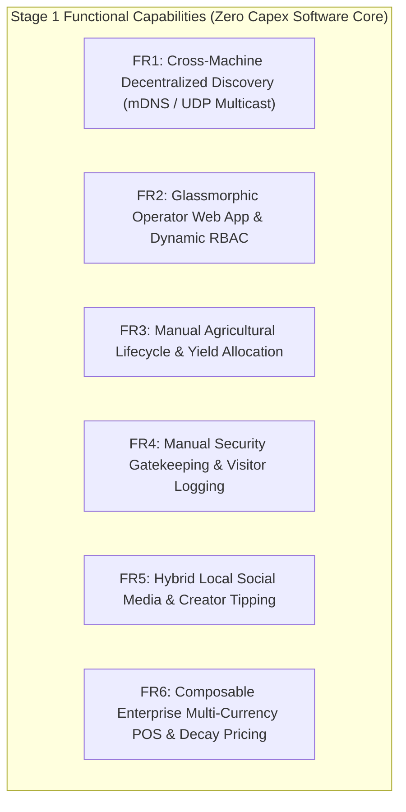
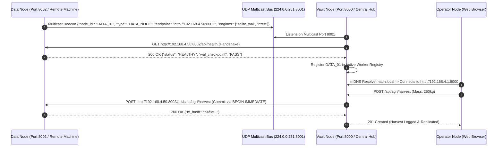
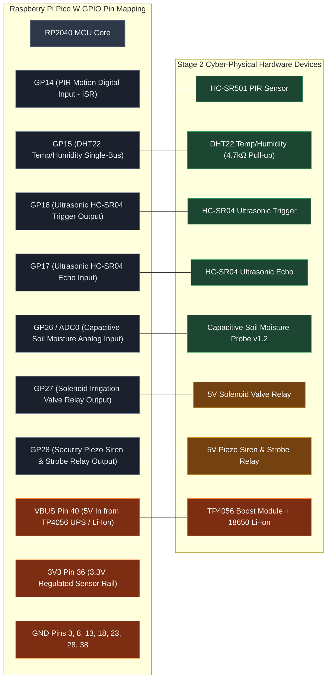
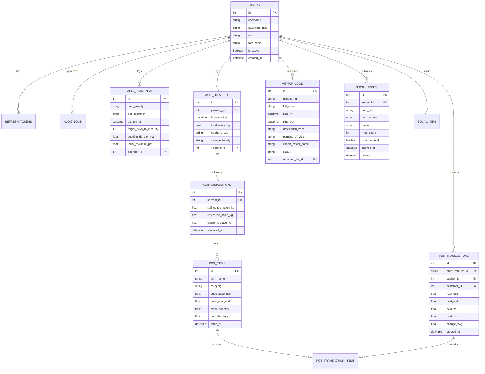
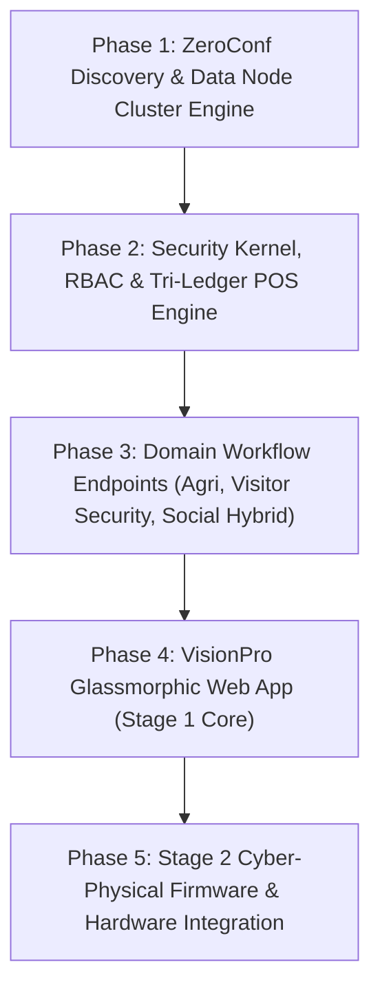

# CHAPTER 3: RESEARCH METHODOLOGY AND SYSTEM DESIGN

## 3.1 Introduction

This chapter details the research methodology, architectural specifications, and structural system design governing the development of the **Modular Adaptive Data Node (MAD-Node) for Dynamic Value Systems**. The system design translates the conceptual 4-Node Taxonomy (Operator Nodes, Vault Nodes, Data Nodes, Cyber-Physical Nodes) and Phased Resource-Bootstrapping Model (*Ukunciphisa*) into rigorous engineering specifications. 

This chapter outlines the Design Science Research (DSR) methodology, defines comprehensive functional and non-functional requirements for Stage 1 (immediate software foundation) and Stage 2 (scale-up hardware automation), presents formal discovery protocols and hardware pin mappings, details the database schemas and Role-Based Access Control (RBAC) matrix (including the Customer role), and establishes the experimental testing and ethical frameworks guiding prototype validation.

---

## 3.2 Research Design

The study follows the **Design Science Research Methodology (DSRM)** (Peffers et al., 2007), an established framework for creating and evaluating novel IT artifacts intended to solve identified organizational and infrastructural problems. DSRM is particularly suited for the MAD-Node as it emphasizes iterative prototyping, rigorous empirical evaluation, and pragmatic utility in resource-constrained environments.

The research execution proceeds through five iterative DSRM phases:


1. **Problem Identification & Motivation**: Contextualizing infrastructure vulnerabilities, expensive telecom tariffs, and lack of localized digital value systems in Bulawayo and Tsholotsho (Chapter 1 & 2).
2. **Objectives of a Solution**: Defining engineering criteria for zero-internet autonomy, 4-node taxonomy decoupling, cross-machine zero-configuration discovery, multi-currency accounting, and phased self-funding (*Ukunciphisa*).
3. **Architectural Design & Artifact Development**: Engineering the VisionPro Glassmorphic Web App (Stage 1), FastAPI Vault Gateway, decoupled SQLite WAL Data Node, and Stage 2 Cyber-Physical hardware blueprints.
4. **Empirical Demonstration & Benchmarking**: Deploying artifacts in controlled bench simulations to evaluate discovery latency, write lock throughput, memory footprint, thermal stability, and power draw.
5. **Evaluation & Evolution**: Quantifying system performance against research questions and iterating codebase optimizations.

---

## 3.3 System Requirements

The system requirements are organized systematically across functional tiers (Stage 1 Foundation vs. Stage 2 Scale-Up) and non-functional engineering standards.

### 3.3.1 Stage 1 Functional Requirements (Immediate Software Foundation)



* **FR1: Decentralized Node Discovery**:
  - The system must permit Data Nodes, Vault Nodes, and Operator Nodes to execute across separate directories, physical machines, VMs, or containers on a local subnet.
  - Data Nodes must broadcast a UDP multicast heartbeat (`224.0.0.251:8001`) declaring their IP, port, storage engine, and available capacity.
  - Vault Nodes must dynamically discover active Data Nodes, establish health-checked connections, and route ACID transactions without hardcoded IP configurations.
* **FR2: Operator Web App & Dynamic RBAC**:
  - Provide a responsive VisionPro glassmorphic Single Page Application (SPA) compatible with any modern mobile or desktop browser.
  - Dynamically render views and navigation pills based on active user roles: `admin`, `agronomist`, `guard`, `merchant`, `customer`, and `guest`.
  - Secure authentication via `scrypt` password hashing, RFC 6238 TOTP two-factor authentication, CSRF double-submit cookies, and 15-minute step-up privileged elevation.
* **FR3: Manual Agricultural Lifecycle Tracking**:
  - **Planting Log**: Capture Crop Name/Variety, Plot/Bed Identifier, Planting Timestamp, Seeding Density ($\text{seeds}/\text{m}^2$), Target Maturity Date, and Initial Soil Hydration.
  - **Harvest Log**: Capture Crop ID, Harvest Timestamp, Total Harvested Mass ($\text{kg}$ or $\text{tons}$), Harvest Quality Grade (Grade A/B/C), and Storage Facility.
  - **Yield Disposition Allocation**: Interactive allocation splitting harvest mass between **Self-Consumption** (subsistence/community reserve) and **Composable Enterprise POS Sales**.
* **FR4: Manual Security Gatekeeping & Visitor Management**:
  - **Visitor Access Form**: Record National ID/Passport Number, Full Name, Time In (`time_in`), Time Out (`time_out`), Destination Environment (Main Office, Crop Silos, Farm Quadrant B, Machine Shed), Purpose of Visit, Escort/Host Officer Name, and Status (`Active`, `Checked-Out`, `Overstay Flagged`).
  - Searchable real-time visitor registry accessible offline during power blackouts.
* **FR5: Hybrid Local Social Media & Creator Tipping**:
  - **X Paradigm**: Text micro-posts, threaded comments, and community broadcasts.
  - **Instagram Paradigm**: Multi-photo carousels and produce showcase cards.
  - **Snapchat Paradigm**: 24-hour ephemeral status bubbles for daily stories.
  - **TikTok Paradigm**: Full-screen vertical swipe video reel stream for farming tutorials.
  - **Customer Tipping**: Wallet-to-wallet micro-tipping supporting USD, ZAR, and ZWG.
  - **Captive Network Access**: Bandwidth access tokens generated as QR codes on POS checkout receipts.
* **FR6: Composable Enterprise Multi-Currency Tri-Ledger**:
  - Unified catalog supporting USD base pricing with dynamic exchange conversion to ZAR and ZWG.
  - Continuous exponential price decay engine calculating perishable goods pricing:
    $$P(t) = P_{cost} + (P_{base} - P_{cost}) \cdot e^{-\lambda t}, \quad \lambda = \frac{\ln(2)}{T_{half\_life}}$$
  - Mixed-tender split payment change calculation:
    $$V_{paid} = T_{USD} + \frac{T_{ZAR}}{\text{rate}_{ZAR}} + \frac{T_{ZWG}}{\text{rate}_{ZWG}}$$
  - Strict `BEGIN IMMEDIATE` write locks on SQLite WAL and idempotent request deduplication via `X-Client-Request-Id` headers.

---

### 3.3.2 Stage 2 Functional Requirements (Revenue-Funded Scale-Up Tier)

* **FR7: Cyber-Physical Agricultural Telemetry & Actuation**:
  - Hardware integration with Raspberry Pi Pico W microcontrollers reading capacitive soil moisture (GP26/ADC0) and DHT22 temperature/humidity (GP15).
  - MicroPython non-blocking polling loops transmitting telemetry via MQTT (`port 1883`).
  - GP27 relay shield triggering physical 5V solenoid irrigation valves based on localized quantized TensorFlow Lite model predictions (<15KB FlatBuffer).
* **FR8: Cyber-Physical Perimeter Defense & Spatial Math**:
  - HC-SR501 PIR motion sensor on GP14 (MicroPython hardware interrupt ISR) and HC-SR04 ultrasonic distance sensor on GP16 (Trigger) / GP17 (Echo).
  - GP28 relay actuating high-decibel piezo siren and visual LED strobe upon confirmed perimeter intrusion.
  - Liang-Barsky 2D line-clipping ray-tracing against rectangular map obstacles stored in SQLite `map_obstacles_rtree`.
  - 3-Point RSSI intrusion trilateration calculating physical intruder coordinates $(x_i, y_i)$ on SVG zone maps.
  - Append-only tamper-evident HMAC-SHA256 audit log generation (`security_audit.log`).
* **FR9: Social Media Public Square Beacons**:
  - BLE and localized Wi-Fi beacons broadcasting local feed availability at village markets.
  - Ambient multi-color status LEDs reflecting live local mesh traffic.
* **FR10: Enterprise Hardware Peripherals**:
  - USB/UART thermal receipt printer output and physical cash drawer pulse relays.
  - Contactless NFC/RFID badge readers for rapid operator login.

---

### 3.3.3 Non-Functional Requirements

| Metric Category | Requirement Specification |
| :--- | :--- |
| **NFR1: Offline Latency** | Web App API responses $\le 50\text{ms}$ over local Wi-Fi; edge sensor alert dispatch to Vault $\le 100\text{ms}$. |
| **NFR2: Concurrency & Lock Handling** | Support $\ge 50$ concurrent read requests without lock timeouts (`busy_timeout=5000ms`, WAL mode). |
| **NFR3: Discovery Time** | Cross-machine Data Node to Vault Node mDNS/UDP discovery time $\le 3.0\text{ seconds}$. |
| **NFR4: Power Efficiency** | Total Stage 1 + Stage 2 active system power draw $\le 5.1\text{W}$ at peak inference/write load. |
| **NFR5: Thermal Limits** | Central orchestrator CPU temperature $\le 60^\circ\text{C}$ under continuous load at $38^\circ\text{C}$ ambient. |
| **NFR6: Cryptographic Rigor** | Constant-time token comparisons (`hmac.compare_digest`), scrypt password derivation ($N=16384$). |
| **NFR7: Cost Optimization** | Total prototype hardware expenditure $\le \$120\text{ USD}$ ($>93\%$ capital reduction vs proprietary IoT). |

---

## 3.4 System Design

The system design translates the functional requirements into concrete structural components, network interaction protocols, electrical schematics, database schemas, and permission models.

### 3.4.1 Architectural Block Diagram

```mermaid
flowchart TB
    %% Styling Classes
    classDef opStyle fill:#1a365d,stroke:#3182ce,stroke-width:2px,color:#fff;
    classDef vaultStyle fill:#1c4532,stroke:#38a169,stroke-width:2px,color:#fff;
    classDef dataStyle fill:#44337a,stroke:#805ad5,stroke-width:2px,color:#fff;
    classDef cpStyle fill:#744210,stroke:#d69e2e,stroke-width:2px,color:#fff;
    classDef busStyle fill:#2d3748,stroke:#718096,stroke-width:1px,stroke-dasharray: 4 4,color:#fff;

    subgraph DiscoveryBus ["ZeroConf / mDNS / UDP Multicast Bus (224.0.0.251:8001 / madn.local)"]
        BeaconEngine["Dynamic Peer Registry & Heartbeat Monitor"]:::busStyle
    end

    subgraph OperatorTier ["1. Operator Tier (Multi-Role Client Ecosystem)"]
        WebSPA["VisionPro Glassmorphic Web App (Vanilla JS / HTML5 / CSS3)"]:::opStyle
        RoleViews["Contextual Views (Admin / Agronomist / Guard / Merchant / Customer / Guest)"]:::opStyle
        ClientCache["Service Worker & LocalStorage Nonce Buffer"]:::opStyle
        WebSPA --- RoleViews
        WebSPA --- ClientCache
    end

    subgraph VaultTier ["2. Vault Gateway Tier (Central Hub - Raspberry Pi 4 / Kali Linux)"]
        FastAPIGateway["FastAPI Subsystem Gateway Layer"]:::vaultStyle
        AuthKernel["Security Kernel (scrypt / RFC 6238 TOTP / Step-Up / CSRF)"]:::vaultStyle
        RBACEngine["Fine-Grained RBAC Permission Evaluator"]:::vaultStyle
        DomainRouters["Domain Engines (Agri / Visitor Security / Social / POS Multi-Currency)"]:::vaultStyle
        TFLiteRuntime["Quantized TensorFlow Lite Inference Engine"]:::vaultStyle
        MQTTBroker["Mosquitto MQTT Broker (port 1883)"]:::vaultStyle

        FastAPIGateway --- AuthKernel
        FastAPIGateway --- RBACEngine
        FastAPIGateway --- DomainRouters
        DomainRouters --- TFLiteRuntime
        DomainRouters --- MQTTBroker
    end

    subgraph DataTier ["3. Decoupled Data Tier (Decentralized Workers - Any Folder / Machine)"]
        SQLiteEngine[("SQLite 3 (PRAGMA journal_mode=WAL;)")]:::dataStyle
        SpatialIndex[("SQLite R*Tree Virtual Spatial Index")]:::dataStyle
        InfluxEngine[("InfluxDB v2 Time-Series Engine")]:::dataStyle
        MediaStore["Decentralized Media Asset File System"]:::dataStyle
        AlgoRoutines["Algorithmic Execution (Liang-Barsky / Exponential Decay / Nonce Cache)"]:::dataStyle

        SQLiteEngine --- SpatialIndex
        SQLiteEngine --- AlgoRoutines
    end

    subgraph CPTier ["4. Cyber-Physical Tier (Field Nodes - RP2040 Pico W / MicroPython — STAGE 2)"]
        PicoCore["RP2040 MCU Core (MicroPython Runtime)"]:::cpStyle
        AgriSensors["Capacitive Soil Moisture (ADC0) & DHT22 (GP15)"]:::cpStyle
        AgriActuator["Solenoid Irrigation Valve Relay (GP27)"]:::cpStyle
        SecSensors["HC-SR501 PIR (GP14) & HC-SR04 Ultrasonic (GP16/17)"]:::cpStyle
        SecActuator["Piezo Siren & Strobe Relay (GP28)"]:::cpStyle
        POSHardware["Thermal Receipt Printer & Cash Drawer Relay"]:::cpStyle

        PicoCore --- AgriSensors
        PicoCore --- AgriActuator
        PicoCore --- SecSensors
        PicoCore --- SecActuator
        PicoCore --- POSHardware
    end

    OperatorTier <==>|mDNS Resolution & HTTP/REST / WebSockets| VaultTier
    VaultTier <==>|ACID RPC / Mesh Bus| DataTier
    VaultTier <-.->|MQTT JSON Streams (Stage 2)| CPTier

    OperatorTier -.-> DiscoveryBus
    VaultTier -.-> DiscoveryBus
    DataTier -.-> DiscoveryBus
    CPTier -.-> DiscoveryBus
```

---

### 3.4.2 Cross-Machine Decentralized Discovery Protocol



---

### 3.4.3 Role-Based Access Control (RBAC) Matrix

| Module / Operation | Admin | Agronomist | Guard | Merchant | Customer | Guest |
| :--- | :---: | :---: | :---: | :---: | :---: | :---: |
| **System Settings & Federation** | **CRUD** | None | None | None | None | None |
| **Security Audit Logs (Step-Up)** | **CRUD** | None | Read | None | None | None |
| **Visitor Check-In / Check-Out** | **CRUD** | Read | **CRUD** | None | None | None |
| **Perimeter Tripwires & Map** | **CRUD** | Read | **CRUD** | None | None | None |
| **Planting & Harvest Logging** | **CRUD** | **CRUD** | None | Read | None | None |
| **Yield Split (Self vs Sales)** | **CRUD** | **CRUD** | None | Read | None | None |
| **POS Catalog & Price Decay** | **CRUD** | Read | None | **CRUD** | Read | Read |
| **Checkout & Mixed Tender** | **CRUD** | None | None | **CRUD** | **Create** | None |
| **Social Feeds & Posting** | **CRUD** | **CRUD** | **CRUD** | **CRUD** | **CRUD** | Read |
| **Creator Micro-Tipping** | **CRUD** | **CRUD** | **CRUD** | **CRUD** | **CRUD** | None |
| **Bandwidth Voucher Vending** | **CRUD** | None | None | **CRUD** | Redeem | None |

---

### 3.4.4 Embedded Hardware Pin Schematic (Stage 2 Cyber-Physical Nodes)



---

### 3.4.5 Database Schema & Entity Relationships



---

## 3.5 Tools and Materials Used

The development and empirical validation of the MAD-Node framework utilized a combination of low-cost hardware components, robust embedded modules, and open-source software libraries.

### 3.5.1 Software Development Stack & Frameworks

| Software Component | Technology / Library | Purpose & Justification |
| :--- | :--- | :--- |
| **Backend Web Framework** | Python 3.11 / FastAPI | High-concurrency async REST/WebSocket routing and auto-generated OpenAPI documentation. |
| **Database Engine** | SQLite 3 (WAL Mode) | Zero-configuration ACID transactional storage with sub-millisecond write performance. |
| **Spatial Indexing** | SQLite R\*Tree Virtual Table | 2D bounding-box spatial indexing for obstacle attenuation and ray-tracing lookups. |
| **Security & Auth Kernel** | `hashlib` (scrypt), `pyotp` (TOTP), `secrets` | Cryptographically secure key derivation ($N=16384$), 2FA token generation, and constant-time CSRF verification. |
| **Message Broker** | Eclipse Mosquitto (MQTT v3.1.1) | Ultra-lightweight publish/subscribe telemetry and alert routing on port 1883. |
| **Microcontroller Firmware** | MicroPython v1.22 | Non-blocking asynchronous I/O and interrupt service routine (ISR) handling on RP2040. |
| **Frontend Architecture** | HTML5 / Vanilla JS / CSS3 Glassmorphism | Lightweight, zero-build SPA compatible with legacy and modern mobile browsers. |

### 3.5.2 Hardware Prototype Materials (Stage 1 & Stage 2)

| Hardware Item | Technical Specifications | Function within MAD-Node | Cost (USD) |
| :--- | :--- | :--- | :---: |
| **Raspberry Pi 4 Model B** | 4GB LPDDR4, Quad-core Cortex-A72 @ 1.5GHz | Central Vault Node & Orchestrator Hub | $55.00 |
| **Raspberry Pi Pico W** | RP2040 Dual-core ARM Cortex-M0+, CYW43439 Wi-Fi | Cyber-Physical Node Core (Stage 2) | $6.00 |
| **Adafruit Terminal PiCowbell** | 2x20 socket header with spring screw terminals | Solderless, strain-relieved field wiring (Stage 2) | $4.95 |
| **Capacitive Soil Moisture Sensor** | Analog output v1.2, corrosion-resistant PCB | Soil hydration monitoring without electrolysis (Stage 2) | $1.80 |
| **DHT22 Sensor** | Single-bus digital, $-40\text{ to }80^\circ\text{C}, 0-100\%\text{ RH}$ | Ambient temperature and humidity tracking (Stage 2) | $3.50 |
| **HC-SR501 PIR Motion Sensor** | Digital trigger output, $120^\circ$ cone, $7\text{m}$ range | Perimeter intrusion detection (Stage 2) | $1.50 |
| **HC-SR04 Ultrasonic Sensor** | $2\text{cm}-400\text{cm}$ range, $3\text{mm}$ resolution | Virtual boundary tripwire monitoring (Stage 2) | $1.20 |
| **5V Relay Modules** | 1-Channel optocoupled relays (10A 250VAC / 30VDC) | Solenoid valve & siren actuation (Stage 2) | $2.00 |
| **Power Supply & UPS Buffer** | 3.7V 18650 Li-Ion (2600mAh) + TP4056 5V boost | Uninterruptible DC power buffer | $6.50 |
| **Custom Enclosure** | 3D Printed PETG with dual active fans | Weather-resistant, thermal extraction housing | $4.00 |
| **Total Hardware Prototype Cost** | | | **$86.45** |

---

## 3.6 Development Procedure

The technical implementation was executed through a five-stage engineering procedure:



1. **Phase 1: ZeroConf Discovery & Data Node Decoupling**:
   - Engineered the UDP multicast beacon listener and mDNS responder scripts.
   - Initialized the decoupled SQLite schema with WAL configuration (`PRAGMA journal_mode=WAL;`, `PRAGMA busy_timeout=5000;`) and R\*Tree virtual bounding tables.
2. **Phase 2: Security Kernel, RBAC & Tri-Ledger Engine**:
   - Implemented `scrypt` password hashing, TOTP two-factor token evaluation, and double-submit CSRF cookies.
   - Built the multi-currency ledger with mixed-tender conversion algorithms and continuous exponential price decay functions.
3. **Phase 3: Domain Workflow Endpoints**:
   - Implemented REST and WebSocket endpoints for agricultural planting/harvest logs and disposition splits.
   - Built the visitor access check-in/check-out router and audit log append functions.
   - Developed social media post ingestion, image carousels, and creator micro-tipping endpoints.
4. **Phase 4: VisionPro Glassmorphic Web Application**:
   - Developed the 3-panel fluid glassmorphic layout in pure HTML5, vanilla JavaScript, and modern CSS3 (`backdrop-filter: blur(28px)`).
   - Wired dynamic RBAC view switching and sub-navigation pill updates.
5. **Phase 5: Stage 2 Cyber-Physical Firmware & Hardware Prototyping**:
   - Programmed MicroPython sensor polling scripts, interrupt service routines (ISRs), and MQTT publish loops on the Raspberry Pi Pico W.
   - Fabricated PETG 3D-printed enclosures and soldered Adafruit Terminal PiCowbell stacks.

---

## 3.7 Testing Methods

To validate the MAD-Node framework against its engineering requirements, a multi-faceted testing protocol was designed:

1. **Automated Unit & Cryptographic Test Suite**:
   - Python `unittest` scripts (`test_auth.py`, `test_endpoints_live.py`, `test_cycle3.py`, `test_cycle4.py`) executing automated test cases validating `scrypt` hashing, TOTP verification windows, CSRF token matching, and 15-minute step-up elevation.
2. **Decoupled Cross-Machine Discovery & Ingestion Tests**:
   - Executing Data Node instances on separate physical workstations across a local Wi-Fi router.
   - Measuring UDP multicast beacon discovery latency and transaction replication throughput under varying network loads.
3. **Database Concurrency & Write Lock Contention Simulation**:
   - Spawning 50 concurrent client threads submitting simultaneous checkout and inventory deduction requests.
   - Measuring response latencies, SQLite WAL busy timeout occurrences, and idempotency cache hit rates.
4. **Thermal & Power Profiling**:
   - Benchmarking Raspberry Pi 4 CPU core temperatures during continuous TensorFlow Lite inferences under simulated $38^\circ\text{C}$ ambient temperatures using `vcgencmd measure_temp`.
   - Measuring total system current draw and power consumption using an inline digital USB multimeter (5V rail).
5. **RF Propagation & Ray-Tracing Validation**:
   - Benchmarking Liang-Barsky obstacle intersection calculations against synthetic 2D field maps with metal silos, brick barns, and foliage obstacles.

---

## 3.8 Ethical and Safety Considerations

The deployment of cyber-physical systems and distributed identity ledgers introduces critical ethical, privacy, and physical safety dimensions:

1. **Visitor Privacy & Data Sovereignty**:
   - Manual visitor logs and National ID records contain personally identifiable information (PII). In compliance with data protection principles, all visitor logs are stored locally on the decentralized Data Node cluster and are never uploaded to third-party public clouds. Role-Based Access Control restricts visitor PII access exclusively to authorized `guard` and `admin` roles, with all read operations tracked in tamper-evident HMAC audit logs.
2. **Physical Actuator Safety**:
   - Automated physical actuators (5V solenoid water valves and GP28 security sirens) incorporate software watchdogs and hardware limiters to prevent hazardous conditions (e.g., unintended flooding of agricultural beds or continuous deafening alarm activation due to sensor faults).
3. **Financial Transparency & Fair Dynamic Pricing**:
   - The continuous exponential decay pricing engine ($P(t)$) is bounded by a strict cost floor ($P(t) \ge P_{cost}$) and transparently communicated to customers at the POS terminal, preventing deceptive price gouging while safeguarding farmer livelihoods.
4. **Hardware Electrical Safety**:
   - Low-voltage DC operation (3.3V and 5V) combined with TP4056 over-current, over-charge, and short-circuit protection ensures safe physical handling by non-technical community members.
