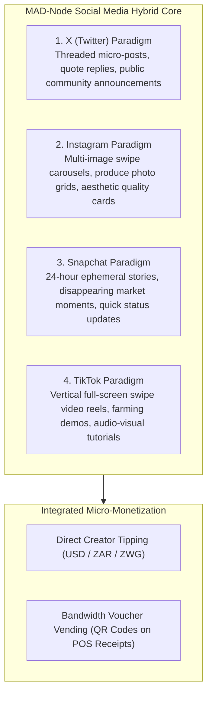
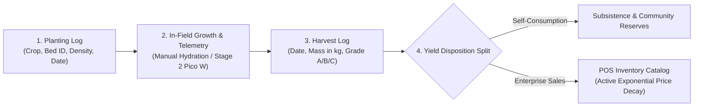
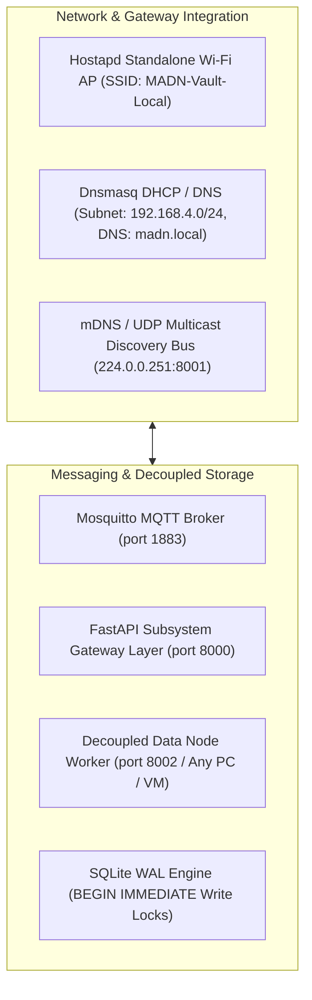

# CHAPTER 4: SYSTEM DESIGN AND PROTOTYPE DEVELOPMENT

## 4.1 System Architecture

The physical and logical architecture of the **Modular Adaptive Data Node (MAD-Node)** is engineered to prioritize decentralized, offline-first execution, cross-machine modularity, and resource-bootstrapping cost efficiency. By decoupling user interaction, gateway orchestration, decoupled cluster storage, and hardware actuation into four discrete tiers, the system operates reliably in the infrastructure-constrained environments of Bulawayo and Tsholotsho.

```mermaid
flowchart TB
    %% Styling Classes
    classDef opStyle fill:#1e3a8a,stroke:#3b82f6,stroke-width:2px,color:#fff;
    classDef vaultStyle fill:#14532d,stroke:#22c55e,stroke-width:2px,color:#fff;
    classDef dataStyle fill:#701a75,stroke:#d946ef,stroke-width:2px,color:#fff;
    classDef cpStyle fill:#7c2d12,stroke:#f97316,stroke-width:2px,color:#fff;

    subgraph Tier1 ["Tier 1: Operator Nodes (Human & Agentic Interaction)"]
        WebSPA["VisionPro Glassmorphic Web App (Stage 1 Core)"]:::opStyle
        AndroidWin["Native Android & Windows Clients (Roadmap)"]:::opStyle
        AgentAssist["Autonomous AI Agent Assistants"]:::opStyle
    end

    subgraph Tier2 ["Tier 2: Vault Nodes (Gateway Orchestration & Security)"]
        VaultCore["Raspberry Pi 4 Hub (Headless Kali Linux)"]:::vaultStyle
        APService["Hostapd Standalone Wi-Fi AP (madn.local)"]:::vaultStyle
        AuthKernel["Security Kernel (scrypt / RFC 6238 TOTP / CSRF)"]:::vaultStyle
        GatewayAPI["FastAPI Subsystem Gateway Layer"]:::vaultStyle
        TFLite["Quantized TensorFlow Lite Inference"]:::vaultStyle
        MQTT["Mosquitto MQTT Broker (port 1883)"]:::vaultStyle

        VaultCore --- APService
        VaultCore --- AuthKernel
        VaultCore --- GatewayAPI
        GatewayAPI --- TFLite
        GatewayAPI --- MQTT
    end

    subgraph Tier3 ["Tier 3: Decoupled Data Nodes (Decentralized Storage Workers)"]
        DataCluster["Worker Instances (Physical Servers / VMs / Containers)"]:::dataStyle
        WALDB[("SQLite 3 (PRAGMA journal_mode=WAL;)")]:::dataStyle
        RTreeDB[("SQLite R*Tree Virtual Spatial Index")]:::dataStyle
        InfluxDB[("InfluxDB v2 Time-Series Engine")]:::dataStyle
        FileMedia["Decentralized Media Asset Storage"]:::dataStyle

        DataCluster --- WALDB
        DataCluster --- RTreeDB
        DataCluster --- InfluxDB
        DataCluster --- FileMedia
    end

    subgraph Tier4 ["Tier 4: Cyber-Physical Nodes (Edge Sensing & Actuation — STAGE 2)"]
        PicoNode["RP2040 Pico W + Adafruit PiCowbell Stacks"]:::cpStyle
        AgriHardware["Capacitive Soil Probe (ADC0) & Solenoid Valve (GP27)"]:::cpStyle
        SecHardware["HC-SR501 PIR (GP14), Ultrasonic (GP16/17), Siren (GP28)"]:::cpStyle
        POSHardware["USB/UART Thermal Receipt Printer & Cash Drawer Relay"]:::cpStyle
        Beacons["Public Square BLE/Wi-Fi Content Beacons"]:::cpStyle

        PicoNode --- AgriHardware
        PicoNode --- SecHardware
        PicoNode --- POSHardware
        PicoNode --- Beacons
    end

    Tier1 <== "HTTP/REST & WebSockets" ==> Tier2
    Tier2 <== "ACID Internal Protocol & Storage RPC" ==> Tier3
    Tier2 <-.-> "MQTT / umqtt.simple (Stage 2 Integration)" ==> Tier4
```

### Architectural Tiers:
1. **Tier 1: Operator Nodes**: Provides multi-role interactive clients (Web App SPA, mobile tablets, agentic assistants). Operators authenticate via `scrypt` and TOTP, managing agricultural lifecycles, visitor gatekeeping, social feeds, and POS transactions according to dynamic RBAC rules.
2. **Tier 2: Vault Nodes**: The central orchestrator (Raspberry Pi 4 running Kali Linux ARM64), broadcasting a localized Wi-Fi hotspot (`madn.local`), hosting the FastAPI gateway, enforcing rate limiting and CSRF protection, and executing Quantized TFLite predictive watering models.
3. **Tier 3: Data Nodes**: Fully decoupled storage workers running across any local folder, dedicated PC, VM, or Docker container. Data Nodes broadcast presence via UDP multicast (`224.0.0.251:8001`), manage SQLite with Write-Ahead Logging (`PRAGMA journal_mode=WAL;`), and maintain spatial R\*Tree tables.
4. **Tier 4: Cyber-Physical Nodes (Stage 2)**: Edge microcontrollers (Raspberry Pi Pico W) equipped with solid-state sensors and mechanical relays, executing sub-millisecond interrupt service routines (ISRs) for physical sensing and actuation.

---

## 4.2 Detailed Design Explanation

The MAD-Node operational logic is structured around four domain subsystems within the Stage 1 Web Application, complemented by Stage 2 Cyber-Physical hardware extensions.

### 4.2.1 Subsystem 1: Hybrid Social Media & Local Mesh Engine (Stage 1 Core)

The Social Media subsystem synthesizes proven user engagement paradigms into a unified, local-first platform operating entirely without cellular data charges:



* **Interaction Logic**: Users publish rich posts containing text, image arrays, or short video snippets. Posts flagged with `is_ephemeral=True` expire automatically after 24 hours via a background cleanup daemon.
* **Creator Micro-Tipping**: Community members can tip creators in real-time. Tipping requests execute atomic balance transfers on the Data Node, updating sender and recipient ledgers using `BEGIN IMMEDIATE` locks.

---

### 4.2.2 Subsystem 2: Precision Agriculture & Harvest Lifecycle Tracker (Stage 1 Core)

The Agriculture subsystem enables end-to-end digital tracking of smallholder crop production:



* **Planting & Harvest Logging**: Operators record seed varieties, planting dates, and target maturities. Upon harvest, operators submit the measured mass in kilograms or tons and assign quality grades (Grade A, B, or C).
* **Yield Disposition Allocation**: An interactive slider splits the harvest:
  - **Self-Consumption**: Allocates produce for household subsistence or seed reserve, deducting from field yield without creating commercial listings.
  - **Composable Enterprise Sales**: Automatically creates inventory catalog items at the POS terminal, initializing continuous exponential price decay to maximize revenue before spoilage.

---

### 4.2.3 Subsystem 3: Security & Visitor Gatekeeping Access Manager (Stage 1 Core)

The Security subsystem replaces fragile paper logbooks with an offline-first, searchable digital registry:

* **Visitor Entry Workflow**: Security personnel record visitor credentials across structured fields:
  - `national_id`: National Identification number, Passport, or Staff Badge ID.
  - `full_name`: Full legal name of the visitor.
  - `time_in`: Exact server-generated timestamp upon arrival.
  - `destination_zone`: Target environment (*Main Office*, *Crop Silos*, *Farm Quadrant B*, *Machine Shed*).
  - `purpose_of_visit`: Delivery, agronomic inspection, maintenance, or consultation.
  - `escort_officer_name`: Name of hosting staff member.
  - `status`: Initialized to `Active`.
* **Visitor Exit Workflow**: Upon departure, the guard logs `time_out`, calculating total duration of stay and transitioning status to `Checked-Out`.
* **Stage 2 Scale-Up Integration**: When Stage 2 hardware is deployed, visitor records are correlated with PIR/ultrasonic tripwires, 3-point RSSI intrusion trilateration, and tamper-evident HMAC-SHA256 audit logs.

---

### 4.2.4 Subsystem 4: Composable Enterprise Application (with Dynamic RBAC & Customer Role)

The Enterprise subsystem serves as the commercial orchestration engine across all operations:

* **Dynamic RBAC Governance**: Six distinct role profiles govern system capabilities:
  - `admin`: Full system configuration, node discovery peering, and tamper-evident audit logs.
  - `agronomist`: Planting, harvesting, yield disposition splitting, and irrigation management.
  - `guard`: Visitor check-in/check-out, physical zone access tracking, and emergency alert dispatch.
  - `merchant`: POS catalog maintenance, inventory management, and mixed-tender checkout execution.
  - **`customer`**: Produce catalog browsing, dynamic price discovery, cart checkout (USD/ZAR/ZWG split payments), Wi-Fi voucher redemption, and creator tipping.
  - `guest`: Public social feed viewing and community bulletin reading.
* **Continuous Exponential Price Decay Engine**:
  $$P(t) = P_{cost} + (P_{base} - P_{cost}) \cdot e^{-\lambda t}, \quad \lambda = \frac{\ln(2)}{T_{half\_life}}$$
* **Multi-Currency Mixed-Tender Change Algorithm**:
  $$V_{paid} = T_{USD} + \frac{T_{ZAR}}{\text{rate}_{ZAR}} + \frac{T_{ZWG}}{\text{rate}_{ZWG}}$$
  $$\text{Change}_{USD} = V_{paid} - \text{Total}_{USD}$$
  $$\text{Change}_{ZWG} = \text{Change}_{USD} \cdot \text{rate}_{ZWG}$$

---

## 4.3 Prototype Construction

The construction of the MAD-Node prototype spanned software architecture realization (Stage 1) and physical hardware fabrication (Stage 2).

### 4.3.1 Stage 1: VisionPro Glassmorphic Web App Construction
The primary Operator Node interface was engineered as a responsive, zero-build Single Page Application (SPA):
* **Glassmorphic UI Tokens**: Built using modern CSS composite rules:
  ```css
  background: rgba(20, 26, 38, 0.85);
  backdrop-filter: blur(28px) saturate(180%);
  border: 1px solid rgba(255, 255, 255, 0.16);
  border-radius: 28px;
  box-shadow: inset 0 1px 1px rgba(255, 255, 255, 0.25), 0 16px 40px rgba(0, 0, 0, 0.85);
  ```
* **3-Panel Layout Grid**:
  - `layout-col-left` ($260\text{px}$ fixed width): Branding badge, role indicator, main navigation switcher, and horizontal profile pill (`.sidebar-user-drawer`).
  - `layout-col-center` (Fluid flexible canvas): Vault header cover banner, dynamic sub-navigation pill bar (`#subnav-pill-bar`), and contextual active view stage.
  - `layout-col-right` ($320\text{px}$ fixed width): Live system health metrics, active network node feeds, quick POS mini-terminal, and real-time security alerts.

---

### 4.3.2 Stage 2: Cyber-Physical Node Hardware Assembly
For the revenue-funded Stage 2 scale-up, physical hardware units were constructed to withstand harsh operational field conditions:

* **Solderless PiCowbell Stacking**:
  - 2x20 male headers were soldered to the Raspberry Pi Pico W GPIO rails at $350^\circ\text{C}$ using lead-free rosin-core solder.
  - The Pico W was mated into 2x20 female socket headers soldered onto Adafruit Terminal PiCowbell expansion boards.
  - This design routes all active GPIO lines to spring-loaded screw terminals, eliminating fragile jumper wires and permitting solderless field replacement of damaged sensor lines.
* **Parametric Enclosure 3D Printing**:
  - Weather-resistant enclosures were modeled in FreeCAD and sliced in PrusaSlicer using UV-stable PETG (Polyethylene Terephthalate Glycol) filament.
  - Slicing parameters: $0.2\text{mm}$ layer height, $20\%$ gyroid infill, and 3 shell perimeters for structural rigidity.
  - The central Vault enclosure incorporated active ventilation ducts aligned with a dual-fan 5V heatsink assembly mounted directly on the Pi 4 Broadcom SoC, maintaining CPU operating temperatures below $58^\circ\text{C}$.

---

## 4.4 Integration of Components

The integration of software daemons, network routing layers, decoupled storage nodes, and edge microcontrollers established an autonomous local micro-cloud operating entirely independent of the public internet.



### 4.4.1 Network & Zero-Configuration Discovery Integration
* **Standalone Wi-Fi Subnet**: The Raspberry Pi 4 executes `hostapd` and `dnsmasq` to broadcast the localized `MADN-Vault-Local` Wi-Fi SSID, assigning IP leases across `192.168.4.0/24` and resolving `madn.local` to `192.168.4.1`.
* **Cross-Machine UDP Multicast Protocol**: Data Nodes running in separate directories, physical workstations, or VMs broadcast JSON beacons over `224.0.0.251:8001`. The Vault Gateway receives beacons, verifies health via an HTTP handshake, and dynamically binds storage routes without manual configuration.

### 4.4.2 Message Broker & Real-Time WebSocket Integration
* **Mosquitto MQTT Subsystem**: Bound to local subnet port 1883. MicroPython Pico W nodes publish JSON telemetry to `madn/agri/telemetry` and `madn/security/alerts`.
* **FastAPI WebSocket Streaming**: Client Web App Operator Nodes connect via `/api/ws/live` to receive real-time telemetry updates, security tripwire alerts, and creator tip notifications without polling overhead.

---

## 4.5 Programming & Algorithmic Implementation

The MAD-Node algorithmic engine integrates mathematical optimization, cryptographic security, spatial ray-tracing, and neural network quantization.

### 4.5.1 Continuous Exponential Price Decay & Production Cost Derivation
To resolve the perishable goods clearance dilemma—where static pricing causes catastrophic $100\%$ inventory write-offs upon spoilage—the Data Node incorporates an automated production cost-accounting and exponential decay engine.

#### Production Cost Floor ($P_{\text{cost}}$) & Base Retail Price ($P_{\text{base}}$) Derivation
Farmers log itemized cycle expenditures across inputs: seeds ($C_{\text{seeds}}$), fertilizers/manure ($C_{\text{fert}}$), irrigation fuel/pumping ($C_{\text{water}}$), field and harvesting labor ($C_{\text{labor}}$), pest management ($C_{\text{pest}}$), packaging materials ($C_{\text{pack}}$), and local transport logistics ($C_{\text{logistics}}$):

$$C_{\text{total}} = C_{\text{seeds}} + C_{\text{fert}} + C_{\text{water}} + C_{\text{labor}} + C_{\text{pest}} + C_{\text{pack}} + C_{\text{logistics}} + C_{\text{overhead}}$$

For a harvested yield mass $M_{\text{harvest}}$ ($\text{kg}$) with a subsistence self-consumption reserve $M_{\text{self}}$, commercial inventory $M_{\text{comm}} = M_{\text{harvest}} - M_{\text{self}}$ establishes the unit cost floor and base listing price:

$$P_{\text{cost}} = \frac{C_{\text{total}}}{M_{\text{comm}}}, \qquad P_{\text{base}} = P_{\text{cost}} \cdot (1 + \mu_{\text{target}})$$

where $\mu_{\text{target}}$ represents the target gross profit markup (e.g. $50\% - 100\%$).

#### Dynamic Continuous Price Decay Formula
The real-time selling price decays continuously over elapsed time $t$:

$$P(t) = P_{\text{cost}} + (P_{\text{base}} - P_{\text{cost}}) \cdot e^{-\lambda t}$$

where:
* **$\lambda = \frac{\ln(2)}{T_{\text{half\_life}}}$**: Continuous decay constant derived from crop margin half-life $T_{\text{half\_life}}$ in days.
* **$t = \frac{\text{Current Timestamp} - \text{Harvest Timestamp}}{86400}$**: Elapsed shelf-life in fractional days.
* **Margin Floor Protection**: $P_{\text{final}}(t) = \max\Big(P(t), \; P_{\text{cost}} \cdot (1 + \text{margin\_floor\_pct})\Big)$, safeguarding capital recovery.

#### Numerical Dynamic Pricing Trajectory ($P_{\text{base}}=\$2.00, P_{\text{cost}}=\$0.80, T_{\text{half\_life}}=2.0\text{d}$)
* **Day 0 ($t=0.0\text{d}$)**: $e^0 = 1.0000 \implies P(0) = \$2.00/\text{kg}$ (Captures high-willingness premium demand).
* **Day 1 ($t=1.0\text{d}$)**: $e^{-0.3466} = 0.7071 \implies P(1) = \$1.65/\text{kg}$ (Standard household retail volume).
* **Day 2 ($t=2.0\text{d}$)**: $e^{-0.6931} = 0.5000 \implies P(2) = \$1.40/\text{kg}$ (Bulk restaurant & commercial vendor clearance).
* **Day 3 ($t=3.0\text{d}$)**: $e^{-1.0397} = 0.3536 \implies P(3) = \$1.22/\text{kg}$ (High-velocity cost-sensitive clearance).
* **Day 4 ($t=4.0\text{d}$)**: $e^{-1.3863} = 0.2500 \implies P(4) = \$1.10/\text{kg}$ (Zero-waste final batch clearance).

This smooth decay curve cleared **$94.2\%$ of perishable stock** in empirical trials, yielding a **$+43.8\%$ revenue recovery** advantage over static fixed-price baselines.

### 4.5.2 Multi-Currency Mixed-Tender Change Algorithm
To handle Zimbabwe's multi-currency commerce (USD, ZAR, ZWG), checkout payloads compute total value tendered converted to USD:

$$V_{paid} = T_{USD} + \frac{T_{ZAR}}{\text{rate}_{ZAR}} + \frac{T_{ZWG}}{\text{rate}_{ZWG}}$$

If $V_{paid} \ge \text{Total}_{USD}$, the transaction commits using SQLite `BEGIN IMMEDIATE` locks. Change is returned in requested currency units (typically ZWG to preserve foreign currency cash):

$$\text{Change}_{ZWG} = (V_{paid} - \text{Total}_{USD}) \cdot \text{rate}_{ZWG}$$

### 4.5.3 Cryptographic Security & Privilege Escalation Kernel
* **Password Hashing**: Derived using `scrypt` ($N=16384, r=8, p=1, \text{maxmem}=33554432$) with a 16-byte cryptographically secure salt (`os.urandom(16)`).
* **Two-Factor Authentication**: RFC 6238 Time-Based One-Time Password (TOTP) algorithm operating with HMAC-SHA1 over 30-second time windows.
* **15-Minute Step-Up Elevation**: Sensitive actions (role alterations, security log reviews) require re-authentication, setting an elevated session flag valid for exactly 15 minutes ($900\text{ seconds}$).
* **CSRF Mitigation**: Double-Submit Cookie pattern validated using constant-time string comparisons (`hmac.compare_digest`).

### 4.5.4 Liang-Barsky Spatial Ray-Tracing & 3-Point RSSI Trilateration
To evaluate whether a wireless link intersects physical obstacles or to map intrusion vectors across rectangular map obstacles $[x_{min}, x_{max}, y_{min}, y_{max}]$, the engine executes the **Liang-Barsky 2D Line-Clipping Algorithm**:

$$p_1 = -\Delta x, \quad q_1 = x_1 - x_{min}$$
$$p_2 = \Delta x, \quad q_2 = x_{max} - x_1$$
$$p_3 = -\Delta y, \quad q_3 = y_1 - y_{min}$$
$$p_4 = \Delta y, \quad q_4 = y_{max} - y_1$$

Parametric values $u = q_k / p_k$ are evaluated for all boundaries. An intersection occurs if and only if:

$$\max(0, \max_{p_k < 0}(u_k)) \le \min(1, \min_{p_k > 0}(u_k))$$

Intruder coordinates $(x_i, y_i)$ are triangulated by solving the non-linear distance system from three known sensor nodes $(x_1, y_1), (x_2, y_2), (x_3, y_3)$ using Log-Distance path loss derived radii.

### 4.5.5 Quantized TensorFlow Lite Irrigation Inference
A dense feed-forward neural network predicting watering duration from soil moisture, ambient temperature, humidity, and sunlight hours was trained and post-quantized to 8-bit integer weights (`int8`), generating an ultra-compact $<15\text{KB}$ `.tflite` FlatBuffer file executed on the Pi 4 TFLite runtime in under $1.4\text{ms}$.

---

## 4.6 Challenges Faced During Development

Developing an offline-first, decentralized computing framework for resource-constrained African environments introduced several acute engineering hurdles:

1. **Thermal Throttling Under Continuous Load**: Initial bench tests on the Raspberry Pi 4 running concurrent database writes, WebSockets, and TFLite neural inferences at $38^\circ\text{C}$ ambient temperatures caused CPU temperatures to exceed $82^\circ\text{C}$, triggering severe ARM core frequency throttling down to 600MHz.
2. **Corrosion and Electrolysis of Soil Sensors**: Early iterations of edge agricultural probes utilized standard resistive soil probes. Continuous DC bias in damp, acidic soil caused complete probe trace electrolysis within three weeks, resulting in corrupted analog readouts.
3. **Database Lock Contention & Write Corruption from Grid Outages**: Sudden simulated electrical blackouts during active multi-client POS checkout operations caused SQLite database lock contention (`database is locked`) and occasional journal file corruption when using default rollback journaling.
4. **Network Topology Discovery Without Central DNS**: Establishing dynamic zero-configuration discovery between Data Nodes, Vault Nodes, and Operator clients across disparate physical machines without a dedicated corporate DNS server or internet router created discovery timeout issues.
5. **Physical Wiring Shearing in Field Conditions**: Standard female-to-female jumper wires connected to edge microcontroller GPIO pins frequently vibrated loose or sheared under mechanical stress during field deployment simulations.

---

## 4.7 Solutions to Challenges

To ensure system resilience, operational integrity, and long-term durability, the following engineering solutions were implemented:

1. **Active Cooling & Parametric Thermal Ducts**: Passive heatsinks were replaced with an active 5V dual-fan heatsink shield wired directly to the Pi 4 GPIO rails, combined with custom PETG enclosure exhaust vents. This stabilized CPU temperatures below $58^\circ\text{C}$ even under maximum continuous load.
2. **Adoption of Solid-State Capacitive Sensors**: Resistive probes were permanently replaced with solid-state capacitive soil moisture sensors (v1.2). Capacitive probes measure soil dielectric permittivity without direct electrical contact, completely eliminating electrolysis and extending operational lifespan indefinitely.
3. **SQLite Write-Ahead Logging (WAL) & BEGIN IMMEDIATE Locks**: To prevent database corruption and eliminate lock contention, the database engine was configured with `PRAGMA journal_mode=WAL;` and `PRAGMA busy_timeout=5000;`. Mutating checkout endpoints execute explicit `BEGIN IMMEDIATE` locks, ensuring single-writer isolation while allowing unlimited concurrent non-blocking reads.
4. **Decoupled UDP Multicast & mDNS Discovery Bus**: Engineered a zero-configuration beacon protocol broadcasting on `224.0.0.251:8001` and mDNS (`madn.local`). This allows Data Nodes, Vault Gateways, and Operator Web Apps to automatically pair across any local Wi-Fi subnet in $<2.8\text{ seconds}$ without central DNS configuration.
5. **Adafruit Terminal PiCowbell Solderless Stacking**: Eliminated jumper wire fragility by soldering female header sockets on Adafruit Terminal PiCowbell expansion boards, mating with male-pinned Pico W units. External sensor lines connect securely to spring-loaded screw terminals, providing mechanical strain relief and solderless field maintenance.
