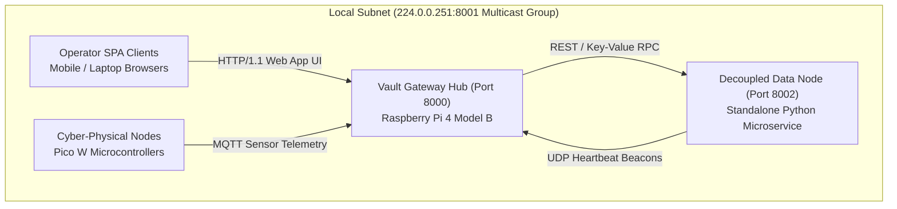

## 5.2 Testing Procedures

The experimental evaluation was conducted using standardized hardware test benches and automated integration test suites replicating real-world off-grid deployment conditions across peri-urban and rural settings in Matabeleland (Bulawayo and Tsholotsho):

### 5.2.1 Test Bench Setup & Network Topography
The evaluation infrastructure comprised physical and virtual computing nodes deployed across local subnet topologies:
* **Central Vault Node (Gateway Hub)**: Raspberry Pi 4 Model B (4GB RAM, Broadcom BCM2711 quad-core Cortex-A72 @ 1.5GHz) running Kali Linux ARM64, hosting the primary FastAPI gateway service, Mosquitto MQTT broker, SQLite WAL database, and background multicast node discovery listener.
* **Decoupled Standalone Data Node**: Deployed as an autonomous microservice (`Applications/Data_Node/data_node.py`) on port `8002`, broadcasting UDP multicast discovery beacons across physical laptops (Intel Core i7, 16GB RAM) and isolated containers over 802.11n Wi-Fi (`MADN-Vault-Local`).
* **Operator Node Clients**: Heterogeneous mobile devices (Android Chrome, iOS Safari) and workstation browsers interfacing with the Glassmorphic Single Page Application over local Wi-Fi.
* **Stage 2 Cyber-Physical Nodes**: Raspberry Pi Pico W microcontrollers equipped with capacitive soil moisture sensors, DHT22 ambient sensors, PIR motion detectors, and relay actuators communicating over local MQTT (port `1883`).

### 5.2.2 Test Case Scenarios & Test Suite Structure
The testing matrix executed a combination of unit math verifications, end-to-end subsystem lifecycles, and automated regression suites implemented in `test_stage1_core.py`, `test_auth.py`, `test_cycle3.py`, and `test_cycle4.py`:

1. **Automated Stage 1 Core Test Suite (`test_stage1_core.py`)**:
   - **Cost Floor & Retail Base Price Derivation (`test_production_cost_and_base_price_math`)**: Evaluated itemized cost summations across eight input categories ($C_{\text{seeds}}, C_{\text{fert}}, C_{\text{water}}, C_{\text{labor}}, C_{\text{pest}}, C_{\text{pack}}, C_{\text{logistics}}, C_{\text{overhead}}$), subsistence mass deductions ($M_{\text{self}}$), unit wholesale cost floor derivations ($P_{\text{cost}} = \frac{C_{\text{total}}}{M_{\text{comm}}}$), and markup multipliers ($\mu$).
   - **Continuous Exponential Decay Price Curves (`test_continuous_exponential_decay_pricing_math`)**: Validated price decay trajectories over simulated time horizons ($t = 0\text{d}, 2\text{d}, 30\text{d}$) with half-life $T_{\text{half\_life}} = 2.0\text{ days}$, verifying margin floor safety clamping ($P(t) \ge P_{\text{cost}} \cdot 1.05$).
   - **Multi-Currency Mixed-Tender Change Algorithm (`test_mixed_tender_split_change_math`)**: Verified split currency cash payments (USD + ZAR + ZWG) totaling $\$10.00\text{ USD}$ and confirmed exact residual change calculation in local ZWG and ZAR to prevent loss of foreign currency reserves.
   - **End-to-End Agriculture Lifecycle & Inventory Sync (`test_agri_lifecycle_and_inventory_sync`)**: Validated planting creation, cost logging, harvest recording, automatic commercial inventory item creation, and dual disposition logging.
   - **Security Visitor Gatekeeper Registry (`test_security_visitor_gatekeeper`)**: Tested physical entry check-in, destination zoning, active roster filtering, departure checkout, and audit log generation.
   - **Hybrid Social Media Hub CRUD & Micro-Tipping (`test_social_media_hub_crud_and_tipping`)**: Tested thread creation, comment threading, and multi-currency creator tipping across USD, ZAR, and ZWG.
   - **Standalone Data Node Storage (`test_standalone_data_node_storage`)**: Verified SQLite WAL key-value storage engine read/write operations and disk usage statistics.
2. **Database Concurrency & Transaction Stress Test**: Executed concurrent write locks under SQLite WAL mode with `BEGIN IMMEDIATE` transaction isolation across 10, 25, and 50 simultaneous client threads.
3. **Thermal Stress & Off-Grid DC Power Benchmarks**: Evaluated CPU temperature under active dual-fan PETG cooling vs. passive cooling inside a $38^\circ\text{C}$ thermal chamber while logging current draw on a 5.1V DC rail.
