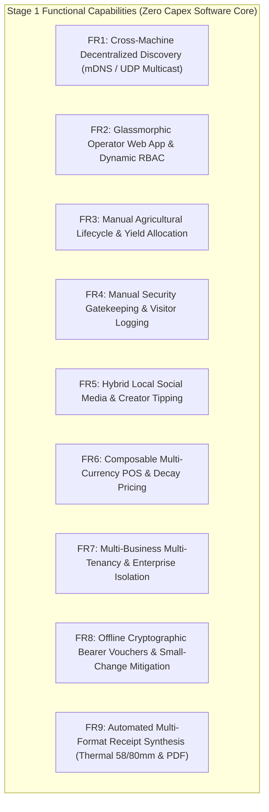

## 3.3 System Requirements

The system requirements are organized systematically across functional tiers (Stage 1 Foundation vs. Stage 2 Scale-Up), multi-tenant enterprise isolation, offline cryptographic voucher lifecycle, and non-functional engineering standards.

### 3.3.1 Stage 1 Functional Requirements (Immediate Software Foundation)

* **FR1: Decentralized Node Discovery**:
  - The system must permit Data Nodes, Vault Nodes, and Operator Nodes to execute across separate directories, physical machines, VMs, or containers on a local subnet.
  - Data Nodes must broadcast a UDP multicast heartbeat (`224.0.0.251:8001`) declaring their IP, port, storage engine, and available capacity.
  - Vault Nodes must dynamically discover active Data Nodes, establish health-checked connections, and route ACID transactions without hardcoded IP configurations.
* **FR2: Operator Web App & Dynamic RBAC**:
  - Provide a responsive VisionPro glassmorphic Single Page Application (SPA) compatible with any modern mobile or desktop browser.
  - Dynamically render views and navigation pills based on active user roles: `admin`, `agronomist`, `guard`, `merchant`, `customer`, and `guest`.
  - Secure authentication via `scrypt` password hashing ($N=2^{14}, r=8, p=1$), RFC 6238 TOTP two-factor authentication, CSRF double-submit cookies, and 15-minute step-up privileged elevation.
* **FR3: Manual Agricultural Lifecycle & Production Cost Accounting**:
  - **Planting Log**: Capture Crop Name/Variety, Plot/Bed Identifier, Planting Timestamp, Seeding Density ($\text{seeds}/\text{m}^2$), Target Maturity Date, and Initial Soil Hydration.
  - **Production Cost Accounting**: Itemize production expenditures throughout the cycle: seeds ($C_{\text{seeds}}$), fertilizers ($C_{\text{fert}}$), irrigation fuel/power ($C_{\text{water}}$), field/harvesting labor ($C_{\text{labor}}$), pest control ($C_{\text{pest}}$), packaging ($C_{\text{pack}}$), and logistics ($C_{\text{logistics}}$) to compute $C_{\text{total}}$.
  - **Harvest Log & Allocation**: Capture Harvest Timestamp, Total Mass $M_{\text{harvest}}$ ($\text{kg}$), Quality Grade, Storage Location, and split between **Self-Consumption** $M_{\text{self}}$ and **Commercial POS Sales** $M_{\text{comm}}$.
  - **Automated Price Derivation**: Calculate wholesale unit cost floor $P_{\text{cost}} = \frac{C_{\text{total}}}{M_{\text{comm}}}$ and base listing price $P_{\text{base}} = P_{\text{cost}} \cdot (1 + \mu_{\text{target}})$ automatically.
* **FR4: Manual Security Gatekeeping & Visitor Management**:
  - **Visitor Access Form**: Record National ID/Passport Number, Full Name, Time In (`time_in`), Time Out (`time_out`), Destination Environment (Main Office, Crop Silos, Farm Quadrant B, Machine Shed), Purpose of Visit, Escort/Host Officer Name, and Status (`Active`, `Checked-Out`, `Overstay Flagged`).
  - Searchable real-time visitor registry accessible offline during power blackouts.
* **FR5: Hybrid Local Social Media & Creator Tipping**:
  - **X Paradigm**: Text micro-posts, threaded comments, and community broadcasts.
  - **Instagram Paradigm**: Multi-photo carousels and produce showcase cards.
  - **Snapchat Paradigm**: 24-hour ephemeral status bubbles for daily stories.
  - **TikTok Paradigm**: Full-screen vertical swipe video reel stream for farming tutorials.
  - **Customer Tipping**: Wallet-to-wallet micro-tipping supporting USD, ZAR, and ZWG.
* **FR6: Composable Enterprise Multi-Currency Tri-Ledger**:
  - Unified catalog supporting USD base pricing with dynamic exchange conversion to ZAR and ZWG.
  - Continuous exponential price decay engine calculating perishable goods pricing:
    $$P(t) = P_{cost} + (P_{base} - P_{cost}) \cdot e^{-\lambda t}, \quad \lambda = \frac{\ln(2)}{T_{half\_life}}$$
  - Mixed-tender split payment change calculation:
    $$V_{paid} = T_{USD} + \frac{T_{ZAR}}{\text{rate}_{ZAR}} + \frac{T_{ZWG}}{\text{rate}_{ZWG}}$$
  - Strict `BEGIN IMMEDIATE` write locks on SQLite WAL and idempotent request deduplication via `X-Client-Request-Id` headers.
* **FR7: Multi-Business Multi-Tenancy & Enterprise Isolation**:
  - The node must host and isolate multiple independent business entities (e.g. *Green Valley Organic Horticulture*, *Khumalo Milling & Grains Co.*, *Matopos Heritage Dairy & Livestock*) on a single shared physical database instance.
  - Foreign key scoping (`business_id`) must partition inventory catalogs, planting records, crop yields, sales transactions, branded receipts, and customer vouchers without cross-tenant leakage.
* **FR8: Offline Cryptographic Bearer Vouchers & Small-Change Shortage Mitigation**:
  - To resolve the severe physical coin and small-denomination currency shortage in Zimbabwean rural retail, the node must mint signed bearer change tokens in lieu of physical coins.
  - Each voucher payload is cryptographically authenticated via $\text{HMAC-SHA256}$ using a 256-bit vault secret key and serialized into scannable 2D QR matrix codes:
    $$\text{Payload} = \text{vid} \parallel \text{business\_id} \parallel \text{value} \parallel \text{currency} \parallel \text{expires\_at}$$
    $$\text{Signature} = \text{HMAC-SHA256}(K_{\text{vault}}, \text{Payload})$$
  - Verification and redemption must execute locally in $<0.1\text{ms}$ with zero WAN internet dependency and atomic single-use state transition to prevent double-spending.
* **FR9: Automated Multi-Format Receipt Synthesis Pipeline**:
  - The system must generate itemized, branded purchase receipts immediately upon transaction finalization.
  - Support automatic dual rendering: (1) Standardized vector PDF invoices for digital archiving, and (2) 58mm/80mm ESC/POS thermal receipt slips with scannable verification and voucher QR codes.

---

### 3.3.2 Stage 2 Functional Requirements (Revenue-Funded Scale-Up Tier)

* **FR10: Cyber-Physical Agricultural Telemetry & Actuation**:
  - Hardware integration with Raspberry Pi Pico W microcontrollers reading capacitive soil moisture (GP26/ADC0) and DHT22 temperature/humidity (GP15).
  - MicroPython non-blocking polling loops transmitting telemetry via MQTT (`port 1883`).
  - GP27 relay shield triggering physical 5V solenoid irrigation valves based on localized quantized TensorFlow Lite model predictions (<15KB FlatBuffer).
* **FR11: Cyber-Physical Perimeter Defense & Spatial Math**:
  - HC-SR501 PIR motion sensor on GP14 (MicroPython hardware interrupt ISR) and HC-SR04 ultrasonic distance sensor on GP16 (Trigger) / GP17 (Echo).
  - GP28 relay actuating high-decibel piezo siren and visual LED strobe upon confirmed perimeter intrusion.
  - 2D ray-tracing obstruction engine calculating RF signal attenuation through physical obstacles using the Liang-Barsky line clipping algorithm.
* **FR12: Autonomous Multi-Hop RF Mesh Routing**:
  - ESP-NOW / LoRa mesh networking routing telemetry packets across physical nodes without cellular towers.
  - Modified A* pathfinding algorithm optimizing routing metrics across Path Loss, RSSI link quality, Node Battery Voltage, and Processing Congestion:
    $$\text{Cost}(u, v) = w_1 \cdot \text{PL}(d) + w_2 \cdot (100 - \text{RSSI}) + w_3 \cdot \frac{1}{V_{bat}} + w_4 \cdot Q_{len}$$

---

### 3.3.3 Non-Functional Requirements (NFRs)

| Metric | Target Specification | Design Realization |
| :--- | :--- | :--- |
| **NFR1: Power Budget** | $\le 1.8\text{W}$ Idle, $\le 3.5\text{W}$ Peak | Raspberry Pi Zero 2W / Pico W with dynamic DVFS downclocking. |
| **NFR2: Zero Capex (Stage 1)** | \$0.00 new hardware | Runs as software micro-cloud on existing laptops, tablets, or phones. |
| **NFR3: Offline Autonomy** | 100% core capability without WAN | Local SQLite WAL, embedded static client SPA assets, offline HMAC verification. |
| **NFR4: Concurrency Latency** | $<10\text{ms}$ read, $<25\text{ms}$ write | SQLite WAL mode with `BEGIN IMMEDIATE` atomic serialization. |
| **NFR5: Voucher Verification** | $<0.1\text{ms}$ signature check | In-memory HMAC-SHA256 calculation and single indexed lookup. |
| **NFR6: Cryptographic Integrity** | $\ge 256$-bit security | PBKDF2/scrypt, SHA-256 HMAC chained audit log hashes, RFC 6238 TOTP. |
| **NFR7: Cross-Platform** | 100% browser responsive | HTML5, CSS3 Glassmorphism, Vanilla ES6 JavaScript, Canvas 2D QR synthesis. |
