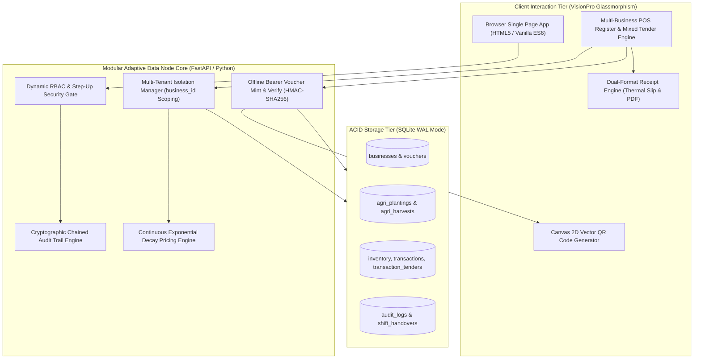
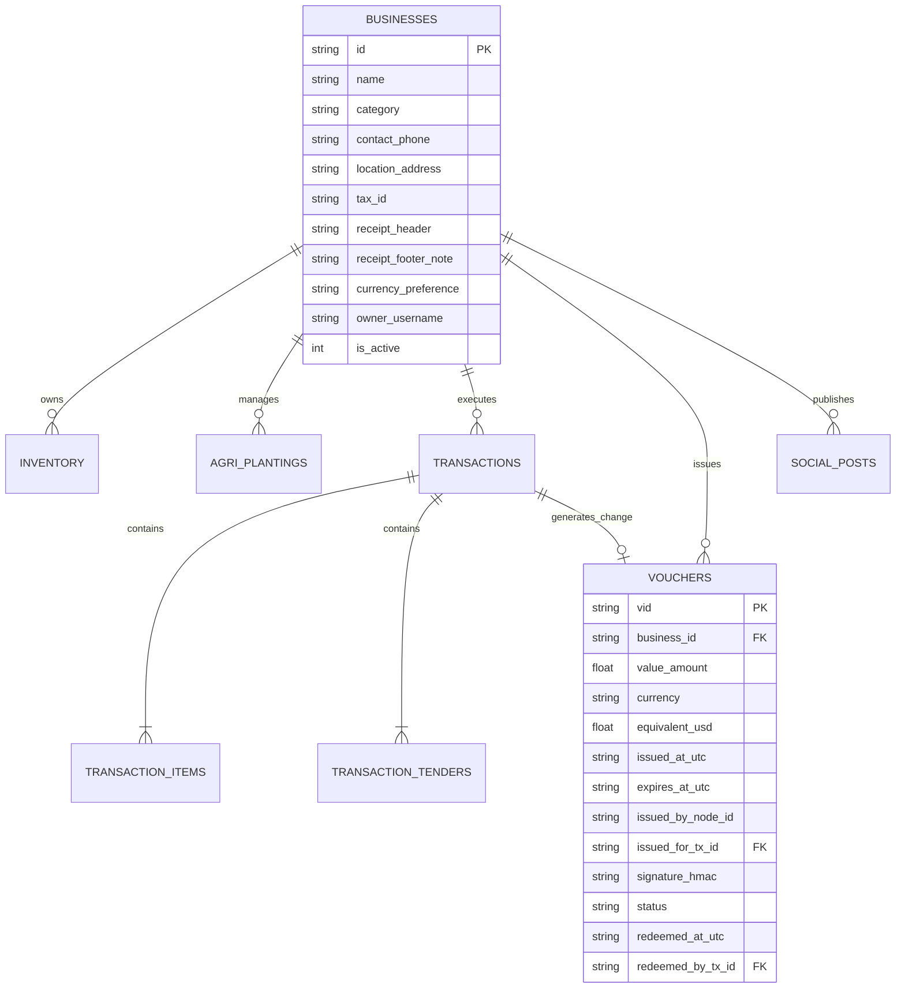
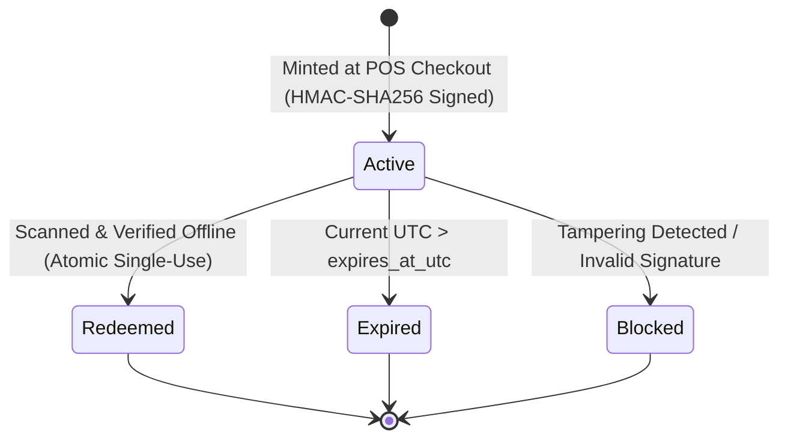
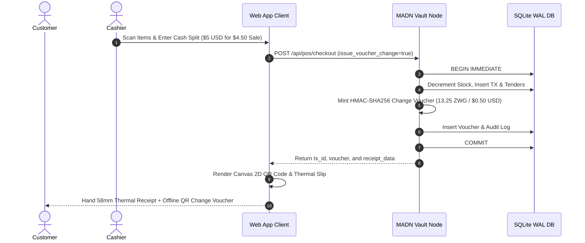

## 3.4 System Design

The system design reflects a decentralized, zero-capex modular edge architecture engineered specifically for resource-constrained, multi-tenant rural African retail and agricultural ecosystems.

---

### 3.4.1 Multi-Tenant Enterprise Architecture & Data Isolation

To support multiple smallholder agribusinesses and cooperative retailers within a single rural peri-urban market (e.g. Umguza Valley, Kensington, and Tsholotsho), MADN implements database-level multi-tenancy.

1. **Tenant Identification**: Every commercial record (stock, plantings, harvests, transactions, vouchers, posts) includes a mandatory `business_id` foreign key.
2. **Scoping Rules**:
   - POS catalog queries filter exclusively by active tenant: $\text{SELECT} \dots \text{WHERE } \text{business\_id} = B_k$.
   - Tenders and receipts dynamically brand metadata using the tenant's header, tax identity, contact phone, and footer policy note.
   - Vouchers minted by Tenant $A$ cannot be redeemed at Tenant $B$ unless explicit inter-business clearing agreements are provisioned.

---

### 3.4.2 Offline Bearer Voucher State Machine & Cryptography

In hyper-multicurrency cash economies (such as Zimbabwe's USD/ZAR/ZWG tri-currency market), small change ($<\$1.00\text{ USD}$) is chronically unavailable. Cashiers historically force consumers to accept unwanted sweets, matches, or credit chits written on scrap paper that are easily forged.

MADN eliminates this failure mode by minting **Cryptographic Offline Bearer Vouchers**:

#### Cryptographic Specification
1. **Payload Composition**:
   $$\mathcal{P} = \text{vid} \parallel \text{business\_id} \parallel \text{value\_amount} \parallel \text{currency} \parallel \text{expires\_at\_utc}$$
2. **Signature Derivation**:
   $$\mathcal{S} = \text{HMAC-SHA256}(K_{\text{vault}}, \mathcal{P})$$
   where $K_{\text{vault}} \in \{0,1\}^{256}$ is an offline secret key stored in the node's encrypted configuration vault.
3. **Verification Protocol**:
   When a customer presents the 2D QR matrix code at any node terminal:
   - The terminal computes $\mathcal{S}' = \text{HMAC-SHA256}(K_{\text{vault}}, \mathcal{P})$.
   - Constant-time comparison ensures $\mathcal{S}' \equiv \mathcal{S}$ in $<0.05\text{ms}$.
   - The database executes an atomic state transition `status = 'redeemed'` under `BEGIN IMMEDIATE` lock to enforce absolute zero-double-spend guarantees.

---

### 3.4.3 Automated Dual-Format Receipt Synthesis Pipeline

Upon transaction commitment, MADN synthesizes an immutable receipt record comprising:
1. **Invoice Number**: $\text{INV}-\text{YYYYMMDD}-\text{TXID}_{[:6]}$.
2. **Itemized Decay Bill**: Quantities, sale unit prices, decay discounts, and line totals.
3. **Multi-Currency Split Breakdown**: Exact cash amounts tendered in USD, ZAR, and ZWG with exchange rates applied.
4. **Offline Voucher Change**: Cryptographic bearer token details (if change was issued as voucher).
5. **Cryptographic Audit Digest**:
   $$\text{AuditHash} = \text{SHA256}(\text{TXID} \parallel \text{business\_id} \parallel \text{total\_due\_usd} \parallel \text{timestamp})$$

