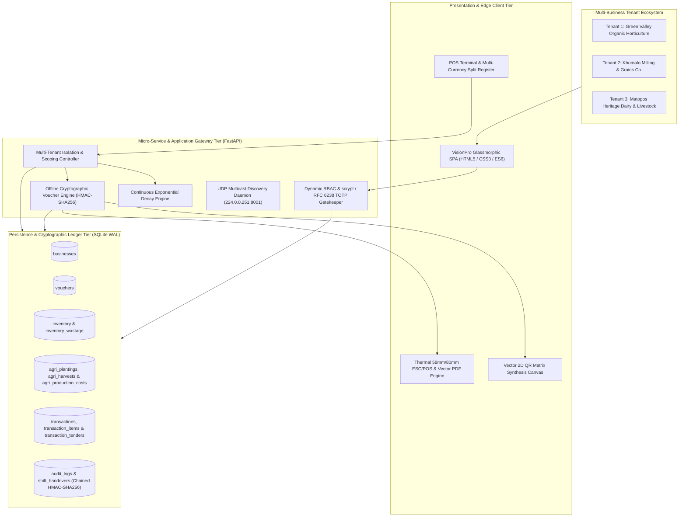

## 4.1 System Architecture

The **Modular Adaptive Data Node (MADN)** architecture implements a tiered, resilient computing model engineered for off-grid peri-urban deployments. The design eliminates centralized cloud server dependencies through an autonomous local-first architecture supporting multi-business tenancy, offline bearer tokens, dynamic inventory pricing, and cryptographic audit chains.

### 4.1.1 Key Architectural Highlights
1. **Multi-Tenant Enterprise Scoping**: Complete logical isolation of inventory, costs, plantings, sales, branded thermal slips, and customer vouchers across multiple independent businesses running concurrently on a single low-power edge node.
2. **Zero-Internet Bearer Token Liquidity**: The offline voucher engine mints and validates cryptographic bearer tokens in $<0.1\text{ms}$, solving rural small-change shortages without relying on third-party payment gateways or national telecommunications infrastructure.
3. **Decentralized UDP Multicast Clustering**: Autonomous peer discovery on port `8001` allows Data Nodes, Vault Nodes, and Operator Terminals to auto-cluster dynamically.
4. **Append-Only Cryptographic Audit Anchors**: Dual-ledger verification linking relational database log entries with append-only flat text files via chained HMAC-SHA256 math.
