## 4.2 Detailed Design Explanation

This section details the internal mechanics of MADN's multi-tenant database partitioning, offline cryptographic voucher subsystem, continuous exponential decay pricing model, and dual-format receipt synthesis engine.

---

### 4.2.1 Multi-Tenant Database Partitioning & Data Model

The schema is partitioned by `business_id` across all relational entities:

```sql
CREATE TABLE IF NOT EXISTS businesses (
    id TEXT PRIMARY KEY,
    name TEXT UNIQUE NOT NULL,
    category TEXT NOT NULL,
    contact_phone TEXT,
    location_address TEXT,
    tax_id TEXT,
    receipt_header TEXT,
    receipt_footer_note TEXT,
    currency_preference TEXT DEFAULT 'USD',
    owner_username TEXT NOT NULL,
    created_at_utc TEXT NOT NULL,
    is_active INTEGER DEFAULT 1
);

CREATE TABLE IF NOT EXISTS vouchers (
    vid TEXT PRIMARY KEY,
    business_id TEXT NOT NULL,
    value_amount REAL NOT NULL,
    currency TEXT NOT NULL,
    equivalent_usd REAL NOT NULL,
    issued_at_utc TEXT NOT NULL,
    expires_at_utc TEXT NOT NULL,
    issued_by_node_id TEXT NOT NULL,
    issued_for_tx_id TEXT,
    signature_hmac TEXT NOT NULL,
    status TEXT DEFAULT 'active',
    redeemed_at_utc TEXT,
    redeemed_by_tx_id TEXT,
    FOREIGN KEY (business_id) REFERENCES businesses(id)
);
```

#### Isolation Invariants
1. **Catalog Scoping**: When an agronomist or merchant queries products or logs plantings, transactions filter automatically against the active tenant context:
   $$\mathcal{Q}_{\text{inventory}}(B_k) = \{ i \in \text{Inventory} \mid i.\text{business\_id} = B_k \land i.\text{quantity} > 0 \}$$
2. **Branding Scoping**: Receipts inherit specific tax identification numbers, location strings, header banners, and custom footer return policies.
3. **Cross-Tenant Prevention**: Vouchers issued by Tenant $A$ contain $B_A$ bound in the HMAC signature. Attempting redemption against Tenant $B$ fails signature or tenancy assertions immediately.

---

### 4.2.2 Cryptographic Offline Bearer Voucher Subsystem

To address cash change shortages in rural and peri-urban retail ($<\$1.00\text{ USD}$), MADN operates an autonomous minting and redemption engine:

```mermaid
flowchart TD
    subgraph Minting_Pipeline ["1. Voucher Minting Pipeline (POS Change)"]
        DIFF["Calculate Cash Surplus: Δ = Paid - Due > 0"]
        V_AMT["Convert Δ to Voucher Currency (ZWG / ZAR)"]
        V_ID["Generate Unique Voucher ID: vid = 'vouch-' + UUID[:8]"]
        V_EXP["Calculate Expiry: UTC_now + 90 Days"]
        V_PAYLOAD["Assemble Payload: vid | biz_id | val | curr | exp"]
        V_SIG["Compute HMAC-SHA256(K_vault, Payload)"]
        V_SAVE["Atomic Insert into vouchers (status='active')"]
    end

    subgraph Redemption_Pipeline ["2. Voucher Redemption Pipeline (Customer Purchase)"]
        SCAN["Customer Presents 2D QR Code at POS"]
        LOOKUP["Lookup Voucher by vid in Local SQLite DB"]
        V_CHECK1{"Status == 'active'?"}
        V_CHECK2{"Current UTC <= expires_at?"}
        V_CHECK3{"Computed HMAC == signature_hmac?"}
        APPLY["Credit Applied to Invoice Tender & status = 'redeemed'"]
        REJECT["Reject Redemption with Detailed Security Reason"]
    end

    DIFF --> V_AMT --> V_ID --> V_EXP --> V_PAYLOAD --> V_SIG --> V_SAVE
    SCAN --> LOOKUP --> V_CHECK1
    V_CHECK1 -- Yes --> V_CHECK2
    V_CHECK1 -- No (Redeemed/Cancelled) --> REJECT
    V_CHECK2 -- Yes --> V_CHECK3
    V_CHECK2 -- No (Expired) --> REJECT
    V_CHECK3 -- Yes --> APPLY
    V_CHECK3 -- No (Tampered) --> REJECT
```



---

### 4.2.3 Continuous Perishable Decay Pricing Model

Perishable produce pricing follows continuous exponential decay to maximize inventory velocity and prevent post-harvest spoilage:

$$P(t) = P_{\text{cost}} + (P_{\text{base}} - P_{\text{cost}}) \cdot e^{-\lambda t}$$

where:
- $P_{\text{base}}$ is the target retail launch price derived from the production cost markup:
  $$P_{\text{base}} = P_{\text{cost}} \cdot (1 + \mu_{\text{target}})$$
- $P_{\text{cost}}$ is the absolute cost floor derived from input expenditures:
  $$P_{\text{cost}} = \frac{C_{\text{seeds}} + C_{\text{fert}} + C_{\text{water}} + C_{\text{labor}} + C_{\text{pest}} + C_{\text{pack}} + C_{\text{logistics}}}{M_{\text{comm}}}$$
- $\lambda$ is the decay constant governed by crop shelf-life half-life $T_{1/2}$:
  $$\lambda = \frac{\ln(2)}{T_{1/2}}$$
- $t$ is the elapsed elapsed post-harvest time in days.

---

### 4.2.4 Dual-Format Receipt Synthesis Pipeline

MADN synthesizes dual-format output immediately upon transaction finalization:

1. **58mm / 80mm ESC/POS Thermal Slip**: Rendered via pure CSS `@media print` with monospace layout, bold headers, itemized subtotals, tender splits, and high-contrast 2D QR matrix canvas blocks.
2. **Downloadable Vector Text / PDF Invoice**: Clean formatted ISO 8601 text document with transaction hashes, cryptographic verification signatures, and itemized billing for merchant audit records.
