## 5.2 Testing Procedures

To empirically validate the Stage 1 Core System Architecture, Multi-Business Tenancy, and Offline Cryptographic Bearer Vouchers, two comprehensive test suites were developed and executed under strict academic testing protocols:
1. `test_stage1_core.py`: Validates agricultural lifecycle math, continuous price decay curves, mixed tender split payments, inventory concurrency, visitor gatekeeper tracking, and social media micro-tipping.
2. `test_multibiz_and_vouchers.py`: Validates multi-business creation and scoping, HMAC-SHA256 bearer voucher minting and sub-millisecond offline verification, double-spend and counterfeit tamper rejection, and end-to-end POS checkout with automatic dual-format receipt synthesis.

```mermaid
flowchart TB
    subgraph Test_Harness ["Automated Pytest & Integration Testing Harness"]
        T1["Test 1: Agricultural Production Cost & Base Price Math"]
        T2["Test 2: Continuous Exponential Decay Pricing Math"]
        T3["Test 3: Multi-Currency Mixed-Tender Change Math"]
        T4["Test 4: Harvest Inventory Sync with Conflict Resolution"]
        T5["Test 5: Security Visitor Gatekeeper Check-In & Departure"]
        T6["Test 6: Social Media 4-in-1 Feeds & Multi-Currency Tipping"]
        T7["Test 7: Standalone Data Node File-Based Persistence"]
        T8["Test 8: Multi-Business Registration, Scoping & Isolation"]
        T9["Test 9: Offline Voucher Minting & HMAC-SHA256 Validation"]
        T10["Test 10: Voucher Double-Spend & Counterfeit Rejection"]
        T11["Test 11: End-to-End Checkout, Voucher Change & Receipt Synthesis"]
    end

    subgraph Verification_Criteria ["Empirical Verification & Invariant Checks"]
        C1["Wholesale Floor & Markup Invariants Verified"]
        C2["Half-Life Decay Curve Convergence Verified"]
        C3["Zero-Deficit Multi-Currency Split Verified"]
        C4["Atomic SQLite WAL BEGIN IMMEDIATE Locks Verified"]
        C5["Active vs. Historical State Transitions Verified"]
        C6["Creator Wallet Balance Increments Verified"]
        C7["Multi-Tenant Isolation & Zero Leakage Verified"]
        C8["Sub-Millisecond HMAC Signature Timing Verified"]
        C9["Double-Spend Protection & Tamper Detection Verified"]
        C10["Dual-Format Receipt & Vector QR Integrity Verified"]
    end

    T1 --> C1
    T2 --> C2
    T3 --> C3
    T4 --> C4
    T5 --> C5
    T6 --> C6
    T7 --> C4
    T8 --> C7
    T9 --> C8
    T10 --> C9
    T11 --> C10
```

---

### 5.2.1 Test Protocol Specifications

| Test Suite Item | Test Case Name | Objective & Mathematical / Logic Assertion | Verification Mechanism |
| :--- | :--- | :--- | :--- |
| **ST-01** | `test_agri_cost_and_price_derivation` | Verify $C_{\text{total}} = \sum C_i$, $P_{\text{cost}} = \frac{C_{\text{total}}}{M_{\text{comm}}}$, and $P_{\text{base}} = P_{\text{cost}} \cdot (1 + \mu)$. | Exact assertion on $180.00$ cost across 60kg yield yielding $P_{\text{cost}} = \$3.00$ and $P_{\text{base}} = \$3.75$ at 25% markup. |
| **ST-02** | `test_continuous_exponential_decay_pricing` | Verify exponential decay curve $P(t) = P_{\text{cost}} + (P_{\text{base}} - P_{\text{cost}}) \cdot e^{-\lambda t}$ and hard floor clamp at $P_{\text{cost}}$. | Time progression assertions at $t=0$, $t=T_{1/2}$, and $t=10 \cdot T_{1/2}$. |
| **ST-03** | `test_mixed_tender_split_change_math` | Verify multi-currency conversion $V_{\text{paid}} = T_{\text{USD}} + \frac{T_{\text{ZAR}}}{18.5} + \frac{T_{\text{ZWG}}}{26.5}$ and change breakdown. | Exact assertion on \$5 USD + R100 ZAR tender against \$10 USD invoice. |
| **ST-04** | `test_agri_harvest_inventory_sync` | Verify commercial yield $M_{\text{comm}}$ automatically creates/increments inventory items with UPSERT logic. | SQLite WAL concurrency and stock level verification. |
| **ST-05** | `test_security_gatekeeper_workflow` | Verify visitor check-in, active listing, and departure status transition. | Audit logging and foreign key integrity checks. |
| **ST-06** | `test_social_media_feed_and_tipping` | Verify creation of 4 post paradigms (thread, carousel, story, reel) and tip balance additions. | Tip aggregation verification across USD, ZAR, and ZWG. |
| **ST-07** | `test_standalone_data_node_storage` | Verify zero-dependency Data Node REST API (`/data/read`, `/data/write`). | JSON payload persistence and UUID retrieval. |
| **ST-08** | `test_multi_business_creation_and_scoping` | Verify dynamic business registration, metadata isolation, and catalog scoping. | Independent tenant query filtering without cross-tenant bleed. |
| **ST-09** | `test_offline_qr_voucher_minting_and_cryptographic_verification` | Verify HMAC-SHA256 signing, USD exchange equivalence, and offline redemption in $<0.1\text{ms}$. | Cryptographic signature recomputation and status assertion. |
| **ST-10** | `test_voucher_double_spend_and_tamper_prevention` | Verify rejection of re-used vouchers and counterfeit payloads with invalid signatures. | Immediate rejection with `already redeemed` and `Cryptographic signature verification failed`. |
| **ST-11** | `test_full_pos_checkout_with_voucher_change_and_receipt` | Verify complete transactional loop: inventory decrement, split tender, voucher change minting, and receipt generation. | Full receipt metadata validation (invoice number, items, tenders, voucher, audit hash). |
