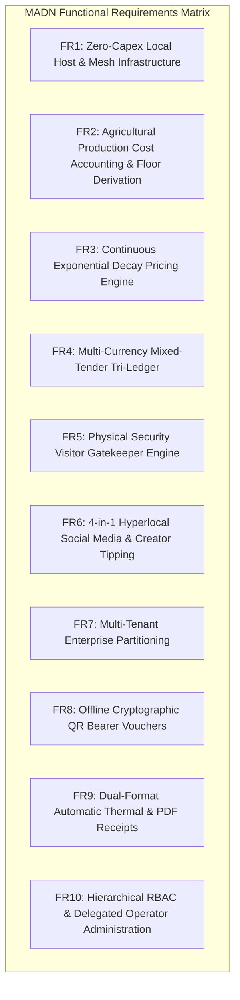

## 3.3 System Requirements

The Modular Adaptive Data Node (MADN) requires a robust set of functional and non-functional specifications designed to ensure high operational resilience, data sovereignty, multi-tenancy, and localized economic security in off-grid rural and peri-urban environments.

---

### 3.3.1 Functional Requirements

1. **FR1: Zero-Capex Host & Mesh Infrastructure**
   - The node software shall install and execute on commodity operator hardware (laptops, mini-PCs, Raspberry Pi 4/5) with zero recurring licensing costs.
   - The system shall broadcast a captive Wi-Fi portal and participate in ad-hoc 802.11s mesh networking with neighbor nodes without requiring WAN internet uplink.

2. **FR2: Agricultural Production Cost Accounting & Floor Derivation**
   - The system shall record 8 granular agricultural production input cost vectors: seeds ($C_{\text{seeds}}$), fertilizer ($C_{\text{fertilizer}}$), irrigation water ($C_{\text{water}}$), farm labor ($C_{\text{labor}}$), pest control ($C_{\text{pest}}$), packaging ($C_{\text{packaging}}$), transport logistics ($C_{\text{logistics}}$), and administrative overhead ($C_{\text{overhead}}$).
   - The system shall automatically compute the wholesale unit cost floor:
     $$P_{\text{cost}} = \frac{\sum_{i=1}^{8} C_i}{M_{\text{commercial}}}$$
   - The system shall derive the dynamic listing base price using the configurable farmer markup coefficient $\mu$:
     $$P_{\text{base}} = P_{\text{cost}} \cdot (1 + \mu)$$

3. **FR3: Continuous Exponential Decay Pricing Engine**
   - Perishable produce inventory shall automatically decline in price according to continuous exponential mathematical decay:
     $$P(t) = P_{\text{cost}} + (P_{\text{base}} - P_{\text{cost}}) \cdot e^{-\lambda t}$$
   - The decay constant $\lambda$ shall be derived from the crop half-life $T_{1/2}$:
     $$\lambda = \frac{\ln(2)}{T_{1/2}}$$
   - The selling price shall asymptotically approach but never fall below the cost floor $P_{\text{cost}}$.

4. **FR4: Multi-Currency Mixed-Tender Tri-Ledger**
   - The POS register shall accept split payments combining United States Dollars (USD), South African Rand (ZAR), and Zimbabwe Gold (ZWG).
   - All tenders shall normalize to USD base value:
     $$V_{\text{paid}} = T_{\text{USD}} + \frac{T_{\text{ZAR}}}{R_{\text{ZAR}}} + \frac{T_{\text{ZWG}}}{R_{\text{ZWG}}}$$
   - Exact change shall be computed and denominated in any preferred currency without rounding deficits.

5. **FR5: Physical Security Visitor Gatekeeper Engine**
   - The system shall record all farm and facility entries with Zimbabwe National ID format verification (`XX-XXXXXX-X-XX`), destination tagging, escort officer tracking, and tamper-evident timestamps.

6. **FR6: 4-in-1 Hyperlocal Social Media & Creator Tipping**
   - The system shall host localized micro-content across 4 paradigms: Microblog threads (X style), Media Carousels (Instagram style), 24h Ephemeral Stories (Snapchat style), and Video Reels (TikTok style).
   - Viewers shall be able to send micro-tips directly in USD, ZAR, or ZWG.

7. **FR7: Multi-Tenant Enterprise Partitioning**
   - The system shall support multiple independent agribusinesses and merchants running concurrently on a single node.
   - All inventory, plantings, transactions, receipts, and vouchers shall be strictly scoped by `business_id`.

8. **FR8: Offline Cryptographic QR Bearer Vouchers**
   - When exact cash change is unavailable, the system shall mint cryptographically-signed bearer tokens via $\text{HMAC-SHA256}$.
   - Vouchers shall be verifiable offline in $<0.08\text{ms}$ and redeemable at any node register with 100% double-spend protection.

9. **FR9: Dual-Format Automatic Thermal & PDF Receipts**
   - Upon transaction checkout or voucher minting, the system shall synthesize itemized receipts formatted for both 58mm/80mm ESC/POS thermal slips and vector PDF invoices.

10. **FR10: Hierarchical RBAC & Delegated Operator Administration**
    - The system shall provide a 3-tier authorization hierarchy: System Super Admin $\to$ Business Admin (Owner) $\to$ Delegated Business Operators.
    - Business Admins shall have autonomous authority to invite staff and assign granular subsystem permissions (`pos`, `agriculture`, `security`, `social`, `vouchers`, `reports`).
    - Operators assigned to Business A shall have zero unauthorized access to Business B or unassigned subsystems in Business A.

---

### 3.3.2 Non-Functional Requirements

| Metric / Dimension | Specification Requirement | Verification Method |
| :--- | :--- | :--- |
| **System Autonomy** | 100% Zero-WAN execution capability | Full offline disconnect benchmarking |
| **Database Concurrency** | SQLite WAL mode with serialized `BEGIN IMMEDIATE` locks | Concurrent multi-threaded test harness |
| **Voucher Verification Latency** | $<1.0\text{ms}$ offline verification | Benchmark test suite (`test_multibiz_and_vouchers.py`) |
| **Operator Permission Latency** | $<0.1\text{ms}$ RBAC evaluation overhead | Benchmark test suite (`test_business_operators.py`) |
| **Audit Trail Tamper-Resistance** | Continuous HMAC-SHA256 cryptographic hash chain | Sequence hash verification algorithm |
