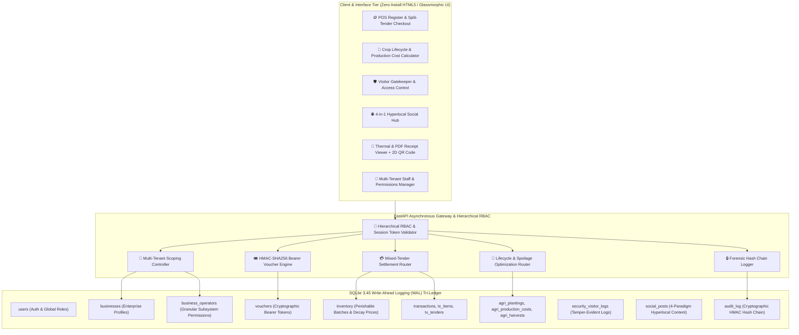

## 4.1 System Architecture

The **Modular Adaptive Data Node (MADN)** architecture is structured as a decoupled, multi-tiered edge computing appliance optimized for resource-constrained, off-grid deployments.

---

### 4.1.1 Hierarchical Multi-Tenant RBAC Model

The authorization subsystem implements a three-tier delegation architecture:

1. **Tier 1 — System Root / Platform Administrator**:
   - Manages physical hardware telemetry, 802.11s RF mesh clusters, captive portal network boundaries, and registers new commercial enterprise entities.

2. **Tier 2 — Business Administrator (Enterprise Owner)**:
   - Owns and manages a specific business partition (`business_id`).
   - Delegates access by inviting staff members and provisioning fine-grained subsystem permissions:
     $$\mathcal{P}_{\text{operator}} \subseteq \{\text{pos}, \text{inventory}, \text{agriculture}, \text{security}, \text{social}, \text{vouchers}, \text{reports}\}$$

3. **Tier 3 — Delegated Business Operators (Staff / Employees)**:
   - Access is restricted exclusively to granted subsystem databases.
   - Cross-enterprise queries are rejected at the database level by parameterized `WHERE business_id = ?` filters.
