## 5.2 Testing Procedures

To empirically validate the Stage 1 Core System Architecture, Multi-Business Tenancy, Offline Cryptographic Bearer Vouchers, and Hierarchical RBAC Operator Delegation, three comprehensive test suites were developed and executed under strict academic testing protocols:
1. `test_stage1_core.py`: Validates agricultural lifecycle math, continuous price decay curves, mixed tender split payments, inventory concurrency, visitor gatekeeper tracking, and social media micro-tipping.
2. `test_multibiz_and_vouchers.py`: Validates multi-business creation and scoping, HMAC-SHA256 bearer voucher minting and sub-millisecond offline verification, double-spend and counterfeit tamper rejection, and end-to-end POS checkout with automatic dual-format receipt synthesis.
3. `test_business_operators.py`: Validates hierarchical RBAC delegation, granular subsystem permission evaluation (`pos`, `agriculture`, `security`, `social`, `vouchers`, `reports`), cross-business operator isolation, and immediate permission revocation.

```mermaid
flowchart TB
    subgraph Test_Harness ["Automated Pytest & Integration Testing Harness (15 Test Cases)"]
        T1["Test 1: Agricultural Production Cost & Base Price Math"]
        T2["Test 2: Continuous Exponential Decay Pricing Math"]
        T3["Test 3: Multi-Currency Mixed-Tender Change Math"]
        T4["Test 4: Harvest Inventory Sync with Conflict Resolution"]
        T5["Test 5: Security Visitor Gatekeeper Check-In & Departure"]
        T6["Test 6: Social Media 4-in-1 Feeds & Multi-Currency Tipping"]
        T7["Test 7: Standalone Data Node File-Based Persistence"]
        T8["Test 8: Multi-Business Registration, Scoping & Isolation"]
        T9["Test 9: Offline Voucher Minting & HMAC-SHA256 Validation"]
        T10["Test 10: Voucher Double-Spend & Counterfeit Rejection"]
        T11["Test 11: End-to-End Checkout, Voucher Change & Receipt Synthesis"]
        T12["Test 12: Business Admin Operator Delegation & Permission Mapping"]
        T13["Test 13: Subsystem Granular Permission Enforcement"]
        T14["Test 14: Cross-Business Operator Security Isolation"]
        T15["Test 15: Instant Operator Revocation & Access Denial"]
    end

    subgraph Verification_Criteria ["Empirical Verification & Invariant Checks"]
        C1["Wholesale Floor & Markup Invariants Verified"]
        C2["Half-Life Decay Curve Convergence Verified"]
        C3["Zero-Deficit Multi-Currency Split Verified"]
        C4["Atomic SQLite WAL BEGIN IMMEDIATE Locks Verified"]
        C5["Active vs. Historical State Transitions Verified"]
        C6["Creator Wallet Balance Increments Verified"]
        C7["Multi-Tenant Isolation & Zero Leakage Verified"]
        C8["Sub-Millisecond HMAC Signature Timing Verified"]
        C9["Double-Spend Protection & Tamper Detection Verified"]
        C10["Dual-Format Receipt & Vector QR Integrity Verified"]
        C11["Hierarchical RBAC Subsystem Bounds Verified"]
    end

    T1 --> C1
    T2 --> C2
    T3 --> C3
    T4 --> C4
    T5 --> C5
    T6 --> C6
    T7 --> C4
    T8 --> C7
    T9 --> C8
    T10 --> C9
    T11 --> C10
    T12 --> C11
    T13 --> C11
    T14 --> C7
    T15 --> C11
```

