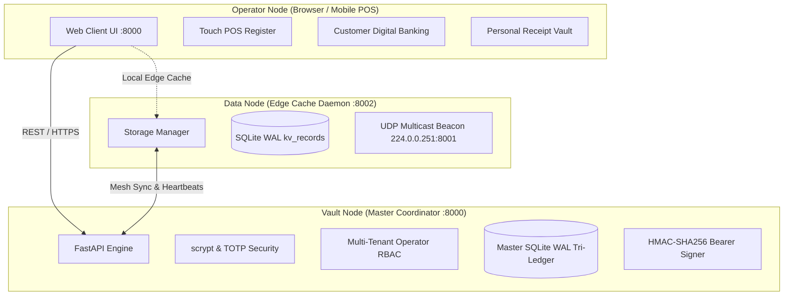

# 3.4 System Design

## 3.4.1 Tri-Node Architectural Decomposition
The Modular Adaptive Data Node (MADN) framework implements a three-tier heterogeneous node topology designed to guarantee partition tolerance, local economic liquidity, and low-latency client interaction under intermittent connectivity. The architecture decouples operations across three specialized operational nodes:

1. **Operator Node (Client Interface & Interaction Engine)**:
   A zero-installation, responsive web client hosted on edge terminals and consumer smartphones (TCP `:8000`). It manages interactive Point-of-Sale (POS) registers, dynamic decay catalog displays, customer digital banking wallets, P2P balance transfers, and on-demand thermal/PDF receipt rendering.

2. **Data Node (Edge Cache & Mesh Discovery Storage)**:
   A lightweight, autonomous edge daemon executing on decentralized embedded hardware (TCP `:8002`). It maintains localized SQLite WAL key-value storage (`kv_records`), caches high-velocity catalogs and digital receipts, and broadcasts periodic UDP multicast heartbeats (`224.0.0.251:8001`) to coordinate mesh discovery.

3. **Vault Node (Master Coordinator & Cryptographic Multi-Currency Tri-Ledger)**:
   The authoritative coordinator and multi-tenant ledger engine (`:8000`). It orchestrates `scrypt`/TOTP authentication, enforces strict database serialization via `BEGIN IMMEDIATE` locks, maintains composite RBAC permissions across multi-business enterprises, and computes HMAC-SHA256 bearer signatures for offline vouchers and customer digital receipts.

## 3.4.2 Customer Digital Banking & Multi-Currency Tri-Ledger Design
To eliminate dependency on external fiat banking rails during grid collapse, MADN provisions sovereign customer digital bank accounts upon user registration. Accounts track liquid balances across three distinct currency denominations:
- **USD**: United States Dollar (Base reference accounting unit)
- **ZAR**: South African Rand (Regional cross-border tender, \(1\text{ USD} = 18.50\text{ ZAR}\))
- **ZWG**: Zimbabwe Gold (National asset-backed unit, \(1\text{ USD} = 26.50\text{ ZWG}\))

Each account is assigned an immutable alphanumeric identifier (`ACC-2026-XXXXXX`). Every balance modification (top-up, P2P transfer, offline voucher deposit, or POS checkout payment) is atomically appended to `wallet_ledger` with an HMAC-SHA256 audit signature:

\[
\sigma_{\text{ledger}} = \text{HMAC-SHA256}\Big(K_{\text{vault}}, \; \text{tx\_id} \parallel \text{acc\_num} \parallel \text{type} \parallel \text{curr} \parallel \text{amount} \parallel \text{bal\_after} \parallel t_{\text{utc}}\Big)
\]

## 3.4.3 Personal Digital Receipt Vault Architecture
Customer transactions generate structured digital receipts archived in the `customer_receipts` table. Each vaulted receipt contains full itemization (product name, quantity, unit, price at sale, and subtotal), tender breakdowns, change voucher metadata, and a SHA-256 cryptographic audit hash:

\[
H_{\text{receipt}} = \text{SHA-256}\Big(\text{receipt\_json}\Big)
\]

The receipt vault provides instant keyword lookup, thermal slip re-rendering with embedded QR codes, and downloadable standard A4 PDF invoices.
