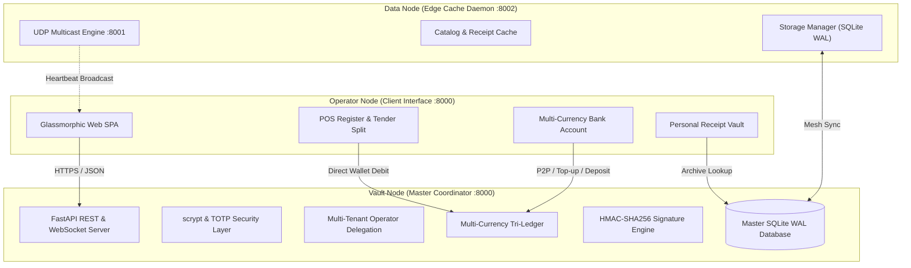

# 4.1 System Architecture

## 4.1.1 Overview of the Tri-Node Heterogeneous Architecture
The Modular Adaptive Data Node (MADN) system architecture is organized around a resilient three-tier heterogeneous node layout that ensures complete offline operational capability across rural and semi-urban smallholder enterprises:

1. **Operator Node**: Zero-installation web client executing directly inside any modern web browser on smartphones, tablets, or point-of-sale terminals. It enables real-time interaction with touch register menus, customer digital wallets, peer-to-peer fund transfers, personal receipt vaults, and agricultural cost logging.
2. **Data Node**: Autonomous edge daemon executing on decentralized embedded devices (e.g. Raspberry Pi 4 / Compute Module 4). It manages local key-value storage (`kv_records`), maintains localized cache copies of product catalogs and receipts, and broadcasts periodic UDP multicast beacon frames (`224.0.0.251:8001`) to coordinate decentralized mesh discovery.
3. **Vault Node**: High-security central coordinator and multi-currency tri-ledger running on port `:8000`. It enforces `scrypt` key derivation with TOTP two-factor authentication, coordinates multi-business tenancy, executes strict concurrency control via SQLite Write-Ahead Logging (WAL) with `BEGIN IMMEDIATE` locks, and signs offline bearer vouchers and digital receipts with HMAC-SHA256 signatures.

## 4.1.2 Multi-Tenant RBAC & Operator Access Delegation
The architecture supports Composable Enterprise tenancy where multiple distinct agribusinesses (e.g. *Green Valley Organics*, *Khumalo Millers*, *Matopos Dairy*) operate on shared node hardware with cryptographic database isolation. 

Business owners and administrators delegate operational privileges to staff across 6 granular subsystems (`pos`, `vouchers`, `agriculture`, `security`, `social`, `reports`) via the `business_operators` table. Access control is verified dynamically on every transaction:

\[
\text{Allowed}(u, b, p) = \Big(u \in \text{SysAdmin}\Big) \lor \Big(u = \text{Owner}(b)\Big) \lor \Big(p \in \text{Permissions}(u, b) \land \text{Active}(u, b)\Big)
\]

## 4.1.3 Multi-Currency Tri-Ledger & Wallet State Machine
The banking subsystem maintains accounts in the `wallets` table, tracking multi-currency balances with atomic double-entry bookkeeping in `wallet_ledger`. Supported transaction types include:
- `deposit`: Cash top-up at node kiosks.
- `pos_payment`: Direct wallet debit for marketplace produce purchases.
- `p2p_transfer`: Peer-to-peer balance transfer between registered users.
- `voucher_deposit`: Conversion of offline cryptographic bearer vouchers into liquid bank balance.
- `social_tip`: Micropayments sent to agrarian content creators.
