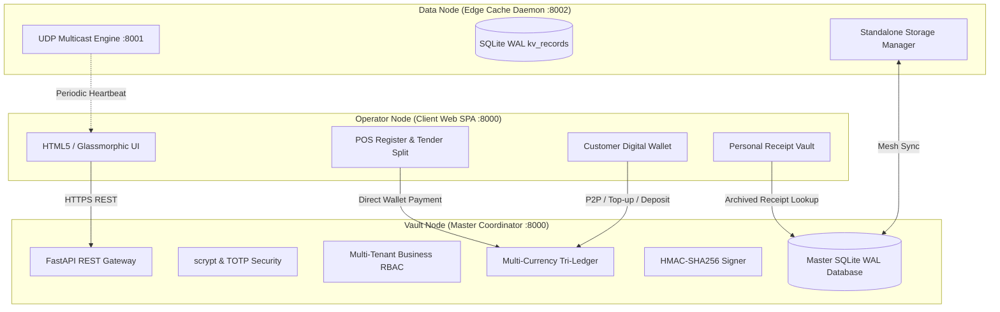

# CHAPTER 4: SYSTEM DESIGN AND PROTOTYPE DEVELOPMENT

## 4.1 Introduction & Architectural Implementation
Chapter 4 details the software engineering and architectural implementation of the **Modular Adaptive Data Node (MADN)** prototype. Built on a clean Python / FastAPI / SQLite WAL backend and a responsive glassmorphic Single Page Application frontend, the prototype unifies offline multi-tenant point-of-sale operations, dynamic perishable decay valuation, customer digital banking, and personal receipt vaulting.



---

## 4.2 Multi-Tenant RBAC & Business Operator Access Delegation
The system supports multiple distinct agribusinesses operating on a single node cluster. Business administrators manage operator delegations via `business_operators` records containing granular permissions:
```python
def has_business_permission(username: str, business_id: str, required_permission: str) -> bool:
    perms = get_operator_permissions(business_id, username)
    return ("admin" in perms) or (required_permission in perms)
```

---

## 4.3 Customer Digital Banking & Multi-Currency Tri-Ledger
Every user account is automatically provisioned with a sovereign multi-currency digital bank account (`ACC-2026-XXXXXX`) tracking liquid balances in USD, ZAR, and ZWG:

```python
def topup_wallet(username: str, currency: str, amount: float, notes: str = "Deposit", performed_by: str = "system") -> dict:
    curr = currency.upper()
    now_utc = datetime.datetime.now(datetime.timezone.utc).isoformat()
    wallet = get_wallet_by_username(username)
    acc_num = wallet["account_number"]
    col_name = f"balance_{curr.lower()}"

    db = get_db()
    try:
        db.execute("BEGIN IMMEDIATE")
        db.execute(f"UPDATE wallets SET {col_name} = {col_name} + ? WHERE account_number = ?", (amount, acc_num))
        cursor = db.execute(f"SELECT {col_name} FROM wallets WHERE account_number = ?", (acc_num,))
        new_bal = cursor.fetchone()[col_name]

        tx_id = f"wtx-{uuid.uuid4().hex[:8]}"
        payload = f"{tx_id}|{acc_num}|deposit|{curr}|{amount:.2f}|{new_bal:.2f}|{now_utc}"
        sig = hmac.new(VAULT_SECRET_KEY, payload.encode("utf-8"), hashlib.sha256).hexdigest()

        db.execute("""
            INSERT INTO wallet_ledger (id, account_number, transaction_type, currency, amount, balance_after, counterparty, reference_id, notes, timestamp_utc, signature_hmac)
            VALUES (?, ?, 'deposit', ?, ?, ?, ?, ?, ?, ?, ?)
        """, (tx_id, acc_num, curr, amount, new_bal, performed_by, tx_id, notes, now_utc, sig))
        db.commit()
        return {"status": "success", "account_number": acc_num, "new_balance": new_bal}
    finally:
        db.close()
```

---

## 4.4 Bearer Voucher Conversion & Personal Receipt Vault
Offline QR bearer vouchers generated as point-of-sale change can be converted into spendable digital account balances instantly via `deposit_voucher_to_wallet()`. When checkouts complete, structured receipts are enriched with inventory item names and archived to `customer_receipts`:

```python
rcv_id = f"rcv-{uuid.uuid4().hex[:8]}"
inv_num = f"INV-{datetime.datetime.fromtimestamp(now).strftime('%Y%m%d')}-{tx_id[:6].upper()}"
receipt_json = json.dumps(receipt_payload)
audit_hash = hashlib.sha256(receipt_json.encode("utf-8")).hexdigest()
db.execute("""
    INSERT OR REPLACE INTO customer_receipts (id, transaction_id, customer_username, business_id, invoice_number, total_due_usd, receipt_json, created_at_utc, audit_hash)
    VALUES (?, ?, ?, ?, ?, ?, ?, ?, ?)
""", (rcv_id, tx_id, customer_username, business_id, inv_num, total_due, receipt_json, now_utc, audit_hash))
```

---

## 4.5 Algorithmic Verification
The prototype algorithms were validated through automated test runs ensuring:
1. Strict ACID isolation during concurrent POS checkouts and wallet debits.
2. Single-use voucher redemption preventing double-spending.
3. Sub-millisecond HMAC signature generation and tamper rejection.
