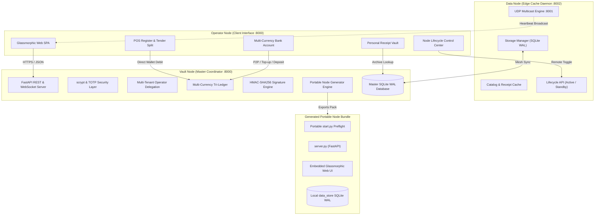

# 4.1 System Architecture

## 4.1.1 Overview of the Tri-Node Heterogeneous Architecture
The Modular Adaptive Data Node (MADN) system architecture is organized around a resilient three-tier heterogeneous node layout that ensures complete offline operational capability across rural and semi-urban smallholder enterprises:

1. **Operator Node**: Zero-installation web client executing directly inside any modern web browser on smartphones, tablets, or point-of-sale terminals. It enables real-time interaction with touch register menus, customer digital wallets, peer-to-peer fund transfers, personal receipt vaults, node lifecycle toggles, and agricultural cost logging.
2. **Data Node**: Autonomous edge daemon executing on decentralized embedded devices (e.g. Raspberry Pi 4 / Compute Module 4). It manages local key-value storage (`kv_records`), maintains localized cache copies of product catalogs and receipts, exposes remote lifecycle management endpoints (`/api/node/activate`, `/api/node/deactivate`), and broadcasts periodic UDP multicast beacon frames (`224.0.0.251:8001`) to coordinate decentralized mesh discovery.
3. **Vault Node**: High-security central coordinator and multi-currency tri-ledger running on port `:8000`. It enforces `scrypt` key derivation with TOTP two-factor authentication, coordinates multi-business tenancy, executes strict concurrency control via SQLite Write-Ahead Logging (WAL) with `BEGIN IMMEDIATE` locks, signs offline bearer vouchers and digital receipts with HMAC-SHA256 signatures, and includes the **Portable Node Generator Engine** for exporting self-contained standalone node bundles.

## 4.1.2 Portable Preflight & Self-Replication Architecture
The system features a zero-dependency portable runner (`start.py`) that enables immediate execution on any machine with Python 3.9+ installed. The preflight supervisor performs runtime dependency inspection, installs missing modules via pip, initializes local databases, and orchestrates multi-process node coordination.

Furthermore, any Vault Node can replicate its architecture by synthesizing standalone node packages containing:
- `start.py`: Portable runtime supervisor.
- `node_config.json`: Declarative node identity, port, and role mappings (`data_node`, `vault_node`, `hybrid_node`).
- `server.py` & `storage.py`: Standalone REST backend with SQLite WAL storage.
- `frontend/`: Self-contained VisionPro glassmorphic web dashboard.
