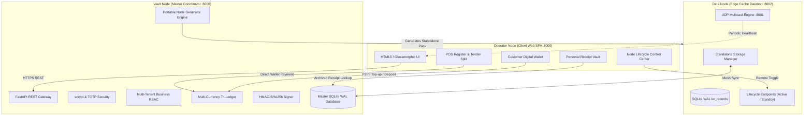

# CHAPTER 4: SYSTEM DESIGN AND PROTOTYPE DEVELOPMENT

## 4.1 Introduction & Architectural Implementation
Chapter 4 details the software engineering and architectural implementation of the **Modular Adaptive Data Node (MADN)** prototype. Built on a clean Python / FastAPI / SQLite WAL backend and a responsive glassmorphic Single Page Application frontend, the prototype unifies offline multi-tenant point-of-sale operations, dynamic perishable decay valuation, customer digital banking, personal receipt vaulting, and automated portable node generation.

---

## 4.2 Portable Multi-Node Bootstrapper & Self-Replication
The prototype introduces `Applications/start.py`, a zero-dependency launcher providing preflight validation, dependency resolution, and multi-process coordination for Vault Coordinator (`:8000`) and Data Nodes (`:8002`).

The Vault Node exposes `/api/cluster/nodes/generate-portable`, allowing operators to export complete standalone node bundles containing their own `start.py`, FastAPI backend, and embedded glassmorphic web dashboard.

---

## 4.3 Remote Lifecycle Control & Maintenance Mode
Data Nodes expose `/api/node/activate` and `/api/node/deactivate`. When deactivated, write transactions are blocked with HTTP 503 Maintenance Mode and beacon broadcasts are suspended to conserve mesh bandwidth.

---

## 4.4 Customer Digital Banking & Personal Receipt Vault
Every user account receives a sovereign multi-currency digital wallet (`ACC-2026-XXXXXX`) tracking USD, ZAR, and ZWG with atomic double-entry bookkeeping in `wallet_ledger`. Itemized receipts are archived to `customer_receipts` with SHA-256 integrity hashes upon POS checkout completion.
