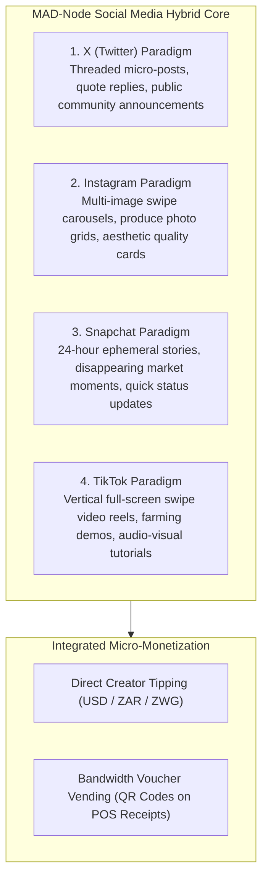
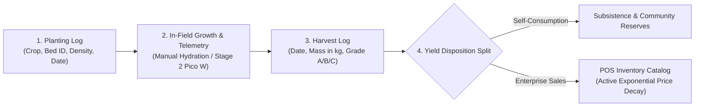

## 4.2 Detailed Design Explanation

The MAD-Node operational logic is structured around four domain subsystems within the Stage 1 Web Application, complemented by Stage 2 Cyber-Physical hardware extensions.

### 4.2.1 Subsystem 1: Hybrid Social Media & Local Mesh Engine (Stage 1 Core)

The Social Media subsystem synthesizes proven user engagement paradigms into a unified, local-first platform operating entirely without cellular data charges:

* **Interaction Logic**: Users publish rich posts containing text, image arrays, or short video snippets. Posts flagged with `is_ephemeral=True` expire automatically after 24 hours via a background cleanup daemon.
* **Creator Micro-Tipping**: Community members can tip creators in real-time. Tipping requests execute atomic balance transfers on the Data Node, updating sender and recipient ledgers using `BEGIN IMMEDIATE` locks.

---

### 4.2.2 Subsystem 2: Precision Agriculture & Harvest Lifecycle Tracker (Stage 1 Core)

The Agriculture subsystem enables end-to-end digital tracking of smallholder crop production:

* **Planting & Harvest Logging**: Operators record seed varieties, planting dates, and target maturities. Upon harvest, operators submit the measured mass in kilograms or tons and assign quality grades (Grade A, B, or C).
* **Yield Disposition Allocation**: An interactive slider splits the harvest:
  - **Self-Consumption**: Allocates produce for household subsistence or seed reserve, deducting from field yield without creating commercial listings.
  - **Composable Enterprise Sales**: Automatically creates inventory catalog items at the POS terminal, initializing continuous exponential price decay to maximize revenue before spoilage.

---

### 4.2.3 Subsystem 3: Security & Visitor Gatekeeping Access Manager (Stage 1 Core)

The Security subsystem replaces fragile paper logbooks with an offline-first, searchable digital registry:

* **Visitor Entry Workflow**: Security personnel record visitor credentials across structured fields:
  - `national_id`: National Identification number, Passport, or Staff Badge ID.
  - `full_name`: Full legal name of the visitor.
  - `time_in`: Exact server-generated timestamp upon arrival.
  - `destination_zone`: Target environment (*Main Office*, *Crop Silos*, *Farm Quadrant B*, *Machine Shed*).
  - `purpose_of_visit`: Delivery, agronomic inspection, maintenance, or consultation.
  - `escort_officer_name`: Name of hosting staff member.
  - `status`: Initialized to `Active`.
* **Visitor Exit Workflow**: Upon departure, the guard logs `time_out`, calculating total duration of stay and transitioning status to `Checked-Out`.
* **Stage 2 Scale-Up Integration**: When Stage 2 hardware is deployed, visitor records are correlated with PIR/ultrasonic tripwires, 3-point RSSI intrusion trilateration, and tamper-evident HMAC-SHA256 audit logs.

---

### 4.2.4 Subsystem 4: Composable Enterprise Application (with Dynamic RBAC & Customer Role)

The Enterprise subsystem serves as the commercial orchestration engine across all operations:

* **Dynamic RBAC Governance**: Six distinct role profiles govern system capabilities:
  - `admin`: Full system configuration, node discovery peering, and tamper-evident audit logs.
  - `agronomist`: Planting, harvesting, yield disposition splitting, and irrigation management.
  - `guard`: Visitor check-in/check-out, physical zone access tracking, and emergency alert dispatch.
  - `merchant`: POS catalog maintenance, inventory management, and mixed-tender checkout execution.
  - **`customer`**: Produce catalog browsing, dynamic price discovery, cart checkout (USD/ZAR/ZWG split payments), Wi-Fi voucher redemption, and creator tipping.
  - `guest`: Public social feed viewing and community bulletin reading.
* **Continuous Exponential Price Decay Engine**:
  $$P(t) = P_{cost} + (P_{base} - P_{cost}) \cdot e^{-\lambda t}, \quad \lambda = \frac{\ln(2)}{T_{half\_life}}$$
* **Multi-Currency Mixed-Tender Change Algorithm**:
  $$V_{paid} = T_{USD} + \frac{T_{ZAR}}{\text{rate}_{ZAR}} + \frac{T_{ZWG}}{\text{rate}_{ZWG}}$$
  $$\text{Change}_{USD} = V_{paid} - \text{Total}_{USD}$$
  $$\text{Change}_{ZWG} = \text{Change}_{USD} \cdot \text{rate}_{ZWG}$$

### 4.2.6 Modular Dynamic Field Product Engine & Business Subsystem Architecture

The MADN architecture implements a decoupled, field-selectable inventory model within the **Business Subsystem** (transitioning from legacy isolated POS terminals to full commercial management). Unlike conventional rigid enterprise ERP schemas, the MADN Modular Product Engine allows store operators to configure attributes dynamically:

1. **Deterministic System SKU Auto-Assignment**:
   $$\text{SKU} = \text{Prefix}_4(\text{Name}) \mathbin{\Vert} \text{Code}_3(\text{Category}) \mathbin{\Vert} \text{CRC16}(\text{Entropy})$$
   Enforces internal tracking consistency while eliminating human labeling errors.

2. **Mandatory Dual-Tier Financial Accounting**:
   Every inventory item enforces strict non-negative Cost Price ($C_{\text{unit}}$) and positive Selling Price ($P_{\text{unit}}$), calculating real-time gross profit margin:
   $$\text{Margin}\% = \left( \frac{P_{\text{unit}} - C_{\text{unit}}}{P_{\text{unit}}} \right) \times 100$$

3. **Modular Taxonomic Hierarchy & Extensibility**:
   Operators selectively enable metadata layers including scannable universal product codes (EAN/UPC/ISBN), hierarchical multi-tier taxonomy (e.g. $\text{Category} \succ \text{Subcategory}$), manufacturer brands, dynamic specification key-value tuples, tiered wholesale volume pricing, and localized image attachments.

4. **Empty-State POS Bypass & Data Node Replication**:
   When inventory count $N = 0$, the checkout terminal is systematically bypassed, rendering an operator setup intake form. Every registered item is asynchronously replicated to decentralized Data Nodes (`http://127.0.0.1:8002/api/node/data/inventory`) ensuring complete offline continuity.

### 4.2.8 Sovereign Heavy Data-at-Rest Encryption & Cryptographic Envelopes (AES-256-GCM + scrypt KDF)
To guarantee complete confidentiality and sovereign privacy against physical node seizure or unauthorized disk access, the MADN ecosystem enforces military-grade **AES-256-GCM authenticated encryption at rest**:
1. **Key Derivation (scrypt KDF)**: Master cryptographic keys are derived from operator-held passphrases using $\text{scrypt}(N=16384, r=8, p=1, dklen=32, maxmem=64\text{MB})$.
2. **Authenticated AEAD Ciphertexts**: Payloads stored across SQLite tables (`customer_receipts`, `kv_records`, `wallets`, `vouchers`) are encrypted with 96-bit random nonces and 128-bit authentication tags in armored format: `ENC:<nonce_b64>:<ciphertext_and_tag_b64>`. Any external bit manipulation triggers immediate integrity failure.
3. **Sequential Visibility Gating**: The user interface adapts strictly to the operator's onboarding lifecycle: Stage 1 (Store Setup Required) $\to$ Stage 2 (Empty Catalog Prompt) $\to$ Stage 3 (Active Point of Sale & Analytics).
