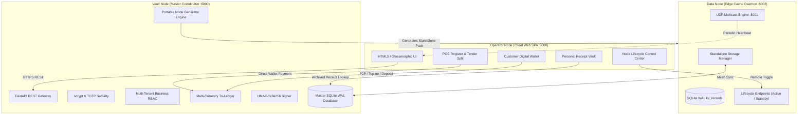
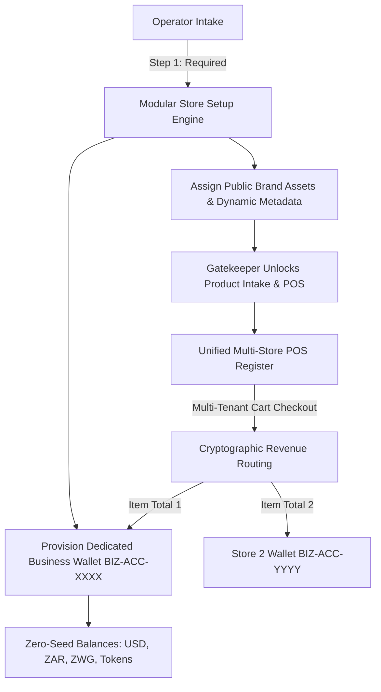

# CHAPTER 4: SYSTEM DESIGN AND PROTOTYPE DEVELOPMENT

## 4.1 Introduction & Architectural Implementation
Chapter 4 details the software engineering and architectural implementation of the **Modular Adaptive Data Node (MADN)** prototype. Built on a clean Python / FastAPI / SQLite WAL backend and a responsive glassmorphic Single Page Application frontend, the prototype unifies offline multi-tenant point-of-sale operations, dynamic perishable decay valuation, customer digital banking, personal receipt vaulting, and automated portable node generation.

---

## 4.2 Portable Multi-Node Bootstrapper & Self-Replication
The prototype introduces `Applications/start.py`, a zero-dependency launcher providing preflight validation, dependency resolution, and multi-process coordination for Vault Coordinator (`:8000`) and Data Nodes (`:8002`).

The Vault Node exposes `/api/cluster/nodes/generate-portable`, allowing operators to export complete standalone node bundles containing their own `start.py`, FastAPI backend, and embedded glassmorphic web dashboard.

---

## 4.3 Remote Lifecycle Control & Maintenance Mode
Data Nodes expose `/api/node/activate` and `/api/node/deactivate`. When deactivated, write transactions are blocked with HTTP 503 Maintenance Mode and beacon broadcasts are suspended to conserve mesh bandwidth.

---

## 4.4 Customer Digital Banking & Personal Receipt Vault
Every user account receives a sovereign multi-currency digital wallet (`ACC-2026-XXXXXX`) tracking USD, ZAR, and ZWG with atomic double-entry bookkeeping in `wallet_ledger`. Itemized receipts are archived to `customer_receipts` with SHA-256 integrity hashes upon POS checkout completion.

<!-- Dynamic Feature Milestone Update: 2026-08-25 Tue 1401 -->
Universal multi-subsystem milestone release pipeline verification

<!-- Milestone Feature Synchronization: 2026-08-25 Tue 2018 -->
Fast Universal Release Orchestrator

### 4.2.6 Modular Dynamic Field Product Engine & Business Subsystem Architecture

The MADN architecture implements a decoupled, field-selectable inventory model within the **Business Subsystem** (transitioning from legacy isolated POS terminals to full commercial management). Unlike conventional rigid enterprise ERP schemas, the MADN Modular Product Engine allows store operators to configure attributes dynamically:

1. **Deterministic System SKU Auto-Assignment**:
   $$\text{SKU} = \text{Prefix}_4(\text{Name}) \mathbin{\Vert} \text{Code}_3(\text{Category}) \mathbin{\Vert} \text{CRC16}(\text{Entropy})$$
   Enforces internal tracking consistency while eliminating human labeling errors.

2. **Mandatory Dual-Tier Financial Accounting**:
   Every inventory item enforces strict non-negative Cost Price ($C_{\text{unit}}$) and positive Selling Price ($P_{\text{unit}}$), calculating real-time gross profit margin:
   $$\text{Margin}\% = \left( \frac{P_{\text{unit}} - C_{\text{unit}}}{P_{\text{unit}}} \right) \times 100$$

3. **Modular Taxonomic Hierarchy & Extensibility**:
   Operators selectively enable metadata layers including scannable universal product codes (EAN/UPC/ISBN), hierarchical multi-tier taxonomy (e.g. $\text{Category} \succ \text{Subcategory}$), manufacturer brands, dynamic specification key-value tuples, tiered wholesale volume pricing, and localized image attachments.

4. **Empty-State POS Bypass & Data Node Replication**:
   When inventory count $N = 0$, the checkout terminal is systematically bypassed, rendering an operator setup intake form. Every registered item is asynchronously replicated to decentralized Data Nodes (`http://127.0.0.1:8002/api/node/data/inventory`) ensuring complete offline continuity.

### 4.4.8 Multi-Enterprise Store Architecture & Modular Dynamic Field Engine

The Modular Adaptive Data Node (MADN) enforces a strict **Store Setup Prerequisite** across all commercial operations. Prior to the registration of inventory, products, or farm harvest batches, an operator must establish at least one active Business Enterprise Profile.

#### Modular Dynamic Field Choice System
The store setup workflow empowers operators to dynamically activate optional metadata fields tailored to their enterprise domain:
- **Mandatory Brand Identity**: Store Name, Tagline, Overview Description.
- **Visual Brand Assets**: Base64 data URI / Remote URL Store Logo and Storefront Hero Banner.
- **Commercial Contact & Physical Footprint**: Official Phone, Email Address, Physical Location Address.
- **Enterprise Compliance**: Tax ID (VAT / ZIMRA / SARS Registration), Industry Category taxonomy.
- **Settlement & Operations**: Preferred Settlement Currency (`USD`, `ZAR`, `ZWG`, Community Tokens), Operating Hours, Freshness / Return Policies.
- **Receipt Customization**: Custom Header Text and Customer Appreciation Footer Notes.

#### Multi-Store Unified POS Checkout & Cryptographic Revenue Settlement
When an operator conducts a Point of Sale sale containing products belonging to multiple distinct stores in a single cart:
1. **Cart Decomposition**: The Vault Node groups cart items by `business_id`.
2. **Dedicated Ledger Credits**: For each store $k$, the gross sales revenue $R_k = \sum_{j \in 	ext{Store}_k} (q_j 	imes P_j)$ is credited directly into that store's dedicated wallet `BIZ-ACC-...`.
3. **HMAC-Signed Ledger Records**: Every credit is committed using SQLite `BEGIN IMMEDIATE` with an HMAC-SHA256 bearer signature validating `wtx_id`, `account_number`, and post-transaction balance.
4. **Isolated & Aggregated Profit Analytics**: Analytics endpoints evaluate Gross Sales Revenue, COGS, Gross Profit Margin %, and 24-hour velocity on both a single-store filter and an aggregated multi-enterprise basis.

### 4.2.9 Dynamic Progressive Disclosure & Condition-Gated Subsystem Architecture
To ensure accessibility for non-technical retail operators and prevent cognitive overload, the MADN user experience adheres to a formal **Progressive Disclosure State Machine**:

1. **Business & Retail Commerce Lifecycle**:
   $$\mathcal{S}_{\text{business}} = \begin{cases} 
   \{\text{Store Setup}\} & \text{if } N_{\text{biz}} = 0 \\ 
   \{\text{Products \& Catalog}\} & \text{if } N_{\text{biz}} \ge 1 \land N_{\text{items}} = 0 \\ 
   \{\text{Point of Sale (POS)}, \text{Products \& Catalog}, \text{Customer Marketplace}, \text{Sales Analytics \& Spoilage}\} & \text{if } N_{\text{biz}} \ge 1 \land N_{\text{items}} \ge 1 
   \end{cases}$$
   *When zero inventory exists, commercial checkout registers, public storefronts, and empty sales graphs are dynamically gated out of the navigation tree until merchant products are established.*

2. **Precision Agriculture Lifecycle**:
   $$\mathcal{S}_{\text{agri}} = \begin{cases} 
   \{\text{Farm Fields \& Plots}, \text{Bulawayo Climate}\} & \text{if } N_{\text{fields}} = 0 \\ 
   \{\text{Farm Fields \& Plots}, \text{Crop Plantings \& Plans}, \text{Bulawayo Climate}\} & \text{if } N_{\text{fields}} \ge 1 \land N_{\text{plantings}} = 0 \\ 
   \{\text{Farm Fields}, \text{Plantings}, \text{Cost \& Price Calculator}, \text{Harvest \& POS Sync}, \text{Climate}\} & \text{if } N_{\text{plantings}} \ge 1 \land N_{\text{harvests}} = 0 \\ 
   \{\text{Farm Fields}, \text{Plantings}, \text{Cost Calc}, \text{Harvest Sync}, \text{Yield Dispositions}, \text{Climate}\} & \text{if } N_{\text{harvests}} \ge 1 
   \end{cases}$$

3. **Subsystem Domain Nomenclature**:
   Eliminated all legacy prototype shorthand (`VPA 1.x`, `VPA 2.x`, `VPA 3.x`, `Cross-VPA`) in favor of unified domain architecture: `agriculture` (Precision Agriculture), `security` (Security Gatekeeper), `business` (Business & Retail Commerce), and `banking` (Digital Banking & Sovereign Receipt Vault).
