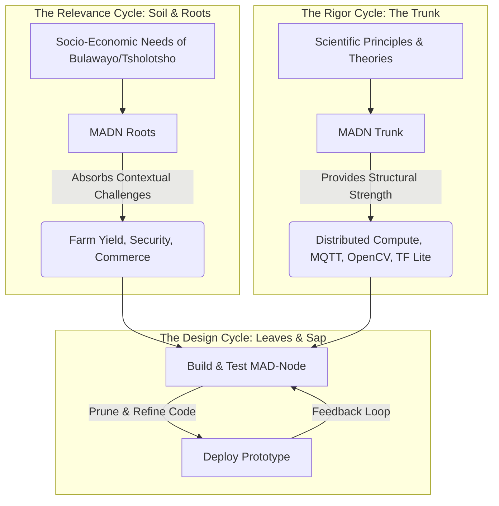

# Metaphors and Mental Models of Design Science Research (DSR)

This document builds our intuitive, non-academic understanding of the **Design Science Research (DSR)** framework as it applies to the **Modular Adaptive Data Node (MADN)**. Here, we step away from dry academic jargon and visualize our project as a living, breathing part of the Zimbabwean landscape.

---

## 1. The Tree of DSR: Mapping Hevner's Three Cycles

In Design Science Research, we build an **artifact** to solve a real-world problem. DSR is traditionally described through three intersecting loops: the *Relevance Cycle*, the *Rigor Cycle*, and the *Design Cycle*. 

To understand this intuitively, let us picture the MADN as a **Umganu (Marula) Tree** growing in the sandy soils of Tsholotsho.

### 🌿 The Roots: The Relevance Cycle (The Soil)
The roots of the Marula tree grip the soil tightly. The soil is the **Environment**—the streets of Bulawayo, the fields of Tsholotsho, the local markets, and the people. 
*   **The Soil's Dryness**: Farmers struggling with unpredictable rainfall, vendors facing blackouts, and families wanting to keep their perimeters safe.
*   **The Roots' Job**: The roots absorb these nutrients (real-world problems and data). If our roots don't touch this soil, our project is just a useless simulation. It dies of dehydration.

### 🌳 The Trunk: The Rigor Cycle (The Wood)
The trunk is made of strong, hard wood that grows slowly over years. This represents the **Knowledge Base**—the science, the theories, and the established rules of engineering.
*   **The Wood's Composition**: We didn't invent MQTT, cryptography, OpenCV, or TensorFlow Lite. These are the strong fibers of the trunk developed by thousands of scientists before us.
*   **The Trunk's Job**: It holds the tree upright against the strong winds. By using rigorous, open-source standards, we ensure that our local system doesn't collapse under pressure.

### 🍃 The Leaves & Sap: The Design Cycle (The Growth)
The leaves absorb sunlight, and the sap carries nutrients back and forth. This is the **Design Cycle**—the active process of building, coding, testing, debugging, and improving.
*   **The Seasonal Loop**: We write code for the Pico W, flash it, watch it run, see it fail when it gets too hot, add a mini-fan, and write better code. This is the tree growing leaves, losing them in the winter, and growing stronger ones in the spring.
*   **The Output**: The fruit (the Marula fruit) is the actual working MAD-Node prototype that the community can use.

---

## 2. Visualizing the "Dynamic Value System"

In our main thesis, we talk about a "dynamic value system." What does this actually mean? Let's use the metaphor of **Water (Rain and Rivers)**.

*   **The Rain (Data Sources)**: Rain falls unevenly across the land. One farm gets a heavy shower (lots of soil data); another gets nothing. One market is busy with transactions; another is quiet. Data is like rain—dynamic, unpredictable, and scattered.
*   **The Puddles (Idle Compute)**: When it rains, water pools in small hollows and rock basins. These are our idle devices (phones, laptops). They are small, scattered reservoirs of water that usually just evaporate (wasted processing power).
*   **The Water Channels (MADN)**: The MAD-Node is a network of small, hand-dug channels that connect these puddles. Instead of letting the water evaporate, we guide it toward a central pond (The Vault/Pi 4) where it can irrigate a garden. 
*   **The Value Generated**: The irrigated garden produces food. In our system, the "irrigated data" produces **Value**—crop predictions, safety alerts, and completed sales. The value is "dynamic" because as the rain moves, the channels adapt to capture water wherever it falls.

---

## 3. "What If" Scenarios: The Power of Local Micro-Clouds

To understand why we aren't just using standard cloud services (like AWS or Google Cloud), let's explore three "what if" scenarios in the local context.

### Scenario A: The 3-Day Grid Blackout
*   **The Situation**: A severe power cut knocks out the local cellular tower. The internet is completely dead. 
*   **Without MADN**: The local store cannot process digital transactions. Business grinds to a halt. The security cameras stop recording because they can't upload to the cloud.
*   **With MADN**: The store's POS system runs locally on the Pi 4. The Pico W price tags on the shelves update automatically. Neighbors connect their smartphones to the MADN local Wi-Fi mesh to log transactions on the local ledger. The security tripwires still trigger the Pi 4 camera because the brain is right there, running on a local battery. When the cellular network returns, the Pi 4 auto-syncs the accumulated ledger to the cloud.

### Scenario B: The Smartphone Cooperative
*   **The Situation**: A local farming cooperative needs to run a complex machine learning model to analyze soil health across 100 plots, but the Pi 4 is busy processing security feeds.
*   **Without MADN**: The cooperative must pay expensive data costs to upload gigabytes of soil profiles to a cloud server in South Africa or Europe.
*   **With MADN**: Three young farmers sit under a tree, chatting. Their smartphones are in their pockets, idle. The MADN Orchestrator detects these three devices on the local network. It splits the machine learning task into three small chunks, sends them to the idle smartphones to process, and collects the results in minutes. The farmers didn't even notice their phones working, and no internet data was spent!

---

## 4. Summary of the DSR Journey

When we present our project to academic panels or supervisors (like Mr. Kunene), they want to see the rigorous equations and methodologies. But when we build it, we must remember:
*   We build because there is a **need in the soil** (Relevance).
*   We build using the **strength of the trunk** (Rigor).
*   We build by **constantly growing and pruning** (Design).
