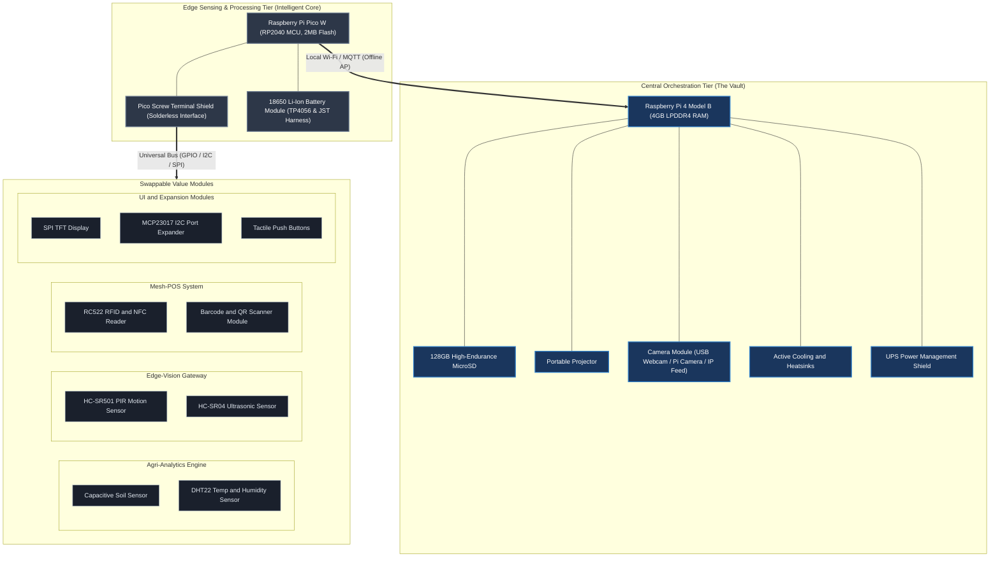

## 3.3 System Requirements (Hardware and Software)

To realize the decentralized, resilient architecture of the Modular Adaptive Data Node (MADN) within the resource-constrained and infrastructure-unstable environments of Bulawayo and Tsholotsho, a robust selection of hardware and software resources is required. This section delineates the precise system requirements of the prototype ecosystem, structured to support localized operation, local-first data processing, and physical durability.

---

### 3.3.1 Hardware Requirements

The physical infrastructure of the MADN is divided into three functional tiers: the Central Orchestration Tier (The Vault), the Edge Sensing and Processing Tier (The Intelligent Core), and the Swappable Value Modules. These are complemented by a resilient power and physical enclosure subsystem.

#### 1. Central Orchestration & Storage Tier (The Vault)
The orchestration hub serves as the primary coordination point for local data accumulation, model inference, and local-first network routing.
*   **Central Computing Unit**: Raspberry Pi 4 Model B equipped with a Broadcom BCM2711 quad-core Cortex-A72 (ARM v8) 64-bit SoC @ 1.5GHz, configured with 4GB (or 8GB) of LPDDR4-3200 SDRAM. This level of RAM is required to run multi-threaded Python logic, local databases, and inference runtimes concurrently.
*   **System Storage**: A 128GB high-endurance Class 10 UHS-I MicroSD Card. This capacity is necessary to support a local-first time-series database containing extensive historical telemetry, local transaction ledgers, image logs captured by the security gateway, and system log files.
*   **Peripherals**: 
    *   A low-power portable projector. This peripheral enables local administrators to manage system configurations, run diagnostic checks, and present analytical data (such as farm yield projections and market transaction metrics) directly to community groups in field conditions where traditional monitors are impractical.
*   **Thermal Management**: An active dual-fan cooling system paired with copper micro-heatsinks. This is a critical requirement due to the high ambient temperatures characteristic of Bulawayo and Tsholotsho, which would otherwise induce thermal throttling and degrade processing throughput.
*   **Power Management**: A dedicated Uninterruptible Power Supply (UPS) shield capable of holding dual 18650 Li-Ion cells, providing power storage status indicators and automatic failover logic to prevent file corruption during grid blackouts.

#### 2. Edge Sensing and Processing Tier (Intelligent Core)
The edge nodes process raw data at the boundary of the physical environment before transmitting structured summaries to the central hub.
*   **Compute Unit**: Raspberry Pi Pico W microcontrollers. Each node features the RP2040 chip, which hosts two ARM Cortex-M0+ cores clocked up to 133MHz, 264KB of embedded SRAM, and 2MB of onboard QSPI flash storage. A built-in Infineon CYW43439 wireless interface provides single-band 2.4GHz Wi-Fi connectivity (802.11n).
*   **Assembly Interface**: Pico Screw Terminal Expansion Shields. To facilitate rapid, solderless deployment and quick field maintenance, all wire connections from sensors to the Pico W GPIO pins are secured via screw terminal blocks. This prevents wire shearing and connection degradation in rugged operational environments.
*   **Prototyping Materials**: Mini solderless breadboards and male-to-male/male-to-female/female-to-female jumper wires to facilitate fast experimental adjustments of newly introduced sensing elements.

#### 3. Swappable Value Modules
Sensors and input-output peripherals are standardized to connect to the Intelligent Core using a universal bus structure.
*   **Agri-Analytics Engine (Precision Farming)**:
    *   *Capacitive Soil Moisture Sensors*: Custom calibrated to prevent electrical corrosion of the probe tips (which occurs on cheap resistive soil probes), ensuring long-term operational lifespan in acidic and alkaline soils.
    *   *DHT22 (AM2302) Sensors*: High-accuracy capacitive humidity and thermistor temperature sensors, capable of reading relative humidity from 0–100% (±2% accuracy) and temperatures from -40°C to 80°C (±0.5°C accuracy) to monitor microclimatic variations.
*   **Edge-Vision Gateway (Perimeter Security)**:
    *   *Passive Infrared (PIR) Sensors (HC-SR501)*: Low-power infrared motion detectors with adjustable sensitivity and delay timers. These function as physical triggers connected to the Pico W, which send state updates to the Orchestrator via MQTT.
    *   *Ultrasonic Distance Sensors (HC-SR04)*: Capable of non-contact distance measurement from 2cm to 400cm (±3mm accuracy), used to construct virtual tripwires connected to the Pico W to detect physical entry.
    *   *Camera Capture Interface (USB Webcam / Pi Camera Module / IP Feed)*: The physical video/image acquisition source connected directly to the primary node (Pi 4) or streamed over the local network (e.g., a repurposed smartphone). While the PIR and ultrasonic sensors on the Pico W act as spatial triggers, the Camera Capture Interface provides the actual visual data for computer vision processing.
*   **Mesh-POS System (Commercial Transactions)**:
    *   *RC522 RFID/NFC Reader Module*: Operates at 13.56 MHz, used to scan local security cards, member badges, or offline payment tokens.
    *   *Barcode / QR Code Scanner Module*: Low-power serial or I2C module configured to scan retail product barcodes and mobile payment screens.
*   **Interface & System Expansion**:
    *   *SPI TFT Display (1.8-inch or 2.4-inch)*: Low-power color screens providing local output readouts (e.g., current moisture level, last transaction status, battery capacity).
    *   *MCP23017 I2C Port Expander*: A 16-bit input/output expander utilizing the I2C interface, allowing additional sensor lines to stack on the Pico W without depleting native GPIO pins.
    *   *Tactile Buttons*: Rugged push-buttons for local input commands (e.g., manual override, display toggle, power-down request).

#### 4. Power & Enclosure Subsystem
*   **Edge Node Power Supply**: Swappable 18650 Lithium-Ion cells (3.7V nominal, typically 2500mAh capacity) connected to a TP4056 charging and step-up protection module. Power connection is achieved through generic JST-PH 2.0 connectors for simple field swapping.
*   **Physical Protection**: IP65-rated snap-fit weather-resistant enclosures. These protect the electronics from moisture, high humidity, and airborne dust particles common during the dry season, while incorporating ventilation holes aligned with active fan exhausts for core heat extraction.

---

### 3.3.2 Software Requirements

The software stack utilizes open-source software libraries, runtimes, and local-first configurations to eliminate external dependencies and data costs.

| Software Layer | Component / Technology | Purpose | Operational Location |
| :--- | :--- | :--- | :--- |
| **Operating System** | Raspberry Pi OS (64-bit Lite) | Base operating system for orchestrator | Pi 4 Hub |
| **Firmware** | MicroPython (Stable v1.20+) | Script execution runtime for edge nodes | Pico W |
| **Message Broker** | Mosquitto MQTT Broker | Lightweight local telemetry routing | Pi 4 Hub |
| **Telemetry Storage**| InfluxDB | High-speed time-series data storage | Pi 4 Hub |
| **Visualization** | Grafana | Local analytical telemetry dashboard | Pi 4 Hub |
| **Computer Vision** | OpenCV (Python Bindings) | Real-time motion and object recognition | Pi 4 Hub |
| **Machine Learning**| TensorFlow Lite Runtime | Local crop yield prediction inference | Pi 4 Hub |
| **Transaction Storage**| SQLite | Resilient, local transaction ledger | Pi 4 Hub |
| **CAD & Modeling** | FreeCAD & KiCAD | Enclosure and PCB design toolchain | Workstation |

#### 1. Operating Systems & System Firmware
*   **Orchestrator Platform**: Raspberry Pi OS (64-bit Lite, Debian Bullseye/Bookworm core). The headless "Lite" version is mandatory to conserve CPU cycles and system memory, reserving maximum resources for OpenCV and TensorFlow Lite inference engines.
*   **Edge Platform**: MicroPython firmware (v1.20 or later). The runtime is selected for its high execution speed, low memory footprint (optimized for the RP2040's 264KB SRAM), and rapid prototyping capabilities. Custom MicroPython builds are configured with flash encryption flags active to protect edge intelligence files.

#### 2. Communication Protocols & Middleware
*   **Local Network Gateway**: Hostapd and Dnsmasq configured on the Raspberry Pi 4 to project a local Wi-Fi Access Point (AP). This local mesh network operates completely offline, allowing nearby smartphones, laptops, and Pico W units to obtain IP addresses and communicate without requiring an active internet connection.
*   **Message Passing**: Mosquitto MQTT Broker. This lightweight broker handles telemetry routing from edge sensors to the storage systems. Pico W edge nodes utilize the `umqtt.simple` MicroPython package to publish payload metrics under specific telemetry topics.

#### 3. Time-Series Data Storage & Analytics Dashboard
*   **Local Database**: InfluxDB (v2.x). A specialized time-series database configured on the Raspberry Pi 4 to record incoming sensor values (pH, soil moisture, temperature) from the Agri-Analytics system.
*   **Local UI Dashboard**: Grafana (v9.x or later). Hosted locally on the Pi 4, Grafana connects directly to the local InfluxDB instance, serving interactive dashboards that are projected via the portable projector for community training and resource planning sessions.

#### 4. Application Logic and Machine Learning Frameworks
*   **Edge-Vision Gateway Core**: OpenCV (Open Source Computer Vision Library, Python bindings). OpenCV processes the video and image streams generated by the **Camera Capture Interface**. It does not interface directly with raw PIR or ultrasonic GPIO sensor triggers. Instead, a custom Python orchestrator script on the Pi 4 listens for sensor-trigger MQTT messages from the Pico W nodes. Upon receiving a trigger, the script initializes frame capture via OpenCV, invoking background subtraction, contours analysis, and object classification (using pre-trained SSD MobileNet architectures).
*   **Agri-Analytics Inference**: TensorFlow Lite (TF Lite) Interpreter runtime. The model is built using TensorFlow and converted to a quantized flatbuffer format (`.tflite`) to execute low-latency predictive analysis on localized yield variables using the Pi 4 CPU cores without network overhead.
*   **Mesh-POS Transaction Ledger**: SQLite database engine embedded within a Python-based server. SQLite's local-first transactional integrity (ACID compliance) guarantees that sales records, inventory shifts, and customer NFC token records are safely written to the MicroSD card, prepared for mesh synchronization once connected to adjacent shop hubs.

#### 5. Engineering & Simulation Workstation Software
*   **FreeCAD (v0.20+)**: Parameterized 3D CAD modeling software used to design custom, snap-fit weatherproof enclosures for the Pico W units and the central Raspberry Pi 4.
*   **KiCAD (v7.0+)**: Open-source schematic capture and PCB layout editor used to design custom hardware shields, routing I/O from the Pico W to the MCP23017 expander and value module connections.
*   **Blender (v3.6+)**: 3D computer graphics software used for modeling spatial distributions and simulating camera coverage fields of the Edge-Vision Gateway in rural and farm settings.
*   **Inkscape (v1.2+)**: Vector graphics software used to construct vector-based architectural maps and low-level circuit schematics.
*   **IDE Tools**: VS Code (configured with MicroPico extension) and Thonny IDE for edge firmware script uploading and hardware debugging.
