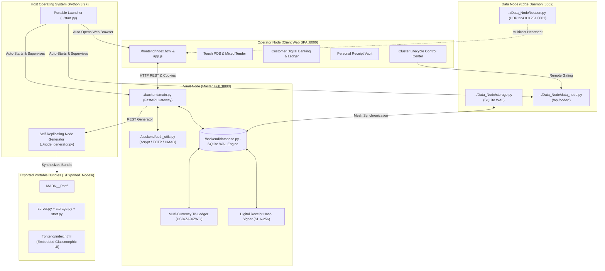

# Modular Adaptive Data Node (MADN) System Internals & Low-Level Subsystem Reference Manual

**Document Edition**: 1.19.11 | **Codename Target**: Ukuzazi (Sovereign Operator Profile, Avatar Customization & VisionPro Form Shielding)  
**Host Application Root**: `./` (Relative to `Applications/Web App/`)  
**Workspace Root**: `../../` (Relative to project workspace base)  
**Audience**: Systems Architects, Embedded Systems Engineers, Security Analysts, and Autonomous AI Coding Agents

---

## Executive Summary & Architectural Overview

The Modular Adaptive Data Node (MADN) is a zero-internet, physics-grounded, dynamic-value edge computing architecture designed for resilient operation across resource-constrained, decentralized agricultural, security, and retail environments. 

The software system implements a decoupled, heterogeneous **Tri-Node Topology** comprising:
1. **Operator Node**: Zero-installation web client executing inside modern web browsers (`./frontend/index.html` at `http://127.0.0.1:8000`), providing touch POS registers, dynamic multi-currency banking, personal receipt vaults, world currency collision validation, multi-store switcher pills, modular dynamic field store creators, and real-time node lifecycle management controls.
2. **Data Node**: Standalone edge caching and discovery daemon (`../Data_Node/data_node.py` at `http://127.0.0.1:8002`), managing local AES-256-GCM encrypted key-value storage (`kv_records`), continuous online/offline collection of 170+ ISO 4217 fiat and 50+ cryptocurrency references (`../Data_Node/currency_collector.py`), enforcing remote lifecycle activation states (`/api/node/activate`, `/api/node/deactivate`), and broadcasting periodic UDP multicast heartbeats (`224.0.0.251:8001`).
3. **Vault Node**: High-security central coordinator and extensible multi-currency tri-ledger (`./backend/main.py` at `http://127.0.0.1:8000`), enforcing `scrypt`/TOTP authentication, military-grade AES-256-GCM authenticated payload encryption at rest, SQLite Write-Ahead Logging (WAL) concurrency with `BEGIN IMMEDIATE` locks, HMAC-SHA256 bearer vouchers, digital receipt hashes, world currency collision-prevention, dedicated enterprise business wallets (`BIZ-ACC-...`), multi-store checkout revenue routing, and the **Portable Node Generator Engine** (`../node_generator.py`).

---

## 11. Sovereign Heavy System Data Encryption at Rest (AES-256-GCM + scrypt KDF)

### 11.1 Master Key Derivation Envelope
Master encryption keys are generated directly from the operator's sovereign passphrase via $\text{scrypt}$ with high-workfactor parameters:
$$K_{\text{vault}} = \text{scrypt}\Big(\text{passphrase}, \; \text{salt}=\text{"MADN\_SOVEREIGN\_VAULT\_SALT\_2026"}, \; N=16384, \; r=8, \; p=1, \; dklen=32, \; maxmem=64\text{MB}\Big)$$

### 11.2 Authenticated Payload Enveloping (AEAD)
All sensitive data records across both Vault Node SQLite (`customer_receipts`, `visitor_logs`, `wallets`, `vouchers`) and standalone Data Node storage (`kv_records.data_json`) are encrypted using Galois/Counter Mode (AES-256-GCM) with 96-bit cryptographically secure pseudorandom nonces and 128-bit authentication tags:
$$C, T = \text{AES-256-GCM-Encrypt}\Big(K_{\text{vault}}, \; \text{IV}_{96}, \; P_{\text{json}}\Big)$$
$$\text{Encrypted Storage Format: } \quad \text{"ENC:"} \parallel \text{Base64}(\text{IV}_{96}) \parallel \text{":"} \parallel \text{Base64}(C \parallel T)$$

Any external file modification or byte tampering instantly causes tag mismatch verification failure, preventing offline database tampering.

### 11.3 Sovereign Zero-Data Exposure & Git Isolation Standard
To ensure complete data privacy when synchronizing codebase repositories with public/private version control systems (e.g. GitHub):
1. **Strict Git Exclusion**: All active SQLite databases (`*.db`), Write-Ahead Logs (`*.db-wal`, `*.db-shm`), key-value stores (`data_store/`), and environment secrets (`.env`, `.env.local`) are permanently excluded via `.gitignore`.
2. **Dynamic RAM-Only Key Derivation**: Master keys derived from `VAULT_MASTER_PASSWORD` live strictly in memory and are never persisted to disk or serialized in repository files.
3. **Clean Code vs Data Separation**: Public clones receive only software logic, schemas, and tests, guaranteeing that zero operational, customer, or transaction data is ever exposed to third parties.

---

## 12. Continuous Data Node Replication Architecture

### 12.1 Concept & Purpose of "Continuous Data Node Replication"
In a decentralized edge environment, individual hardware nodes (Raspberry Pis, field tablets, and edge microservers) frequently lose power or experience intermittent connectivity. **Continuous Data Node Replication** means:
- **Asynchronous Edge Mirroring**: As soon as any product, inventory harvest, or exchange rate is modified on the primary Vault Node, the background replicator thread continuously synchronizes the encrypted key-value record to all discovered peer Data Nodes on the local mesh (`http://127.0.0.1:8002/api/kv`).
- **Autonomous Air-Gapped Survivability**: If the main Vault Node goes offline or undergoes maintenance, local Operator Nodes and customer web clients continue querying nearby Data Nodes for active price catalogs, inventory levels, and verified receipt records with zero service interruption.
- **Bi-Directional Conflict-Free Eventual Consistency**: Standalone Data Nodes broadcast UDP heartbeats (`224.0.0.251:8001`) with sequence vectors, allowing seamless automatic re-synchronization when connection is re-established.

---

---

## 10. Multi-Enterprise Store Engine & Dynamic Revenue Routing

### 10.1 Store Setup Prerequisite Enforcement
The system mandates that an operator must establish at least one active Business Enterprise Profile prior to creating inventory items or recording harvests:
- **Backend Gatekeeper**: `POST /api/inventory` inspects `COUNT(id) FROM businesses WHERE is_active = 1`. If zero stores exist, the endpoint returns `HTTP 400 Bad Request` with `detail: "Store setup required"`.
- **Frontend Gatekeeper**: The operator UI renders `#business-no-store-container`, shielding catalog tables and POS registers behind a prominent setup banner.

### 10.2 Modular Dynamic Field Store Intake
Operators dynamically compose store profiles by activating modular attribute pills:
* **Mandatory**: Business Name, Tagline, Description.
* **Branding**: Base64 / URL Store Logo & Storefront Hero Banner.
* **Contact & Location**: Phone, Email, Physical Address.
* **Compliance & Taxonomy**: Tax ID / VAT Number, Industry Category.
* **Settlement & Operations**: Preferred Settlement Currency, Operating Hours, Return Policy, Receipt Header / Footer Notes.

### 10.3 Enterprise Business Settlement Accounts & Banking
Creating a business automatically provisions a dedicated enterprise banking account:
* Account Number: `BIZ-ACC-<HEX8>` in `wallets` with `account_type='business'` and `business_id='biz-<hex8>'`.
* Multi-Currency Balances: Sovereign zero-seed initialization in `wallet_balances` (USD, ZAR, ZWG, and custom community tokens).

### 10.4 Unified Multi-Store POS Cart Checkout & Cryptographic Revenue Settlement
A single customer cart can contain products belonging to multiple distinct stores. During checkout:
$$\text{Revenue credit to Store } k: \quad R_k = \sum_{i \in \text{Cart}, \, \text{biz}(i) = k} \Big(q_i \times P_i\Big)$$
Each store's dedicated wallet is credited under `BEGIN IMMEDIATE` locks with signed HMAC-SHA256 ledger records:
$$\sigma_{\text{settlement}} = \text{HMAC-SHA256}\Big(K_{\text{vault}}, \; \text{wtx\_id} \parallel \text{account\_number} \parallel \text{"pos\_sale"} \parallel R_k \parallel \text{balance\_after}\Big)$$




---

## 1. Directory Structure & Relative Path Conventions

All subsystem files and destination targets utilize reliable relative paths ensuring seamless transfer across host systems:

```
Applications/
├── start.py                       # Zero-config multi-node launcher & browser auto-opener
├── node_generator.py             # Standalone self-replicating node bundle synthesizer
├── applications_config.json      # Declarative cluster ports & node topology configuration
├── Data_Node/                     # Standalone Data Node Edge Subsystem
│   ├── data_node.py              # FastAPI edge daemon with lifecycle activation API (:8002)
│   ├── storage.py                # Local SQLite WAL key-value storage engine
│   └── beacon.py                 # UDP multicast discovery broadcaster & listener (:8001)
├── Exported_Nodes/               # Destination directory for generated standalone bundles
│   └── MADN_<Name>_Port<Port>/   # Self-contained portable node package
│       ├── start.py              # Autonomous launcher with browser opener
│       ├── server.py             # Standalone FastAPI micro-service
│       ├── storage.py            # Local SQLite WAL storage engine
│       ├── beacon.py             # Embedded discovery beacon
│       ├── node_config.json      # Declarative node identity & port bindings
│       ├── requirements.txt      # Module dependencies
│       └── frontend/index.html   # Embedded VisionPro glassmorphic dashboard
└── Web App/                      # Master Vault Coordinator & Operator Web Application
    ├── SYSTEM_INTERNALS.md       # This low-level system architecture reference manual
    ├── USER_MANUAL.md            # Operator guide & user instruction manual
    ├── PROJECT_CHECKLIST.md      # Completed milestone tracker & task checklist
    ├── backend/                  # Server-side kernel & business logic (:8000)
    │   ├── main.py               # FastAPI entrypoint, REST routers & middleware
    │   ├── database.py           # SQLite schema, WAL engine, seeders & tri-ledger
    │   ├── auth_utils.py         # scrypt hashing, RFC 6238 TOTP & HMAC cryptography
    │   ├── node_discovery.py     # UDP discovery manager & remote node controller
    │   ├── test_*.py             # Automated regression test suites
    │   └── data_store/           # Persistent master SQLite database directory
    └── frontend/                 # Zero-installation Operator Single Page Application
        ├── index.html            # Core SPA interface with 10 modal dialogs
        ├── index.css             # Apple VisionPro-inspired glassmorphic design system
        └── app.js                # State management, canvas charts & API client
```

---

## 2. Core Architecture & Security Kernel

### 2.1 Concurrency Model & Database Engine
* **Storage Engine**: SQLite 3 with Write-Ahead Logging (`PRAGMA journal_mode=WAL;`) and synchronous normal mode (`PRAGMA synchronous=NORMAL;`).
* **Locking Protocol**: Mutating transactional endpoints (e.g. POS checkouts, P2P wallet transfers, voucher minting, harvest status transitions) enforce `BEGIN IMMEDIATE` exclusive write transactions to eliminate write contention and race conditions.
* **Busy Timeout**: Configured with `PRAGMA busy_timeout=5000;` and connection timeout of 10.0s to allow non-blocking concurrent reads during burst write operations over local Wi-Fi hotspots.

### 2.2 Cryptographic Authentication & Step-Up Security
* **Password Hashing**: Derived via `hashlib.scrypt` ($N=16384, r=8, p=1, \text{dklen}=32$) with 16-byte cryptographically random salts (`os.urandom(16)`).
* **Multi-Factor Authentication (2FA)**: RFC 6238 Time-Based One-Time Password (TOTP) algorithm using HMAC-SHA1 over 30-second time steps with dynamic truncation.
* **Session Cookies**: 32-byte (256-bit) cryptographically random tokens stored in `HttpOnly`, `SameSite=Lax` cookies with coarse `/24` subnet and User-Agent fingerprint verification.
* **CSRF Protection**: Double-Submit Cookie pattern. Non-GET operations validate `csrf_token` cookies against incoming `X-CSRF-Token` headers via constant-time comparison (`secrets.compare_digest`).
* **Step-Up Authorization**: Sensitive administrative and financial operations require step-up re-authentication, setting an elevated session flag valid for 15 minutes.

### 2.3 Genesis Bootstrap Account & Sovereign Operator Hierarchy
* **Genesis Bootstrap Credential**: Clean node provisions initialize a single bootstrap user (`admin` / `Password123!`) with `role = 'admin'` to allow zero-internet bootstrapping.
* **Sovereign Profile Transformation**: The `admin` account is temporary in state but permanent in identity. Updating the operator profile (display name, username, password, avatar) mutates the genesis record into the node's **Primary Sovereign Administrator Account** with cascading foreign-key updates across all sub-ledgers.
* **Operator Privilege Delegation**: All subsequent user accounts are scoped Operators (`agronomist`, `guard`, `merchant`, `customer`, `guest`). Privileges and multi-business store assignments are dynamically evaluated and granted exclusively by the Sovereign Admin.
* **Self-Demotion & Lockout Shielding**: The Sovereign Admin account cannot be disabled or demoted, preventing node lockout.

---

## 3. Portable Preflight & Node Generator Engine

### 3.1 Portable Bootstrapper (`../start.py`)
* **Preflight Inspection**: Inspects Python runtime ($\ge 3.9$) and checks for required packages (`fastapi`, `uvicorn`, `pydantic`, `cryptography`, `requests`).
* **Process Supervision**: Supervises multi-node child processes (`Vault-Node` on `:8000`, `Data-Node-Primary` on `:8002`, and custom exported sub-nodes) with unified stdout log multiplexing.
* **Browser Auto-Launcher**: Spawns a background thread that monitors port `:8000` and automatically launches the host web browser to `http://127.0.0.1:8000` as soon as the Vault Node router is mounted.
* **CLI Flags**:
  - `--all`: Start Vault and Data Nodes (default).
  - `--vault-only`: Start only Vault Coordinator (:8000).
  - `--data-only`: Start only Data Node (:8002).
  - `--status`: Inspect local port availability.
  - `--no-browser`: Suppress automatic web browser launch.
  - `--create-node <name> <type> <port>`: Synthesize new standalone bundle via CLI.

### 3.2 Self-Replicating Node Generator (`../node_generator.py`)
Synthesizes fully autonomous portable node bundles into `../Exported_Nodes/MADN_<name>_Port<port>/`. Every bundle contains:
- Autonomous `start.py` preflight launcher with browser auto-opening.
- `server.py`: FastAPI server exposing local `/api/storage/*` and `/api/node/*` lifecycle endpoints.
- `storage.py`: Standalone SQLite WAL KV store (`kv_records`).
- `beacon.py`: Embedded UDP multicast heartbeat broadcaster.
- `frontend/index.html`: Dedicated glassmorphic web dashboard.

---

## 4. Remote Node Lifecycle Protocol & Maintenance Mode

Standalone Data Nodes expose remote lifecycle endpoints:
* `GET /api/node/status`: Returns current operating state (`active` vs `deactivated`), port, and free storage quota.
* `POST /api/node/activate`: Enables storage mutation endpoints and resumes periodic UDP multicast beacon broadcasts (`224.0.0.251:8001`).
* `POST /api/node/deactivate`: Pauses beacon heartbeats and rejects write requests with `HTTP 503 Service Unavailable (Maintenance Mode)` while keeping read operations accessible.

---

## 5. Multi-Tenant RBAC & Business Operator Access Delegation

The system implements hierarchical multi-business tenancy:
* **Business Stores**: Isolated business profiles in `businesses` table (*Green Valley Organics*, *Khumalo Millers*, *Matopos Dairy*).
* **Staff Delegation**: Business owners and admins assign operators via `business_operators` table with granular subsystem permission strings:
  - `pos`: Point of sale register and transaction processing.
  - `inventory`: Product catalog and stock adjustments.
  - `agriculture`: Planting cycles, crop cost tracking, and harvest work orders.
  - `security`: Visitor gatekeeper check-ins and RF mesh monitoring.
  - `social`: Public feed publishing, stories, and tipping.
  - `reports`: Financial exports and ledger analytics.
  - `admin`: Business profile settings and operator management.

---

## 6. Customer Digital Banking & Multi-Currency Tri-Ledger

* **Customer Digital Wallets (`customer_wallets`)**: Every customer account is provisioned with a sovereign multi-currency digital wallet (`ACC-2026-XXXXXX`) tracking USD, ZAR, and ZWG balances.
* **Double-Entry Ledger (`wallet_ledger`)**: All financial mutations (top-ups, P2P transfers, voucher deposits, POS wallet checkouts) execute under `BEGIN IMMEDIATE` locks and append immutable ledger entries with HMAC-SHA256 signature chains:
  $$\sigma_{\text{ledger}} = \text{HMAC-SHA256}\Big(K_{\text{vault}}, \; \text{tx\_id} \parallel \text{acc\_num} \parallel \text{type} \parallel \text{currency} \parallel \text{amount} \parallel \text{balance\_after} \parallel t_{\text{utc}}\Big)$$

---

## 7. Personal Digital Receipt Vault & Offline Bearer Vouchers

* **Permanent Receipt Archival (`customer_receipts`)**: Completed POS checkouts automatically archive itemized receipt payloads stamped with cryptographic SHA-256 hashes:
  $$H_{\text{receipt}} = \text{SHA-256}\Big(\text{receipt\_json}\Big)$$
* **Offline Bearer Vouchers (`offline_vouchers`)**: Minted when change cannot be rendered in physical cash. Signed with HMAC-SHA256 and rendered as offline QR codes. Single-use redemption transitions status from `active` to `redeemed`, preventing double-spend fraud.

---

## 8. Physical Mesh & Signal Ray-Tracing Engine (Security & Connectivity)

* **Spatial Bounding Index**: SQLite R\*Tree virtual index (`map_obstacles_rtree`).
* **Liang-Barsky 2D Ray-Tracing**: Computes obstacle intersections using parametric clipping:
  $$\max(0, \max_{p_k < 0}(u_k)) \le \min(1, \min_{p_k > 0}(u_k))$$
* **Log-Distance Path Loss Model**:
  $$PL(d) = PL(d_0) + 10 \cdot \gamma \cdot \log_{10}\left(\frac{d}{d_0}\right) + \sum_{i} A_{\text{obstacle}, i}$$
* **A\* Max-Min Link Quality Mesh Pathfinding**: Optimizes the bottleneck link quality across relay hops, applying a $-20.0\text{ dBm}$ penalty for battery levels $< 20\%$.

---

## 9. Dynamic Value Systems: Continuous Decay POS (Business & Retail)

* **Continuous Exponential Price Decay**: Perishable products dynamically adjust price based on time-to-spoilage while protecting margin floors:
  $$P(t) = P_{\text{cost}} + (P_{\text{base}} - P_{\text{cost}}) \cdot e^{-\lambda t}, \quad \lambda = \frac{\ln(2)}{T_{\text{half\_life}}}$$
* **Tri-Currency Tender Split Reconciliation**:
  $$V_{\text{paid}} = T_{\text{USD}} + \frac{T_{\text{ZAR}}}{\text{rate}_{\text{ZAR}}} + \frac{T_{\text{ZWG}}}{\text{rate}_{\text{ZWG}}}$$

---

## 13. Dynamic Progressive Disclosure & Condition-Gated Subsystem Architecture

To optimize operator focus and eliminate cluttered empty states for non-technical users, the frontend runtime dynamically evaluates state preconditions before revealing navigation tabs and interactive subviews:

### 13.1 Business Subsystem Progression State Machine
$$\mathcal{S}_{\text{business}} = \begin{cases} 
\{\text{Store Setup}\} & \text{if } N_{\text{biz}} = 0 \\ 
\{\text{Products \& Catalog}\} & \text{if } N_{\text{biz}} \ge 1 \land N_{\text{products}} = 0 \\ 
\{\text{Point of Sale (POS)}, \text{Products \& Catalog}, \text{Customer Marketplace}, \text{Sales Analytics \& Spoilage}\} & \text{if } N_{\text{biz}} \ge 1 \land N_{\text{products}} \ge 1 
\end{cases}$$

### 13.2 Precision Agriculture Progression State Machine
$$\mathcal{S}_{\text{agri}} = \begin{cases} 
\{\text{Farm Fields \& Plots}, \text{Bulawayo Climate}\} & \text{if } N_{\text{fields}} = 0 \\ 
\{\text{Farm Fields \& Plots}, \text{Crop Plantings \& Plans}, \text{Bulawayo Climate}\} & \text{if } N_{\text{fields}} \ge 1 \land N_{\text{plantings}} = 0 \\ 
\{\text{Farm Fields}, \text{Plantings}, \text{Cost \& Price Calculator}, \text{Harvest \& POS Sync}, \text{Climate}\} & \text{if } N_{\text{plantings}} \ge 1 \land N_{\text{harvests}} = 0 \\ 
\{\text{Farm Fields}, \text{Plantings}, \text{Cost Calc}, \text{Harvest Sync}, \text{Yield Dispositions}, \text{Climate}\} & \text{if } N_{\text{harvests}} \ge 1 
\end{cases}$$

---

## 14. Sovereign Operator Profile Customization & VisionPro Form Shielding

### 14.1 Operator Profile Identity & Image Ingestion
Operator accounts support rich personal identity customization with client-side image optimization:
- **Canvas Compression**: Uploaded images are pre-processed in browser memory via HTML5 Canvas, bound to a maximum dimension of $256\times 256$ pixels, and converted to high-quality compressed JPEG data URLs before transmission.
- **Relational Username Cascading**: Username modifications safely disable foreign key constraints (`PRAGMA foreign_keys = OFF;`) during atomic updates across `users`, `wallets`, `businesses`, `business_operators`, and `customer_receipts`, ensuring zero referential integrity violations.

### 14.2 VisionPro Glassmorphic Form Shielding & Validation
- **Autofill Bleed Suppression**: Overrides browser `-webkit-autofill` pseudo-classes with `box-shadow: 0 0 0 1000px rgba(18, 24, 38, 0.96) inset` and `color-scheme: dark;`, guaranteeing that browser credential autocomplete never turns inputs opaque white.
- **Coherent Non-Intrusive Validation**: Enforces `novalidate` on all forms to suppress jarring native browser tooltip bubbles, routing all field feedback through animated glassmorphic toasts (`showErrorToast`, `showSuccessToast`).

