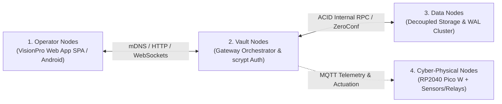

# Modular Adaptive Data Node (MAD-Node) for Dynamic Value Systems

[-blue.svg)](./progress%20tracking/Version_Registry.md)
[](./LICENSE)
[](./Applications/Web%20App/SYSTEM_INTERNALS.md)
[](./01_Documentation_and_Thesis/Chapters/)

---

## Executive Overview

The **Modular Adaptive Data Node (MAD-Node) for Dynamic Value Systems** is an offline-first, decentralized cyber-physical computing framework engineered for resource-constrained and infrastructure-vulnerable environments (specifically Matabeleland North, Bulawayo, and Tsholotsho in Zimbabwe). 

By decoupling monolithic cloud dependencies into a **4-Node Functional Taxonomy** and employing a **Phased Resource-Bootstrapping Model** (*Ukunciphisa* philosophy), the system delivers autonomous, self-funding digital capabilities across **Social Media**, **Precision Agriculture**, **Perimeter Security**, and **Composable Enterprise Management**.

---

## Architectural Pillars



1. **Operator Nodes**: Responsive Glassmorphic Single Page Application (SPA) providing role-based interfaces for six distinct actor roles (`admin`, `agronomist`, `guard`, `merchant`, `customer`, `guest`).
2. **Vault Nodes**: Central orchestrator (Raspberry Pi 4 running Kali Linux ARM64) hosting the FastAPI gateway, RFC 6238 TOTP two-factor authentication, CSRF double-submit protection, and Mosquitto MQTT broker.
3. **Data Nodes**: Decoupled cluster storage workers executing across separate directories, physical machines, VMs, or containers, discovered automatically via UDP multicast (`224.0.0.251:8001`).
4. **Cyber-Physical Nodes (Stage 2)**: Low-power edge microcontrollers (RP2040 Pico W) reading capacitive soil moisture, DHT22 temp/humidity, PIR motion, and triggering mechanical solenoid irrigation valves and piezo security sirens.

---

## Repository Directory Structure

```
├── 📁 01_Documentation_and_Thesis/          # Academic thesis documentation & drafts
│   ├── 📁 Chapters/                         # Versioned chapter suites (Chapters 1 to 5)
│   │   ├── 📁 2026-08-20 Thu 2111 Version/  # [LATEST] Complete 4-Node redeveloped chapter suite
│   │   └── 📁 2026-05-13 Wed 1220 Version/  # Legacy foundation drafts
│   ├── 📁 Supervisor_Revisions_Mr_Kunene/   # DOCX submissions, feedback records & memos
│   ├── 📁 Early_Proposals_and_Assets/       # Original proposal PDFs, preliminary pages & slides
│   └── 📁 Drafts_and_Conceptual_Notes/      # Historical rough notes, level designs & early ideas
│
├── 📁 02_Hardware_and_Prototyping/          # Physical engineering & component sourcing
│   ├── 📁 Sourcing_and_BOM/                 # Component shopping lists, vendor image cards & BOM pricing
│   ├── 📁 Raspberry_Pi_Pico_W_Materials/    # Adafruit PiCowbell specs, headers & pinout diagrams
│   └── 📁 Prototype_Design_Notes/           # Mechanical PETG assembly notes & enclosure specs
│
├── 📁 03_Research_and_Exploration/          # AI prompt engineering & exploratory workflows
│   ├── 📁 Prompt_Response_Flows/            # Historical interaction transcripts & prompt logs
│   ├── 📁 Gemini_CLI_Productions/           # CLI production manifests, research & outputs
│   └── 📁 Side_Quests/                      # Deep-dive side quests (Mandisa flow, metaphors)
│
├── 📁 Applications/                         # Software implementations across node layers
│   └── 📁 Web_App/                          # VisionPro Glassmorphic Web App ecosystem
│       ├── 📁 backend/                      # FastAPI, SQLite WAL, Auth Kernel, TFLite & Tests
│       ├── 📁 frontend/                     # HTML5/CSS3 glassmorphic SPA & dynamic sub-nav engine
│       ├── 📄 SYSTEM_INTERNALS.md           # Low-level mathematical & cryptographic reference
│       ├── 📄 USER_MANUAL.md                # Operator & user guides
│       └── 📄 PROJECT_CHECKLIST.md          # Multi-cycle implementation status
│
├── 📁 progress tracking/                    # Formal version checkpoints & codename registry
│   ├── 📄 version_registry.json             # Machine-readable semver & codename registry
│   ├── 📄 Version_Registry.md               # Human-readable version history table
│   └── 📄 YYYY-MM-DD_HHMM_*.md              # Standardized progress tracking log entries
│
├── 📁 .agents/                              # AI Assistant rules, workflows & automated skills
│   ├── 📁 rules/                            # System operational rules
│   └── 📁 skills/                           # Document-Now, Chapter-Development, System-Internals
│
├── 📄 README.md                             # Master repository index & architecture guide
├── 📄 LICENSE                               # MIT License
└── 📄 .gitignore                            # Version control exclusions
```

---

## Core Domain Systems

1. **Hybrid Social Media & Local Mesh Feeds**:
   - Synthesizes UX paradigms from **X** (threads), **Instagram** (photo carousels), **Snapchat** (24h ephemeral stories), and **TikTok** (vertical short video reels) with offline local-mesh content distribution and multi-currency creator micro-tipping.
2. **Precision Agriculture & Harvest Lifecycle Tracker**:
   - Digital tracking for planting logs, harvesting logs, mass ($\text{kg}/\text{tons}$), and harvest utilization splitting: **Self-Consumption** (subsistence) vs. **Composable Enterprise POS Sales** with continuous exponential price decay:
     $$P(t) = P_{cost} + (P_{base} - P_{cost}) \cdot e^{-\lambda t}, \quad \lambda = \frac{\ln(2)}{T_{half\_life}}$$
3. **Perimeter Security & Visitor Gatekeeping**:
   - Offline digital visitor access registry (National ID, Name, Time In/Out, Destination, Escort, Status) integrated with automated PIR/ultrasonic tripwires, Liang-Barsky obstacle ray-tracing, 3-point RSSI intrusion trilateration, and tamper-evident HMAC audit logs.
4. **Composable Enterprise Application (with RBAC)**:
   - Multi-currency tri-ledger reconciling USD (base), ZAR, and ZWG with mixed-tender change calculations, idempotent request caches (`processed_requests`), and fine-grained role profiles (`admin`, `agronomist`, `guard`, `merchant`, `customer`, `guest`).

---

## Quick Start & Verification

```bash
# 1. Run Complete Backend Test Suite
cd "Applications/Web App/backend"
python test_auth.py
python test_endpoints_live.py
python test_cycle3.py
python test_cycle4.py

# 2. Launch Local Web App Gateway Server
python -m uvicorn main:app --host 0.0.0.0 --port 8000 --reload

# 3. Access Operator Web App Interface
# Open browser at: http://localhost:8000 (or http://madn.local:8000 on Wi-Fi hotspot)

# 4. Execute Progress Tracking Checkpoint
python ../../../.agents/skills/document-now/scripts/version_registry.py bootstrap
```

---

## Authors & Attribution
* **Lead Systems Architect & Developer**: Peter Dube
* **AI Pair Programming & Architecture Assistant**: Antigravity (Google DeepMind)
* **Academic Supervisor**: Mr. Kunene
