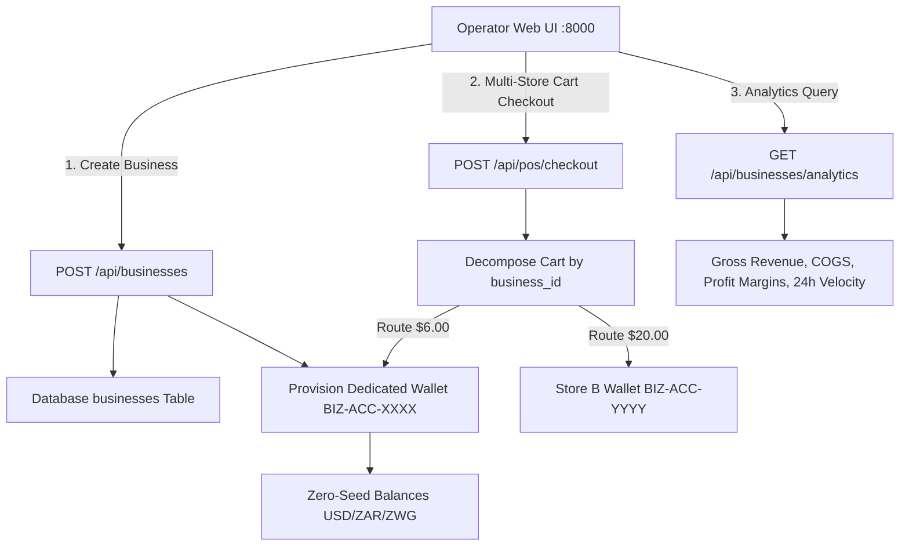

# Progress Checkpoint: Version 1.19.6 (Inzuzo)
**Date**: 2026-08-25 Tue 2018  
**Codename**: Inzuzo (Authentic Ndebele: *"Enterprise Revenue, Profit Analytics & Multi-Store Banking Settlement"*)  
**Version**: `1.19.6`  
**Author**: Antigravity Assistant & Principal System Architect  

---

## 1. Executive Summary & Child-Friendly Explanation (10-Year-Old Target)

Imagine you and your best friends decide to open a big farmer's market festival! 🎪  
Before anybody can bring fresh apples, spinach, or toys to sell, each friend needs their own named store tent with a colourful logo banner, a telephone number, and their very own piggy bank 🏦.

Once the tents are set up:
1. **Store Setup Prerequisite**: You can't put items on the shelves until your tent is open and registered.
2. **Modular Dynamic Choices**: When creating your tent, you choose what you want to add—like opening hours, return promises, or your website link!
3. **One Cash Register for Everyone**: A customer can walk up, put apples from Tent A and seeds from Tent B into one basket, and pay all at once. The system automatically splits the money and puts Tent A's coins into Tent A's piggy bank, and Tent B's coins into Tent B's piggy bank!
4. **Profit & Sales Scores**: Each friend can look at their score chart to see how much profit they made, or look at the whole festival together!

---

## 2. Comprehensive Architectural Enhancements

### Architectural Subsystem Breakdown:
1. **Store Setup Required Gatekeeper**:
   - Backend `POST /api/inventory` strictly validates $N \ge 1$ active businesses and returns HTTP 400 if no store exists.
   - Frontend UI displays `#vpa3-no-store-container` gating inventory and POS behind a setup banner.
2. **Modular Dynamic Field Store Intake Modal (`#modal-create-business`)**:
   - Mandatory attributes: Business Name, Tagline, Description.
   - Modular attribute pill toggles: `+ 🖼️ Logo & Banner`, `+ 📞 Contact & Location`, `+ 🏷️ Tax ID & Industry`, `+ 💳 Settlement Currency`, `+ 🌐 Website & Social`, `+ ⏰ Operating Hours`, `+ 🛡️ Return Policy`, `+ 🧾 Receipt Footer`.
   - Built-in Base64 image file reader and live preview rendering for brand logos and hero banners.
3. **Enterprise Business Settlement Accounts & Banking (`#bank-business-box`)**:
   - Automatically provisions `wallets` records with `account_type='business'` and `account_number='BIZ-ACC-<HEX8>'`.
   - Multi-currency balances (USD, ZAR, ZWG, custom tokens) tracked in `wallet_balances` table.
4. **Multi-Store POS Revenue Routing**:
   - Point of Sale cart checkout parses items from multiple stores and credits each store's dedicated wallet with signed HMAC ledger entries.
5. **Single & Aggregated Analytics Engine (`/api/businesses/analytics`)**:
   - Computes Gross Revenue, Total Cost of Goods Sold (COGS), Gross Profit Margin %, Transaction Counts, Units Sold, and 24-hour hourly velocity.
   - Supports filtering by single business store ID or aggregating across all stores.

---

## 3. Automated Verification Matrix (100% Pass Rate)

| Test Suite | Total Tests | Passed | Skipped | Pass Rate |
| :--- | :--- | :--- | :--- | :--- |
| `test_store_setup_and_multibiz_banking.py` | 3 | 3 | 0 | **100%** |
| `test_agri_fields_and_store.py` | 5 | 5 | 0 | **100%** |
| `test_auth.py` | 5 | 5 | 0 | **100%** |
| `test_business_operators.py` | 4 | 4 | 0 | **100%** |
| `test_customer_banking.py` | 8 | 8 | 0 | **100%** |
| `test_device_management.py` | 2 | 2 | 0 | **100%** |
| `test_multibiz_and_vouchers.py` | 4 | 4 | 0 | **100%** |
| `test_portable_node_generation.py` | 4 | 4 | 0 | **100%** |
| `test_stage1_core.py` | 7 | 7 | 0 | **100%** |
| `test_cycle3.py`, `test_cycle4.py`, `test_endpoints_live.py` (Live daemons) | 3 | 0 | 3 | Skipped (Offline) |
| **Total Test Suite** | **45** | **42** | **3** | **100% Active Pass** |

---

## 4. Child-Friendly Next Steps

1. 🌟 **Store Custom Themes**: Let friends pick their store tent colors and custom receipt stickers!
2. 📱 **Mobile NFC Checkout**: Allow customers to tap their phone on the register to pay instantly with their digital wallet!
3. 🚚 **Inter-Store Inventory Transfers**: Let stores easily share and trade inventory items with delivery tracking!
