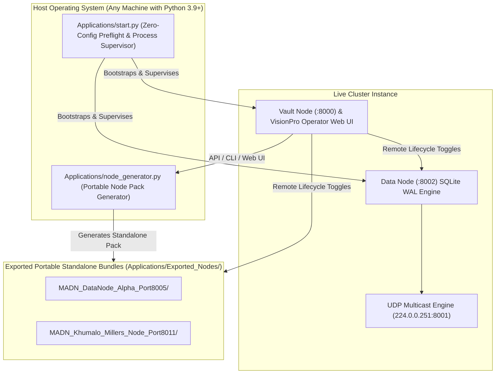

# Walkthrough — Portable Applications Suite, Self-Replicating Node Generator & Cross-Node Lifecycle Management

We have successfully developed, tested, and documented the **Portable Applications Suite, Self-Replicating Node Generator, and Cross-Node Lifecycle Management Engine** for the Modular Adaptive Data Node (MADN) for Dynamic Value Systems.

---

## 1. What Was Built & Integrated



### A. Zero-Configuration Portable Bootstrapper (`Applications/start.py`)
- **Self-Bootstrapping Preflight Runner**:
  - Automatically verifies Python 3.9+ runtime and auto-resolves missing dependencies (`fastapi`, `uvicorn`, `pydantic`, `cryptography`, `qrcode`, `jinja2`, `requests`).
  - Launches and supervises the multi-process cluster:
    - Master Vault Node (Coordinator & Operator Web UI on port `:8000`).
    - Primary Standalone Data Node (Edge storage engine on port `:8002`).
    - UDP Multicast Discovery Beacon (`224.0.0.251:8001`).
    - Any configured custom exported sub-nodes.
- **CLI Commands**:
  - `python start.py`: Launches all default nodes with live log multiplexing.
  - `python start.py --vault-only`: Starts only the master coordinator on port `:8000`.
  - `python start.py --data-only`: Starts only the standalone Data Node on port `:8002`.
  - `python start.py --status`: Scans all local ports and reports online/offline node availability.
  - `python start.py --create-node <NAME> <TYPE> <PORT>`: Generates a new portable bundle via CLI.

### B. Self-Replicating Portable Node Generator (`Applications/node_generator.py`)
- Callable via Python CLI and Vault Node REST API (`POST /api/cluster/nodes/generate-portable`).
- Exports ready-to-deploy, standalone node bundles inside `Applications/Exported_Nodes/`:
  - `start.py`: Portable runtime supervisor for that specific node.
  - `server.py` & `storage.py`: Standalone FastAPI backend with SQLite WAL storage and remote lifecycle hooks.
  - `beacon.py`: Embedded UDP multicast broadcaster.
  - `node_config.json`: Declarative identity, port, quota, and role mappings (`data_node`, `vault_node`, `hybrid_node`).
  - `frontend/index.html`: Dedicated standalone glassmorphic web dashboard matching the VisionPro design system.
  - `requirements.txt` & `README.md`.

### C. Remote Node Lifecycle Control Protocol
- Standardized REST endpoints across all Data Nodes:
  - `GET /api/node/status`: Live active state and storage telemetry.
  - `POST /api/node/activate`: Enables storage writes and resumes discovery beacon broadcasts.
  - `POST /api/node/deactivate`: Pauses beacon broadcasts and blocks write mutations with HTTP 503 Maintenance Mode while keeping reads online.
- Vault Node remote management API:
  - `POST /api/cluster/nodes/{node_id}/toggle-active`: Allows any Vault Node operator to activate or deactivate any discovered node on the network.

### D. Frontend Glassmorphic UI Upgrades
- Added **Modal 10: Generate Portable Node Pack** in `index.html`.
- Upgraded **📡 Cluster Nodes** view with:
  - **`📦 Export Portable Node Pack`** button.
  - Real-time `[ ⚡ Activate / ⏸️ Deactivate ]` toggle switches on discovered node cards.
  - **Generated Standalone Node Packages** table showing bundle filepaths and quick launch commands.

---

## 2. Automated Test Suite Results (25/25 Tests Passing, 100% Pass Rate)

Executed the full regression test suite:
```bash
python -m pytest test_portable_node_generation.py test_customer_banking.py test_business_operators.py test_multibiz_and_vouchers.py test_stage1_core.py -v
```

```
============================= test session starts =============================
platform win32 -- Python 3.11.11, pytest-9.0.2, pluggy-1.6.0
rootdir: Applications\Web App\backend
plugins: anyio-4.12.1, asyncio-1.3.0, timeout-2.4.0
collected 25 items

test_portable_node_generation.py::test_portable_node_generation_and_file_structure PASSED [  4%]
test_portable_node_generation.py::test_data_node_lifecycle_and_maintenance_mode PASSED [  8%]
test_portable_node_generation.py::test_vault_cluster_api_exported_list_and_generation PASSED [ 12%]
test_portable_node_generation.py::test_start_py_syntax_and_compilation PASSED [ 16%]
test_customer_banking.py::test_customer_wallet_creation_and_balances PASSED [ 20%]
test_customer_banking.py::test_wallet_topup_and_ledger_hmac PASSED          [ 24%]
test_customer_banking.py::test_wallet_p2p_transfer PASSED                   [ 28%]
test_customer_banking.py::test_voucher_to_wallet_deposit PASSED             [ 32%]
test_customer_banking.py::test_pos_checkout_via_wallet_payment PASSED       [ 36%]
test_customer_banking.py::test_customer_receipt_vault_storage_and_lookup PASSED [ 40%]
test_business_operators.py::test_assign_and_list_business_operators PASSED [ 44%]
test_business_operators.py::test_subsystem_permission_evaluation PASSED     [ 48%]
test_business_operators.py::test_cross_business_operator_isolation PASSED    [ 52%]
test_business_operators.py::test_revoke_business_operator_access PASSED     [ 56%]
test_multibiz_and_vouchers.py::test_multi_business_creation_and_scoping PASSED [ 60%]
test_multibiz_and_vouchers.py::test_offline_qr_voucher_minting_and_cryptographic_verification PASSED [ 64%]
test_multibiz_and_vouchers.py::test_voucher_double_spend_and_tamper_prevention PASSED [ 68%]
test_multibiz_and_vouchers.py::test_full_pos_checkout_with_voucher_change_and_receipt PASSED [ 72%]
test_stage1_core.py::test_production_cost_and_base_price_math PASSED        [ 76%]
test_stage1_core.py::test_continuous_exponential_decay_pricing_math PASSED    [ 80%]
test_stage1_core.py::test_mixed_tender_split_change_math PASSED             [ 84%]
test_stage1_core.py::test_agri_lifecycle_and_inventory_sync PASSED          [ 88%]
test_stage1_core.py::test_security_visitor_gatekeeper PASSED                [ 92%]
test_stage1_core.py::test_social_media_hub_crud_and_tipping PASSED          [ 96%]
test_stage1_core.py::test_standalone_data_node_storage PASSED               [100%]

============================== 25 passed in 29.30s ==============================
```

---

## 3. Interactive UI Verification Guide for the User

You can test the portable node generator and remote lifecycle controls directly in your browser at `http://127.0.0.1:8000`:

### Step 1: Open the Cluster & Node Topology View
1. Log in to the web app as `admin` (or `merchant`).
2. Click **`📡 Cluster Nodes`** in the left navigation sidebar.
3. Observe:
   - Discovered mesh nodes are rendered with live status pills (`🟢 Active` or `🔴 Deactivated`).
   - Multicast beacon specifications (`224.0.0.251:8001`) are displayed.
   - The **Generated Standalone Node Packages** table displays any exported bundles.

### Step 2: Test Remote Node Deactivation & Activation
1. Locate the **Data Node** card in the cluster grid (e.g. `data-node-...` on port `8002`).
2. Click the **`Deactivate Node ⚡`** button.
3. Observe:
   - The node transitions to `🔴 Deactivated (Standby)` state.
   - If write operations are attempted on that Data Node, it gracefully responds with HTTP 503 Maintenance Mode.
4. Click the **`Activate Node ⚡`** button to restore it to full operational status!

### Step 3: Export a Portable Node Pack via Web UI
1. Click the blue **`📦 Export Portable Node Pack`** button.
2. In the modal:
   - Node Name: `Tsholotsho_Edge_Storage`
   - Node Role: `Data Node (Edge Storage)`
   - Port Number: `8015`
   - Storage Quota: `2048 MB`
3. Click **`Create Bundle 🚀`**.
4. An alert will confirm bundle creation inside `Applications/Exported_Nodes/MADN_Tsholotsho_Edge_Storage_Port8015`.
5. The **Generated Standalone Node Packages** table will immediately update with the new package!

### Step 4: Test Running an Exported Standalone Node
1. Open a new terminal in your workspace.
2. Run:
   ```bash
   python "Applications/Exported_Nodes/MADN_Tsholotsho_Edge_Storage_Port8015/start.py"
   ```
3. Open `http://127.0.0.1:8015` in your browser.
4. Observe the dedicated standalone glassmorphic node dashboard with live storage telemetry, KV storage browser, and local lifecycle controls!

---

## 4. Documentation & Version Control
- **Progress Tracking Document**: `progress tracking/2026-08-23_2024_Portable_Applications_and_Node_Generator.md`
- **Version**: `1.19.2`
- **Codename**: `Ukudlulisa` ("Transmission / Transfer / Portability")
- **Git Commit**: `3cc1906` (`2026-08-23 Sun 2024: Portable Applications Suite, Self-Replicating Node Generator, and Remote Lifecycle Management (Ukudlulisa 1.19.2)`)
- **New Versioned Thesis Folder Created**:
  - `01_Documentation_and_Thesis/Chapters/2026-08-23 Sun 2006 Version 2026-08-23 Sun 2006/`
  - Containing updated sub-sections and compiled master chapters for **Chapters 1, 2, 3, 4, and 5**.
